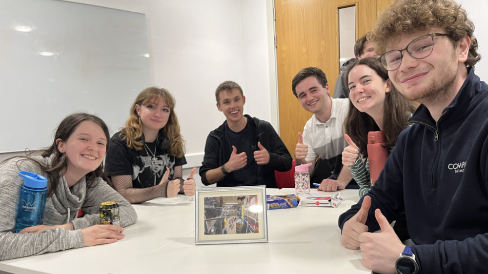

---
sidebar_custom_props:
  emoji: 🚚
---

# The DC Cupboard

The Drama Collective (DC) Cupboard is our main storage area, located on a balcony in the dock. Whilst we share this
with other societies in Warwick Drama, Tech Crew has its own dedicated area of the space where we keep all of our
equipment.

During a show get-in or get-out the door to this will often be left unlocked. Otherwise, the code to this is only
known by the exec or by the DC Cupboard Manager.

:::info
The Cupboard is located on a Mezzanine floor. It has an Info panel attached with this information:

- Supplied By Redditch Partitions & Storage Co.
- Maximum Uniformly Distributed Loading on this Structure is 480kg/m^2
- Maximum Hand Pallet Truck Weight on this Structure is 750kg
- Installation date 21/08/2006
  :::

:::lore
In Term 1 2024, a WAC technician-signed framed image of the DC Cupboard was awarded as second place prize in The Big
Fat Tech Crew Quiz.

<figure>

<figcaption>The second-place team in The Big Fat Tech Crew Quiz with their prize.</figcaption>
</figure>
:::
