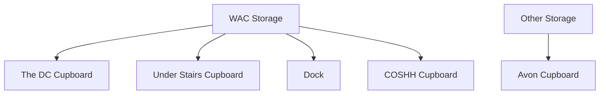

# Storage

As part of [Drama Collective](/wiki/warwick-drama), Tech Crew shares the two storage locations on campus - the DC
Cupboard and the Avon Cupboard. In the Warwick Arts Centre, alongside the DC Cupboard, Tech Crew also has access to the
dock, COSHH cupboard and under-stairs cupboard.

