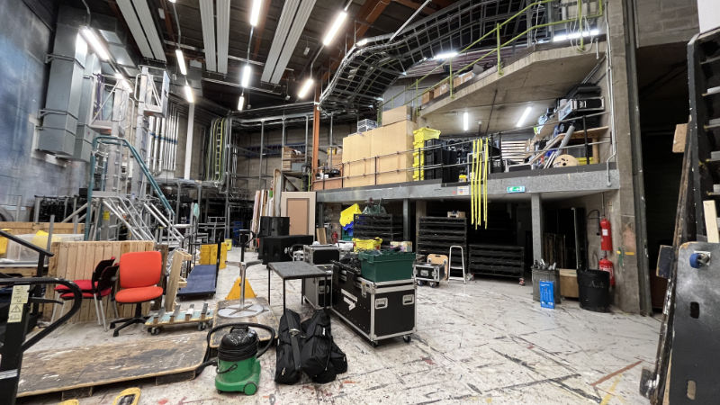
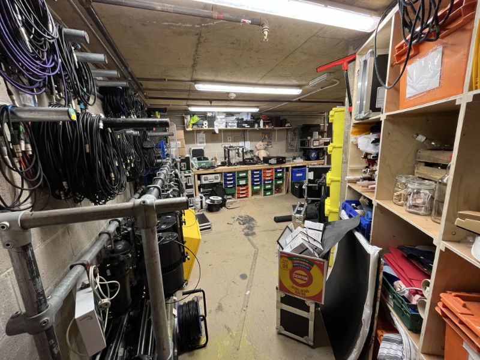
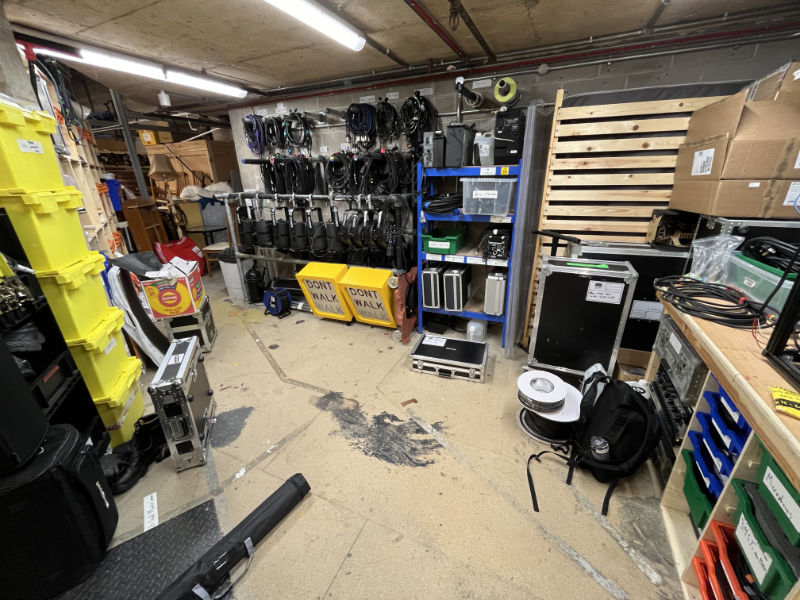
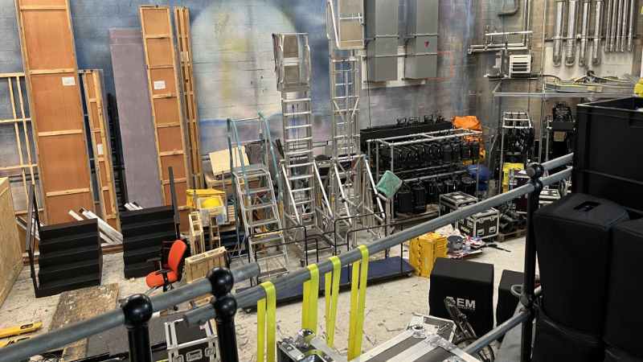
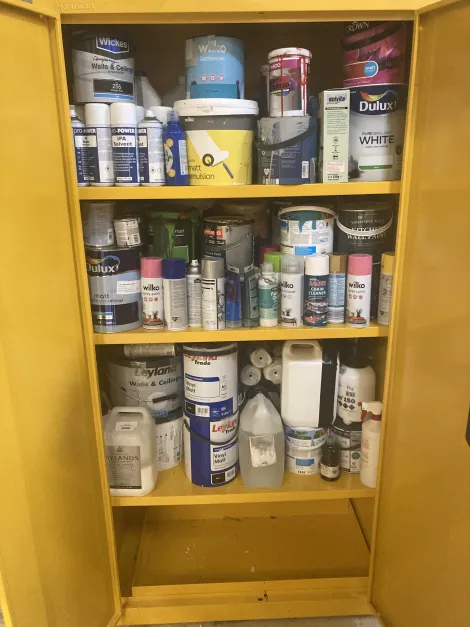

# Storage

As part of [Drama Collective](/wiki/warwick-drama), Tech Crew shares the two storage locations on campus - the DC 
Cupboard and the Avon Cupboard. In the Warwick Arts Centre, Tech Crew also has access to the dock, COSHH cupboard and 
under-stairs cupboard.

## Warwick Arts Centre Storage

The Warwick Arts Centre is the main building that Tech Crew is based in, as it where all the shows take place. It is,
however, also a professional touring venue with regular events, so it is important to be respectful of staff and 
other users of the space at all times.

All of our storage locations are in a closed-off area known as 'Back of House' (BOH), which is only accessible via a 
code which changes every week. This code is given on a need-to-know-basis by the exec, such as when you are on a show.

:::info
More information about the Warwick Arts Centre can be found on the [Warwick Arts Centre Venue Page](/wiki/spaces/wac).
:::

### The DC Cupboard

The Drama Collective (DC) Cupboard is our main storage area, located on a balcony in the dock. Whilst we share this 
with other societies in Warwick Drama, Tech Crew has its own dedicated area of the space where we keep all of our 
equipment.

During a show get-in or get-out the door to this will often be left unlocked. Otherwise, the code to this is only 
known by the exec or by the DC Cupboard Manager.

:::info
The Cupboard is located on a Mezzanine floor. It has an Info panel attached with this information:

- Supplied By Redditch Partitions & Storage Co.
- Maximum Uniformly Distributed Loading on this Structure is 480kg/m^2
- Maximum Hand Pallet Truck Weight on this Structure is 750kg
- Installation date 21/08/2006
:::

:::lore
In Term 1 2024, a WAC technician-signed framed image of the DC Cupboard was awarded as second place prize in The Big 
Fat Tech Crew Quiz.

<figure>

<figcaption>The second-place team in The Big Fat Tech Crew Quiz with their prize.</figcaption>
</figure>
:::

### The Under-Stairs Cupboard

The under-stairs cupboard is a small cupboard which is (shockingly) under the stairs to get to the DC Cupboard. This 
stores some of our speakers and [Percy](./flight-cases), our production flight case. Similarly to the DC cupboard, 
this is left open during a show but otherwise is only accessible to the exec.

### The Dock

The dock is a large open area which is managed by the Senior Head of Workshop at Warwick Arts Centre. This is
mainly used for the Arts Centre's own storage (you may be asked to get their equipment from here if you're working 
on a show), however we also have a few large set pieces here from previous shows (such as a random lamp post!).

During a show, we can use this space (with prior arrangement from Head of Workshop) to store and paint set - however there may 
be many other shows going on, so it is important to be respectful and keep it tidy.

When working in the dock, please note:
- The Ops Assistant is on duty to deal with building operations and are the person who locks up at the end of the day, they might start asking you to leave around 9pm.
- The area outside the yellow and black striped tape must be clear when you leave
- If there are other shows in the Studio or Theatre, you might not be able to use the dock due to a load in/out.
- Even if they aren’t loading in or out, respect how close you are to the venues and dock equipment with noise and belongings
- Paint! – Once you’re finished painting, use the paint sink provided (under the DC cupboard) to wash brushes, rollers, and trays
- If you have a palette still full of paint that you want to keep fresh for tomorrow, cover it with clingfilm, to stop it drying out.
- If you have set with wet paint, leave a note
- Once your show is in the venue, clear out the dock of everything for your show and relabel extra paints for other show use
- You must confirm with WAC Head of Workshop exactly what equipment you are planning to leave in the dock during show week, this must be arranged before your show week!

### The COSHH Cupboard

COSHH stands for Control of Substances Hazardous to Health Regulations and includes materials such as paint, 
Flamebar and isopropyl alcohol. These are kept in a bright yellow, locked cupboard inside the dock workshop, which is 
the taped off area in the dock.

You can find more information about this on the [COSHH Cupboard Subpage](/wiki/tech-crew/storage/coshh)

## The Avon Cupboard

The Avon cupboard is the DC's secondary storage location on the Westwood Campus. Tech Crew often keep a few large 
stands here for easy access for hires, but otherwise we don't really use this cupboard.

The code to this cupboard is only known by the exec or by the DC Cupboard Manager.
