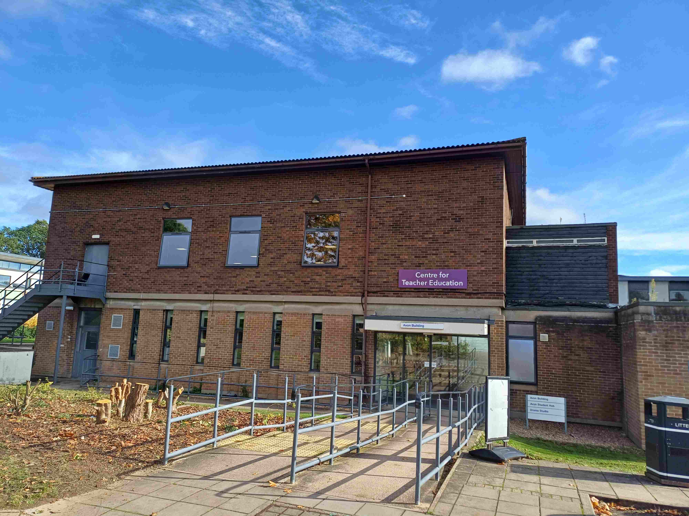
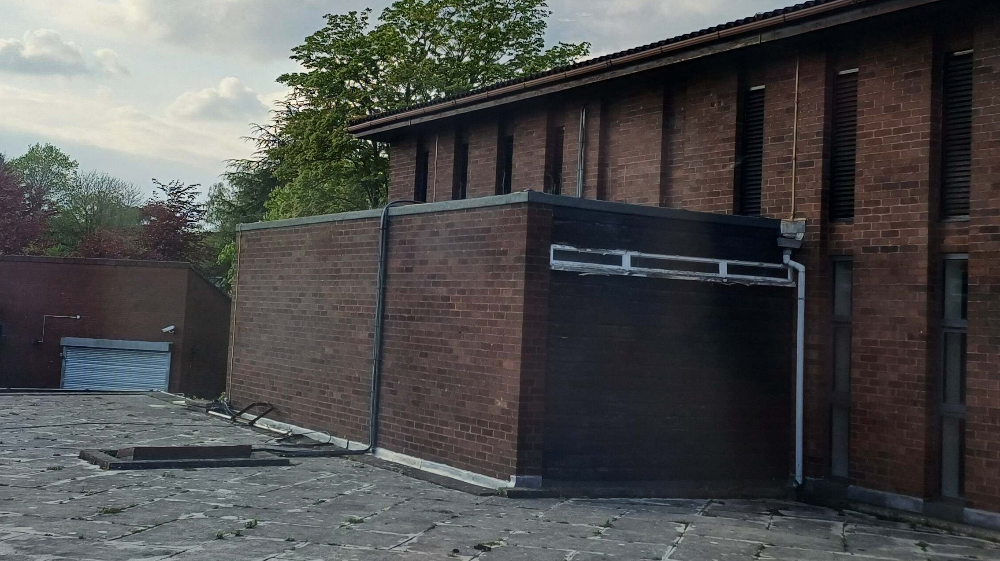

---
sidebar_custom_props:
  emoji: 🗄️
---

# Other Storage locations

## The Avon Cupboard

The Avon cupboard is a DC storage location in the Westwood Campus. Tech Crew often keep a few large stands here for easy
access for hires, but otherwise we don't really use this cupboard. The code to this cupboard is only known by the exec
or by the DC Cupboard Manager. There is a sign in sheet on the door if you'd like to let the DC Cupboard Managers know
you've visited.

<figure>

<figcaption>
Images of the avon building and its little shed cupboard.
</figcaption>
</figure>

:::lore

The Avon Cupboard is protected by a pin code, but the door does have swipe access.

:::

## The Under-Stairs Cupboard

 In WAC, The under-stairs cupboard is a small cupboard
which is (shockingly) under the stairs to get to the DC Cupboard. This stores some of our speakers and Percy, our
production flight case. Similarly to the DC cupboard, this is left open during a show but otherwise is only accessible
to the exec.

## The Above-Stairs Cupboard

This is the floor above DC Cupboard, which we technically do not manage. WAC staff have been kind enough to let us store
our line array here. Please note this is not a social space and you should only go up there to move equipment!
