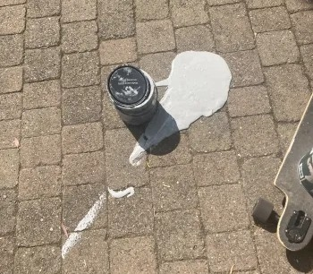

# Paint and Flamebar

Tech Crew owns a variety of paints and paint supplies which are stored in the [COSHH Cupboard](../03-storage/coshh/index.md).
<figure>

<figcaption>Paint in the wrong location, tragically.</figcaption>
</figure>
:::info
Please keep the COSHH cupboard tidy and organised according to the [COSHH Guidelines](../03-storage/coshh/index.md).
Please ensure that all paint is sealed so that it can be reused in the future, and wash any brushes etc. thoroughly.
:::

## Tech Crew Stock

The following paints are stocked by Tech Crew:
* **[Leyland Black Matt Emulsion Paint](https://www.diy.com/departments/leyland-trade-black-matt-emulsion-paint-5l/1335267_BQ.prd)**
  (5L) £6.00 per litre
* **[Leyland Pure Brilliant White Matt Emulsion Paint](https://www.diy.com/departments/leyland-pure-brilliant-white-matt-emulsion-paint-10l/1335443_BQ.prd)**
  (10L) - £2.00 per litre
* **[Flamebar PE6](https://www.flints.co.uk/products/pg_PE6/FLA015)** (5L) (Fabrics & synthetics) - £20.00 per litre
  (Heavy/medium fabrics: 4-6m² per litre, light-weight fabrics: 7-9m² per litre)
* **[Flamebar N5](https://www.flints.co.uk/products/pg_N5/FLA012)** (5L) (Wood & wood products) - £20.00 per litre
  (Wood: ~4-6m² per litre, paper: ~10m² per litre)

These are purchased on a by-usage basis by measuring the difference on weight of the paint container before and after
use. The cost is calculated by the litre, rounded up to the nearest 0.1L.

If these paints are not stocked in the COSHH cupboard, you can obtain these yourself and charge the cost to Tech Crew.
Please speak to the Exec for more information.

## Other Paints

Other paints may be available in the COSHH cupboard from previous shows and hires, however these are not guaranteed
to be available when it comes to your show.

If the COSHH cupboard contains your paint:
* If the paint container is unopened, Tech Crew will charge the B&Q price or Recommended Retail Price (RRP).
* If the paint container is open, you may use this free of charge.

We request that if you have used paint on a show, you leave this in the COSHH cupboard for future shows to use. Unopened
paint containers can likely be returned to the vendor depending on their return policy.

:::warning
When budgeting, it is best to assume that you will need to purchase paint for your show, even if it currently exists
in the cupboard. There is no guarantee that this paint will remain available as it could be used by another show or
thrown out during maintenance.
:::

## Non-Paint Painting Supplies
:::info
This section is incomplete. Please fill this out if you know more about the topic!
:::

Previously-used painting supplies can be reused free of charge providing that these are thoroughly washed after use.

If new painting supplies are required, Tech Crew will charge these on a case-by-case basis depending on their cost in
B&Q or RRP.
