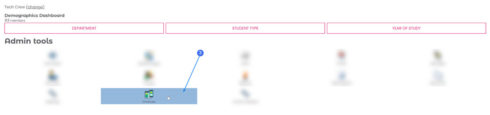

# Finance
As part of Warwick SU, Tech Crew has a society account and must follow all the
[SU regulations](https://www.warwicksu.com/societies-sports/exec-resources/finance/guidelines/). Sometimes finance
can get a little complicated - please don't hesitate to reach out to the Treasurer if you need any assistance.

## Money Request Forms (MRFs)

Money Request Forms are the way to request money from the society account. For most purchases, it is easiest to
first purchase the item using your own funds (ensuring to obtain and keep a receipt) and then 'request' this to be
paid bank in a bank transfer. Alternatively, the payee can be paid directly by the SU by entering their bank details in
the MRF instead.

:::info
Online MRFs are can take a while to be reimbursed - they must be approved by the Treasurer, Societies
Coordinator (SU) and Finance Office (SU) before they are paid out, so can sometimes take up to two weeks before they
arrive in your account. Large purchases above £2k also need to go through Manager approval.
:::

### Submitting an MRF

:::info
Requesting money back from a show (e.g. for set/stage)? Generally, these MRFs should be made to the society behind the show, and not Tech
Crew, otherwise these may be rejected by the SU. If you are not a member of the society, you can ask the producer to submit an MRF on your
behalf - just sent them the documents to submit and your bank details!
:::

There are two ways to submit an MRF: online, or through a
[physical form](https://www.warwicksu.com/societies-sports/exec-resources/finance/financeforms/). Generally, the
physical form is only used  for larger purchases which require the use of the SU credit card. These instructions will
cover submitting an MRF online.

1. Log in to the [Warwick SU](https://www.warwicksu.com) website, click on your initials in the top right, click on
   *Tech Crew* then click on *Finances*. Alternatively, go straight to
    [https://www.warwicksu.com/sgf/4251/Home/Dashboard](https://www.warwicksu.com/sgf/4251/Home/Dashboard).
   
2. Click *New Money Request*.
   
3. Fill in the form with the details of the payment. This should include:
   1. **Request Type**: Reimbursement
   2. **Payable to**: Who is being reimbursed
   3. **Payment method**: Bank transfer
   4. **Bank Sort Code/Bank Account**: Payee bank details
   5. **Brief Description**: What the reimbursement is for
   6. **Justification**: A brief explanation of why the item/service was purchased
   7. **Gross Amount**: How much to reimburse
   8. **Account**: Which Tech Crew account to take the money from. Please ask the Treasurer if you are unsure.
   9. **Upload Receipt**: Upload a receipt that proves the purchase. This can also be an invoice, as long as it clearly
      says it has been paid. Otherwise, you can also upload a screenshot of a bank statement showing the transaction.
      **Note:** you must click *Upload* to actually upload the image.
4. Click on *Create*, **and then make sure to click *Submit*** to send your MRF to the Treasurer for approval.
5. Notify the Treasurer that you have submitted the MRF.

### Claiming Mileage

Mileage can be claimed for Tech Crew events at a rate of **27p per mile**. This can be claimed by filling in the
[Mileage Form](https://www.warwicksu.com/societies-sports/exec-resources/finance/financeforms/) and submitting this
within an MRF as the 'receipt'.

### Claiming Time/Work

In some rare cases, you may be able to claim for time worked during a hire. This is generally only for a larger hires
with the University itself, and will be clearly stated beforehand. This can be claimed by filling in the
[Payments to Other Students Form](https://www.warwicksu.com/societies-sports/exec-resources/finance/financeforms/)
and then emailing this to exec@warwicktechcrew.co.uk, stating the hire, hours worked and amount to be paid. This
email can then be printed and used as the receipt in an MRF.

### More Urgent Payments

If you need to make a payment urgently and cannot pay for it yourself first, please contact the Treasurer and they can
arrange for the SU to pay the payee directly using the SU credit card or a same-day bank transfer. This can typically
incur a small cost to the society, so should be avoided where possible.

## Public Liability Insurance (PLI)

Tech Crew is covered under Warwick SU's public liability insurance, which protects us against claims made by 
third parties (i.e., members of the public). While PLI is not a legal requirement, many third parties we work 
with request proof of our coverage, so it's good to be aware that we're protected through the SU!

## Budgets and Transparency

As of 2024, Tech Crew is aiming to be more transparent with its finances to its members. At the start of the academic
year, the Treasurer will request exec members to submit a spending plan for the year for each of their roles before
allocating budgets. This (alongside with general information about Tech Crew finances) can be shared with any
Tech Crew member upon request - please just DM or speak to the Treasurer.

