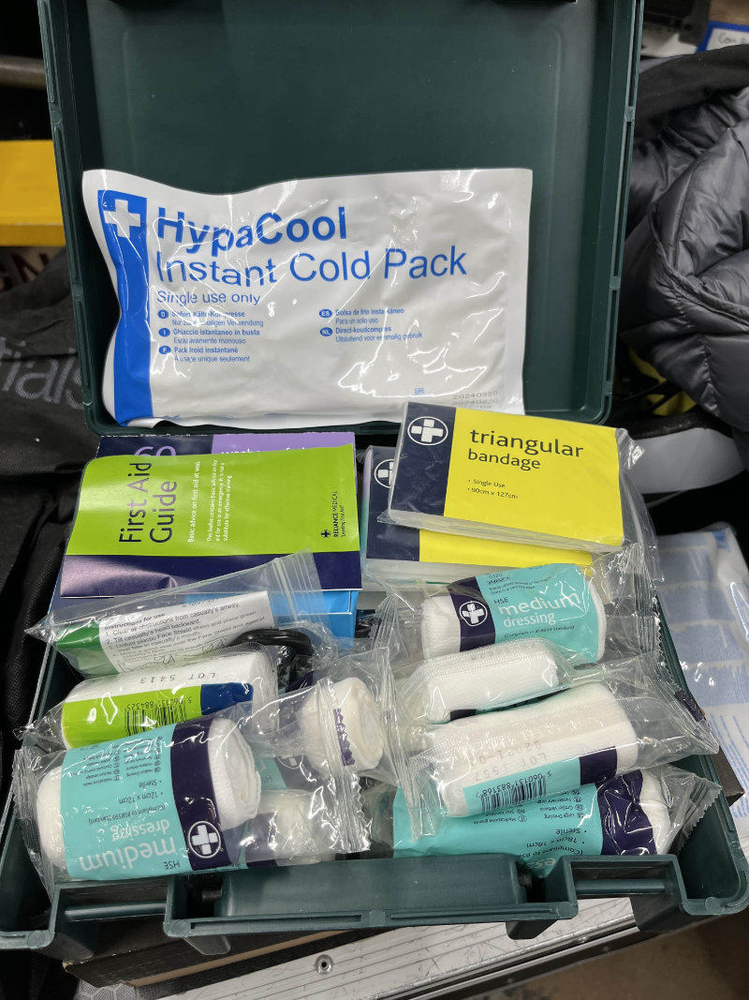
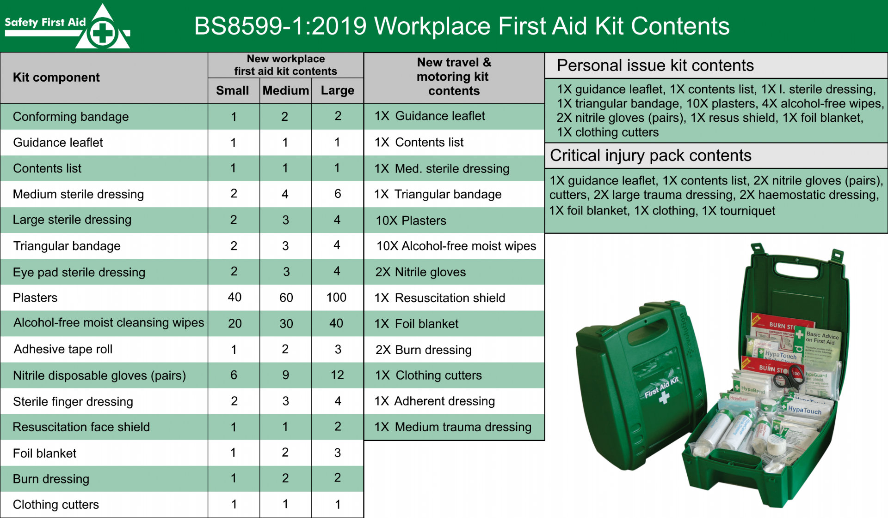

# First Aid

:::danger

If you are in urgent need of first aid, stop reading this wiki page and call for help immediately:

- In the Warwick Arts Centre, find a WAC staff member to request help via radio.
- On the University of Warwick campus, call 24/7 Community Safety at 024 7652 2222.
- Otherwise, call 999 for emergencies or 111 for non-emergencies.

:::

:::warning

This is not official medical advice and has been written by other Tech Crew members. Please consult resources such as
the [Health and Safety Executive](https://www.hse.gov.uk/simple-health-safety/firstaid/index.htm) and
[St John Ambulance](https://www.sja.org.uk/get-advice/) for more information.

:::

First Aid is defined as the first and immediate assistance given to an injured person before professional help arrives.
Note that first aid:

- Is **not** a substitute for professional medical advice, diagnosis or treatment.
- May only help to prevent a condition from worsening before professional help arrives.

When administering first aid, it is vital that you stay calm and primarily keep yourself safe before helping others -
otherwise you may make the situation worse.

## First Aid Kits

Tech Crew owns two first aid kits, which are stored in the safety boxes in the DC Cupboard. It is recommended that these
are brought to every major event, especially those outdoors.

:::note

Tech Crew's first aid kits are there to be used - they are consumables and a piece of equipment, not a prop. There is
nothing wrong with using them, even if it's just for a plaster or to remove a splinter, or opening one up to inspect
what's inside. We just ask that if you use something, please a member of the Tech Crew Exec know so that it can be
refilled for someone else.

:::

Tech Crew first aid kits are [BS 8599-1:2019](https://www.safetyfirstaid.co.uk/british-standard-first-aid-kit-contents/)
medium-quantity compliant, meaning they should contain the following:

- 1x guidance leaflet
- 1x contents list
- 4x medium sterile dressing
- 3x large sterile dressing
- 3x triangular bandage
- 3x eye pad sterile dressing
- 60x sterile adhesive dressings
- 30x alcohol-free moist cleaning wipes
- 2x adhesive tape roll
- 9x pairs of nitrile disposable clothes
- 3x finger sterile dressing
- 1x resuscitation face shield with one-way valve
- 2x foil blanket
- 2x burns dressing
- 1x shears/clothing cutters
- 2x conforming bandage

In addition, for our specific working environments, Tech Crew first aid kits should contain:

- 1x plastic forceps
- 1x instant ice pack
- 2x pairs of earplugs

Note that as these first aid kits are used, the quantities of the above items may vary. However, there should always be
at least one of each item in each kit (enough to reasonably treat any injuries during the event).

## A Brief Note on BS 8599-1:2019

BS8599-1:2019 is the British Standard for the contents of UK workplace first aid kits, which defines the minimum
contents of first aid kits for workplaces depending on their size and risk level. While this is
[not a legal requirement](https://www.hse.gov.uk/simple-health-safety/firstaid/what-to-put-in-your-first-aid-kit.htm),
it is a good baseline to work from.

<figure>

<figcaption>BS 8599-1:2019 Standard, reproduced by Safety First Aid</figcaption>
</figure>

For some reason, somebody thought it would be smart to charge
[£134.00 for an official, digital copy of the BS 8599-1:2019 standard](https://knowledge.bsigroup.com/products/workplace-first-aid-kits-specification-for-the-contents-of-workplace-first-aid-kits-1?version=standard&tab=overview).
Personally, I think that's stupid and is putting a high financial barrier on something that should be freely available
to everyone to keep everyone safe. If you want to view this specification, you can find it at the following places for
free:

- If a member of the University of Warwick, through The Library's
  [proxy service](https://warwick.ac.uk/services/library/find-resources/e-access/british-standards-online) ( note that
  the main institutional login to British Standards Online doesn't seem to work).
- Reproduced on websites such as
  [Safety First Aid](https://www.safetyfirstaid.co.uk/british-standard-first-aid-kit-contents/) and
  [Gompels](https://www.gompels.co.uk/what-is-bs-8599-1.html).
