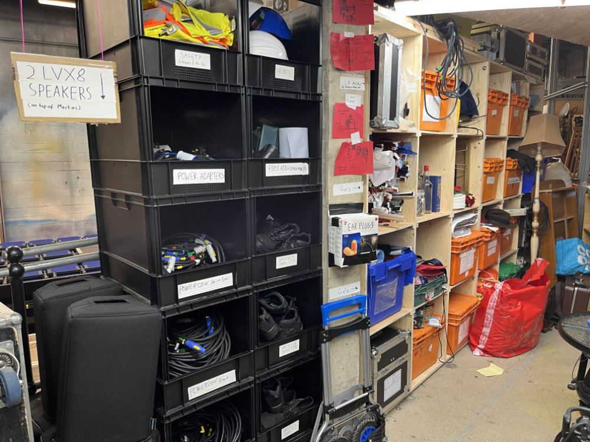
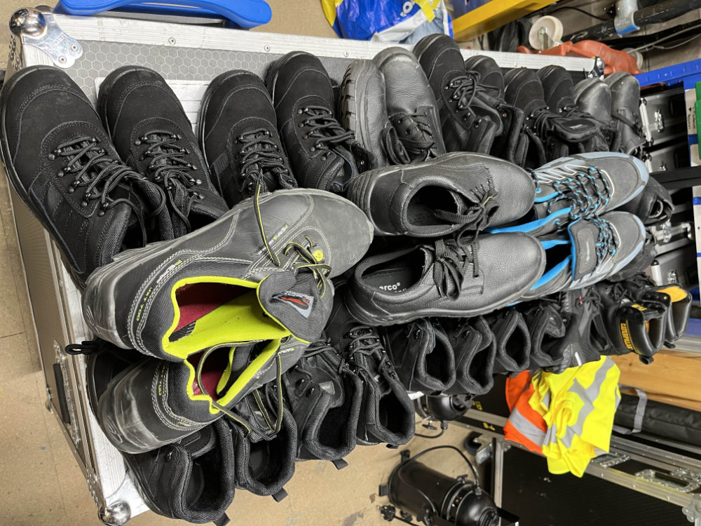
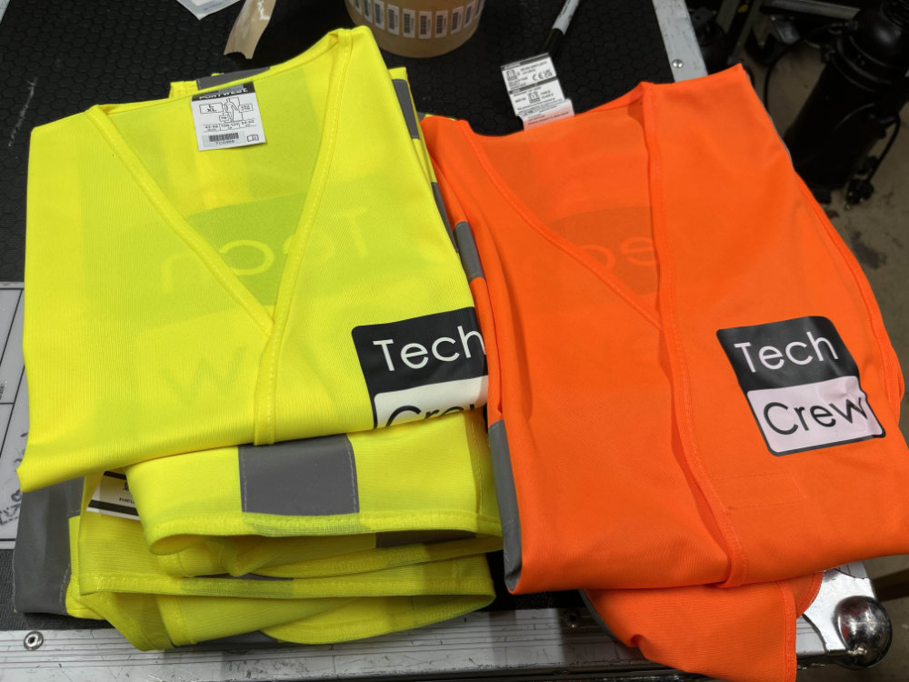
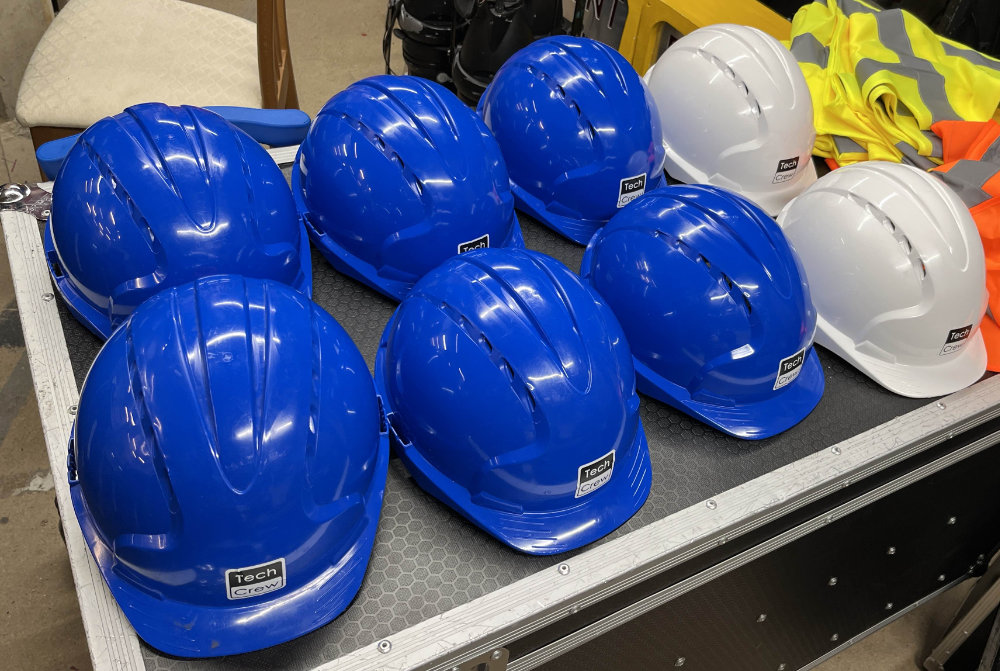
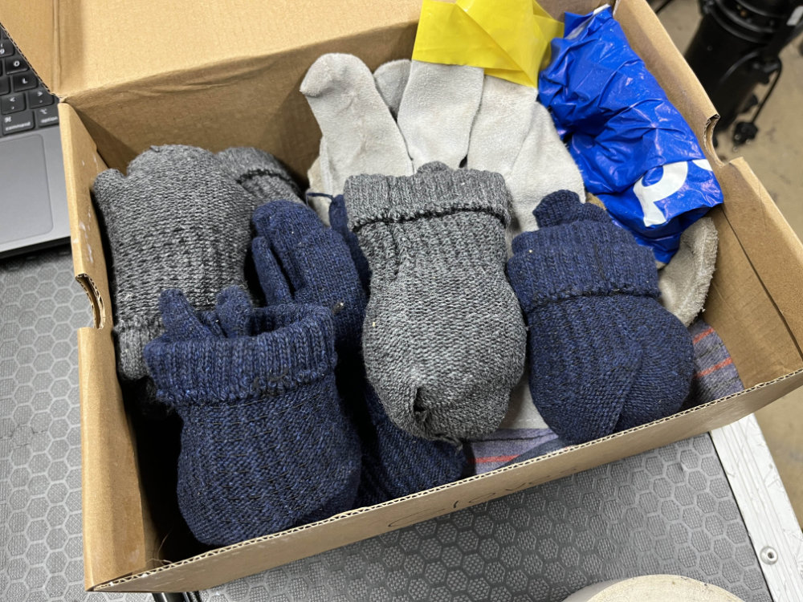
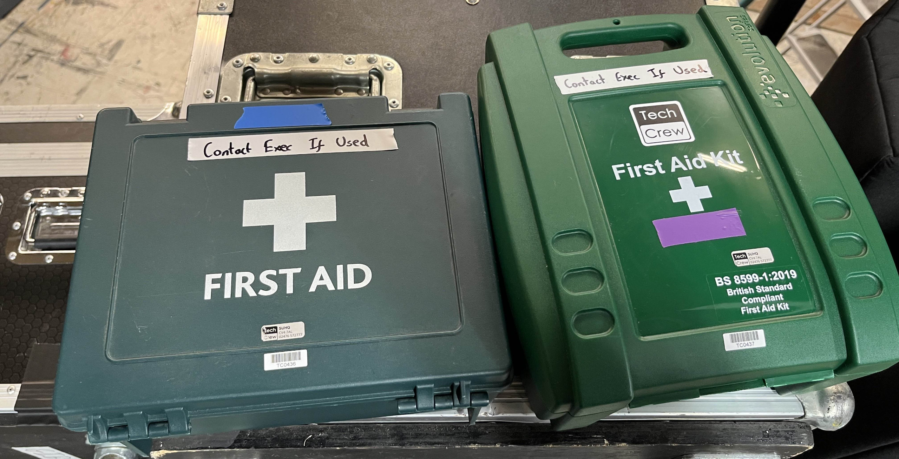
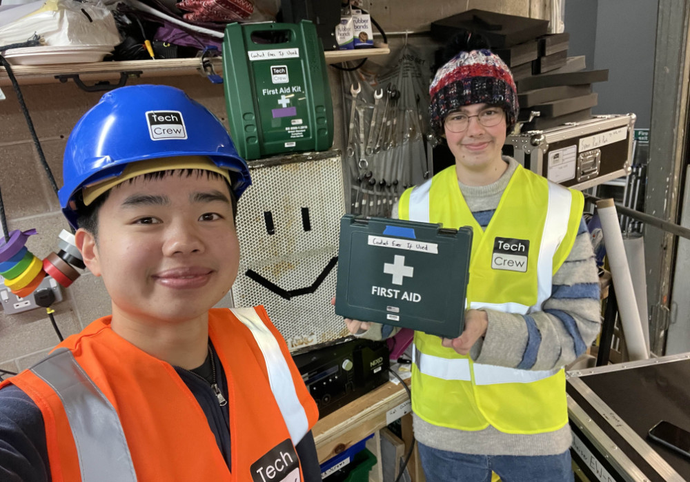
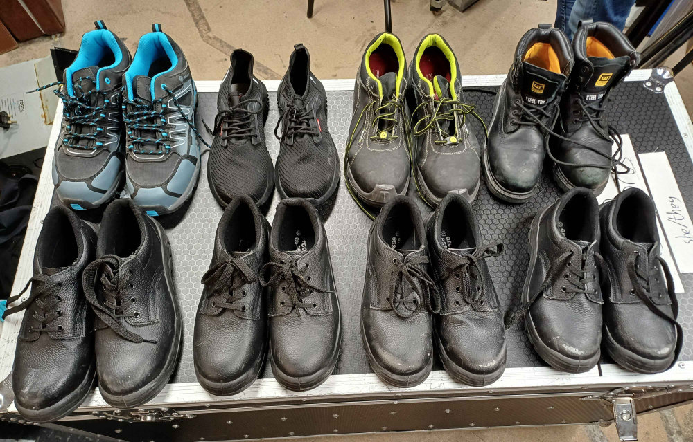

# Safety

Technical theatre and event production can be dangerous and potentially life-threatening if done wrong. However, it is
for this reason that the industry has a strong focus on safety. It's important to be aware of the risks and how to
mitigate them, to keep both yourself and others safe.

:::info
Safety is **everyone's** responsibility, not just (for example) the Technical Officer, Stage Manager or Tech Crew Exec.
If you have a safety concern or see something potentially dangerous, please speak up and report it to those involved,
the Tech Crew Exec or the SU.
:::

:::warning
This is not official advice and has been written by other Tech Crew members.
:::

## Safety During Tech Crew Events

* When working in the Warwick Arts Centre, Tech Crew members are covered under the WAC insurance and are expected to
  follow the guidance of WAC staff/the duty technician.
* Outdoor events can be more dangerous than WAC shows due to the lack of a controlled environment and professional staff
  to supervise. It is important to be more vigilant and aware of any risks, including through the use of risk
  assessments.

## Safety Roles

Tech Crew has several student roles that are responsible for overseeing safety. Please note, however, that these roles
do not
require any formal qualifications or training and are more about having a point of contact and someone to ensure that
things are safe than being a professional who is liable for any injuries.

* The **Technical Manager** of a show or hire is responsible for creating a risk assessment and ensuring that it is
  adhered to.
* The **Stage Manager** of a show is responsible for ensuring the stage is safe, especially for any cast.
* The **Safety Officer** is a non-elected role of the [Tech Crew Exec](../02-democracy/01-exec.md) that is responsible
  for
  being a point of contact for safety within the society and ensuring the society's activities are as safe as possible.

## Personal Protective Equipment (PPE)

Tech Crew has recently invested in several pieces of PPE that Tech Crew members are free to use. As with all Tech Crew
equipment, please ensure that these are treated with respect and returned so that others may also use them.

All PPE is stored in the black safety boxes in the DC cupboard.

### Safety Shoes

There are three boxes of safety shoes, categorised as sizes 5-6, 7-8 and 9-12. We have the following stock:
| Size | Quantity | TC Member Size Count (Term 1 2024 Census) |
| ---- | -------- | ----------------------------------------- |
| 4 | 0 | 1 |
| 5 | 2 | 7 |
| 6 | 3 | 9 |
| 7 | 4 | 10 |
| 8 | 3 | 8 |
| 9 | 2 | 4 |
| 10 | 2 | 2 |
| 11 | 0 | 0 |
| 12 | 2 | 0 |

Whilst everyone is welcome to use these shoes, please leave your own shoes in the cupboard when using them and please
return them after the event has finished, or at the end of the day. They can be used both indoors and outdoors.

Our most common type of safety shoe is
the [Portwest FT63 Steelite Trouper Safety Trainer Boot S1P](https://www.safetecdirect.co.uk/products/ft63bkr/portwest-ft63-steelite-trouper-safety-trainer-boot-s1p)
which has a [EN ISO 20345:2011 rating of S1P](https://www.xamax.co.uk/blog/safety-footwear-ratings.html#S1P). This means
that they:

* Can withstand 200J of impact on the toe (equivalent to a 20kg weight dropped from 1m)
* Can withstand 15kN of compression on the toe (1500kg)
* Is anti-static and is resistant to fuel oil
* Have a shock-absorbing heel
* Have under-foot penetration protection

### Hi-Vis Vests

Tech Crew has eight
branded [Portwest C470](https://www.safetecdirect.co.uk/products/hvw/portwest-c470-yellow-adjustable-hi-vis-vest) hi-vis
vests:

* 3x yellow S/M vests
* 3x yellow L/XL vests
* 1x orange S/M vest
* 1x orange L/XL vest

If we ever buy more vests, probably go for a much smaller logo on both sides.

### Hard Hats

Tech Crew has eight Tech
Crew-branded [JSP EVO3 Wheel Ratchet](https://www.safetecdirect.co.uk/products/evo3wheel/jsp-evo3-safety-helmet-vented-wheel-ratchet-mid-peak)
hard hats - two blue and six white. These are different colours so that they can
be used to differentiate between different roles (such as the Technical Managers or designers having a white helmet).

Generally, in the UK, white helmets are seen as for supervisors (e.g. Technical Managers) and blue helmets are seen as
for technical operators. However, this
apparently [changed in 2017](https://www.totalworkwear.co.uk/blog/hard-hat-colour-coding.html) to white being for site
managers, and blue for anyone who shouldn't be left unsupervised. Ultimately, it doesn't really matter.

In general, hard hats should be used when there is a risk of hitting your head or the risk of falling objects. This
should particularly be used when working at height (or footing a ladder) on outdoor stages, or could be used when
working in the bridges in the WAC studio.

:::warning
There are also two yellow hard hats which are marked as not rated. Do not use these for actual safety purposes, they
should only be used for props.
:::

### Gloves

Tech Crew has a number of gloves which are stored in a shoebox next to the hi-vis vests. These include:

* 7 pairs of wooly gloves (useful for outdoor events)
* 5 right-handed thermal gloves (useful for handling hot lights, such as when follow spotting using a profile)
* 1 left-handed thermal glove (same as above)

Do not question why we have 5 right-handed thermal gloves and only 1 left-handed one.

We also stock a number of disposable nitrile gloves, which can be used e.g. when painting or doing other messy tasks.
There's both a box of these in the black safety boxes, and a few pairs in each first aid kit.

## Risk Assessments

Todo

## First Aid

More information about first aid, including our first aid kits, can be found on the [First Aid](./first-aid.md) page.

## History and Lore

Tech Crew used to have a much more limited number of safety equipment, limited to a several pairs of donated safety
shoes. However, with the society growing to do more and more outdoor events, and as we had more and more issues of not
having enough safety shoes during get-ins, the exec decided to invest in more safety equipment in early 2025.

It is hoped that this will allow Tech Crew members to be safer and more comfortable when working on events, and that
this trend will continue into the future.

<figure class="img-small">

<figcaption>The old collection of safety shoes</figcaption>
</figure>