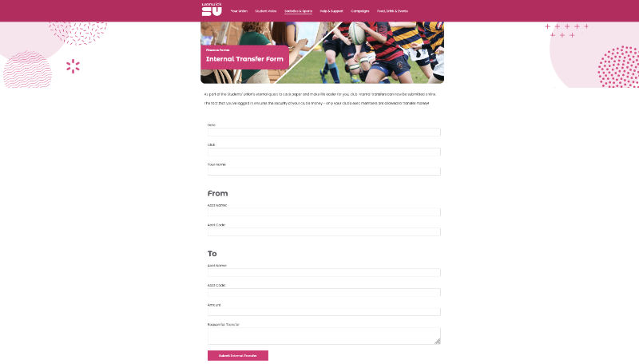

# Internal Transfers

Internal transfers are used to transfer money within Warwick SU society accounts - if you work with Tech Crew on an
event, you will likely be asked to submit an **Internal Transfer Form** for payment.

This is an
[online form](https://www.warwicksu.com/societies-sports/exec-resources/finance/financeforms/internaltransfer/) on the
SU's website, which is processed by the societies coordinators and the finance department monthly.

## Submitting an Internal Transfer Form
<figure>

<figcaption>The Warwick SU Internal Transfer Form</figcaption>
</figure>

1. Go to https://www.warwicksu.com/societies-sports/exec-resources/finance/financeforms/internaltransfer/ on the
   Warwick SU website.
2. Fill in the respective fields, using your account details and the account details provided by Tech Crew
   * Your account details can be obtained using the instructions below.
   * Tech Crew's account details can be found on the bottom of your invoice, or obtained by emailing
     exec@warwicktechcrew.co.uk.
3. Click **Submit Internal Transfer**, and wait for the SU to process the submission.
   * If you are making payment for a Tech Crew invoice, please email exec@warwicktechcrew.co.uk at this point so we can
     track this internally and follow up with the SU if delayed.

## Finding Society Account Details
<figure>

<figcaption>The Warwick SU Finance Dashboard</figcaption>
</figure>

Society account numbers can be found on the [SU Finance Portal](https://finance.warwicksu.com/students/login.aspx),
which is linked at the bottom of the Warwick SU website under **Club & Society Finance Tools**.

If you don't have your society/sports club username and password, this can be requested from the SU
reception/finance office or by emailing studentactivities@warwicksu.com.

On this page, you can find the following for each account:
* **Account Number**: the number on the account. These typically start with `1` for income accounts and `4` for
  outcome accounts.
* **Cost Code:** your society/sports club cost code
* **Department:** `X01` for a society or sports club
* **Account Name:** the name of the account
* **Total:** the value of the account. Note that these are 'inverted' (negative for income, or positive for outcome)

When submitting an Internal Transfer Form, you will need to provide the account number, cost code and department.