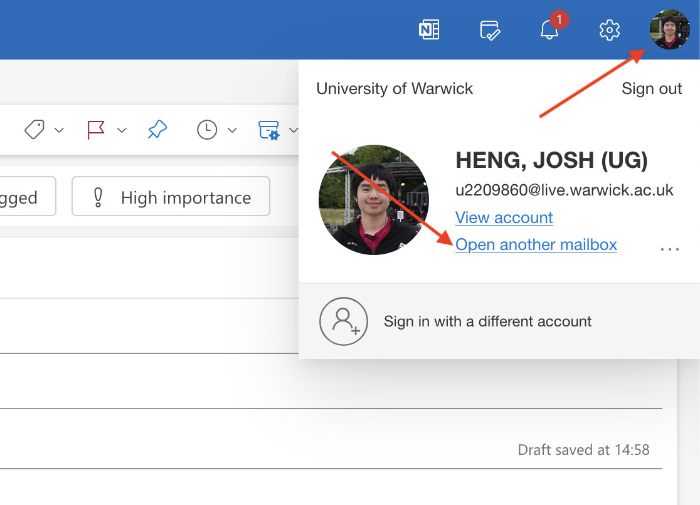
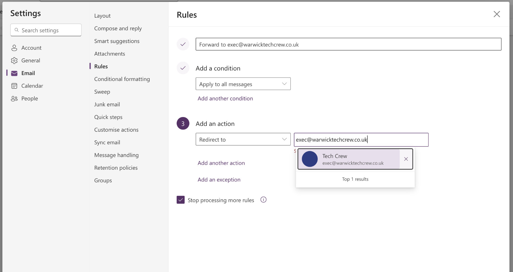

# Microsoft 365 Resource Accounts

Resource accounts are Microsoft 365 accounts used to represent a shared resource, such as group or society. They can be
accessed by multiple users using their own accounts and can be used to send and receive emails.

Tech Crew owns the resource account `warwicktechcrew@warwick.ac.uk`. Using this resource account over the main email
means the email will show up as being sent from the University of Warwick:

- There will be no _External_ tag on the email preview from a University of Warwick mailbox.
- There will not be a warning about the email being sent from an external source.
- This email is an `.ac.uk` address and so can be used to sign up for services that require an education email.

## Accessing Resource Accounts

:::info
To be able to access a resource account you must have been granted Full Access and Send As permissions by the
resource owner/IT Services.
:::

1. Login to your personal University of Warwick email account at https://outlook.office.com/mail/
2. Click on your profile icon in the top right corner and select _Open another mailbox_
   
3. Enter the email address of the resource account you want to access (e.g. `warwicktechcrew@warwick.ac.uk`) and click
   _Open_.

If you have access to this mailbox, it will open in a new tab. Otherwise, you will see an error message.

:::tip
You can also directly access a mailbox by going to `https://outlook.office.com/mail/[email-address]` (e.g.
https://outlook.office.com/mail/warwicktechcrew@warwick.ac.uk).
:::

## Resource Account Forwarding

In order to easily see emails which are sent to the resource account, it is possible to set up mail
forwarding/redirection to an alternative email address:

1. Login to the resource account using the steps above.
2. Click on the settings cog in the top right corner and go to _Email_ -> _Rules_.
3. Create a new rule with a condition of _Apply to all messages_ and an action of _Forward to_ or _Redirect to_.
   
   - _Forward to_ will forward the email like you would do manually, so it will appear to originate from the resource
     account address.
   - _Redirect to_ will redirect the email with it appearing to originate from the original sender address.

:::info The `warwicktechcrew` resource account already has this setup to `exec@warwicktechcrew.co.uk`. :::

## Administrating Resource Accounts

Resource accounts have an **owner**, (optionally) a **secondary owner** and additional accounts with **Full Access/Send
As** permissions. These can be changed by contacting the
[Warwick IT Helpdesk](https://warwick.service-now.com/sp?id=sc_category&sys_id=2835b6731b09dd10b566db5be54bcb27) (note -
many of the forms here are only available to Staff/PGR).

Whilst anyone can be added to a mailbox, you may need to be Staff/PGR to be made an owner and to manage the mailbox
through the service desk.

- [Change Owner of Resource Account Form](https://warwick.service-now.com/sp?id=sc_cat_item&sys_id=32318e5bdb34ebc414eb49ee3b9619cc&sysparm_category=2835b6731b09dd10b566db5be54bcb27&catalog_id=-1)
- [Add/Remove Full Access/Send As Permissions Form](https://warwick.service-now.com/sp?id=sc_cat_item&sys_id=28f6d95fdbfcabc414eb49ee3b961954&sysparm_category=2835b6731b09dd10b566db5be54bcb27&catalog_id=-1)
