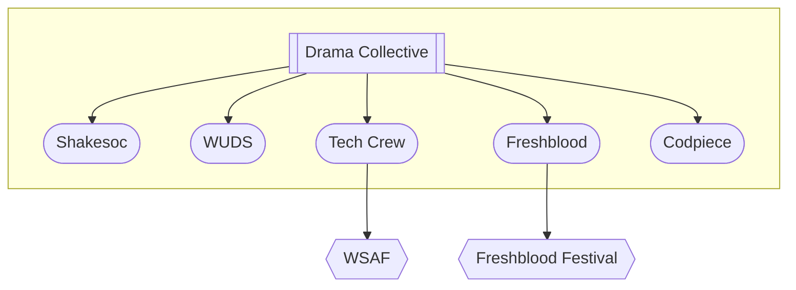

# The Drama Collective (DC)

The [DC is a society](https://www.warwicksu.com/societies-sports/societies/dramacollective/) that was formed to be a larger negotiating body for its consitutent societies.
For example:

- [WAC allocates 2 show slots](../warwick-drama/shows#wac-show-slots) to the DC each term. Without the DC, none of the constituent societies would have the resources to put on 2 shows a term themselves. The DC production manager runs a panel for each of these slots. Show teams can submit packs to DC panel, once they get backing from one of the DC societies.
- The DC also provide "cupboard manager" exec roles to organise and upkeep its two storage locations, the [DC cupboard](../tech-crew/storage#the-dc-cupboard) in WAC, and the [Avon cupboard](../tech-crew/storage#the-avon-cupboard).
- The DC has a [constitution](https://www.warwicksu.com/resources/dramacollective/Drama-Collective-Constitution-updated-2023/) that all its societies are meant to follow.

:::info

If you have tech crew membership, you are automatically a member of the DC! (Or if you have membership of any of its other child societies)

:::

## [Codpiece](https://www.warwicksu.com/societies-sports/societies/codpiecetheatre/)

Codpiece is the "devised theatre" society at Warwick. Devised theatre is when the script originates not from a writer, but from collaborative, often improvisatory, work by the performers themselves.

## [Shakesoc](https://www.warwicksu.com/societies-sports/societies/shakespeare/)

Shakespear society joined the DC in the academic year 22/23, through an AGM motion in the DC Annual General Meeting.

## [WUDS](https://www.warwicksu.com/societies-sports/societies/wuds/)

Warwick University Drama Society focusses on performing established published plays.

## [Freshblood](https://www.warwicksu.com/societies-sports/societies/freshbloodtheatre/)

Freshblood new writing specialise in performing student written shows. They run Freshblood Festival, showcasing short student-written plays. They also run FreshFund, to provide support to new scripts and bring warwick written shows to life.

## [Tech Crew](https://www.warwicksu.com/societies-sports/societies/techcrew/)

Tech crew has a [wiki](../) you should check out :D
