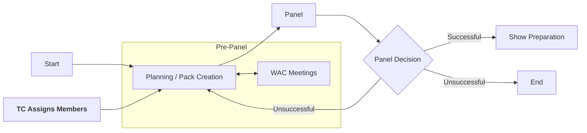

# Pack & Panel

Pack and panel are the first stages of a show at Warwick Drama, consisting of creating a proposal to put on a
production. Generally, most of the tech team will be allocated at this stage, allowing designers to be involved from
the very start and allowing them to give a realistic idea of the tech and its budget to the production team.

:::info
**Pre-Panel Responsibilities**:
* **🧑‍💼 Technical Manager**: Liaise with the WAC and tech team to organise meetings and help the tech team where
  required.
* **💡🎤🎨 Designers**: Design the show and contribute to the pack.
* **📃 Producer**: Add the tech team to relevant groups and chats (we recommend [Discord](https://discord.com/)) and
  discuss the show with the tech team, including budget limitations.
* **🎬 Director**: Discuss with the tech team about the show and your vision.
:::

## Pack
The **pack** is the document that the production team creates to bid for the slot. This is then sent to the respective
society's Production Manager before panel, who will distribute this amongst all panel members to read through.

:::warning
Whilst packs are not strictly confidential, it is considered good practice and etiquette to not share these outside of
the show team unless necessary - especially before panel. There can often be several shows competing for the same slot,
so giving one show team knowledge of another team's pack can give them an unfair advantage.
:::

## Panel
During panel, the production team will present their pack to the panel members - this generally consists of a
presentation followed by a Q&A. The room can sometimes be very crowded, as often most of the production and tech team
will be there in addition to the panelists themselves!

In the DC (although other societies are similar), panel members consist of 5 experienced members of the Warwick Drama
Community, the WAC Technical Director, a representative of Tech Crew and the Diversity and Outreach Officer, Secretary
and Productions Manager of the DC. The exact process and requirements of each panel can be found in each society's
[constitution](https://www.warwicksu.com/resources/dramacollective/Drama-Collective-Constitution-updated-2023/).

After panel, there can be three outcomes (which are emailed to the Producer):
* **Unsuccessful**: The show was not accepted. In some cases the show can re-apply for the same or a different slot, 
  or otherwise the show process can end here (e.g. if there were competing shows).
* **Successful with conditions**: The show was accepted, but with some conditions that need to be met before the show 
  can go ahead.
* **Successful**: The show was accepted and can go ahead as planned.

:::info
**Post-Panel Responsibilities**:
* **📃 Producer**: Let the tech team and Tech Crew Exec know the outcome and any feedback from panel ASAP.
:::

## Meetings and Communication

:::info
**Meeting Responsibilities**:
* **🧑‍💼 Technical Manager**: Collect availability and organise the meetings.
* **💡🎤🎨 Designers**: Attend the meetings and share and discuss your ideas.
* **📃 Producer**: Attend the meetings to clarify any production or admin questions.
* **🎬 Director**: Attend the meetings to clarify any directorial questions.
* **?? Musical Director**: Attend the meetings to clarify any musical questions.
  :::

### Internal Meetings

After the team is assigned, it is important to have an initial meeting to introduce everyone and discuss the show.
This should include all the HoDs for tech and production (including directors and MDs), where everyone can talk
about their initial ideas and formulate some additional ideas.

During these meetings, you should:
* Formulate and discuss ideas for the show
* Ask Tech Crew to obtain a quote

### WAC Meetings

Throughout the process, it is important to regularly get in contact with our technical representatives at the
Warwick Arts Centre as they have a wealth of experience.
If they don't know the answer, they'll know who to forward it to. They can be contacted via email, however it is often
better to schedule regular meetings with them.

During these meetings, you should:
* Give the WAC a general overview of the ideas and designs
Talk with the WAC to obtain an equipment quote
* Talk with the WAC carpenter about set design to obtain a set quote
* Formulate a budget, including WAC-sourced equipment, TC-sourced equipment and externally-sourced
  equipment.
* Discuss seating capacity and layout
* Discuss any safety concerns

## Budget
:::info
**Budget Responsibilities**:
* **🧑‍💼 Technical Manager**: Oversee the technical budget.
* **💡🎤🎨 Designers**: Obtain quotes and fill in costs for your department.
* **📃 Producer**: Oversee the whole show budget.
:::

The budget is a key part to the pack and should be overseen by the Technical Manager in combination with the
producer(s). This should loosely stay the same for the entire production period.

In general, a budget should be formulated as follows:
1. The TM should ask the designers what they would want in an ideal world. These prices should be obtained
   from quotes from the WAC/TC and external suppliers.
2. The TM should discuss this budget with the producer(s), and go back to the designers with what is possible.
3. Throughout the process, the TM should lease with producers and designers to ensure that everyone is happy with the
   budget.

A few tips for budgeting include:
* Make sure to include the Working with Tech Crew charge, which covers consumables etc. This is £40 for a show.
* Make sure to include a contingency of 10/20% for every department.
* Quotes are preferable to estimates, and should be aimed for when the pack goes to panel.
* The break-even point refers to the percentage of seats that need to be sold to make a profit. This should often be
  around 65% for the entire show.
* [Tech Crew Co-Productions](../../01-tech-crew/06-finance/02-coproductions/index.md) are available to provide partial
  funding for a unique technical vision. However, these do not change your overall budget or break-even - TC expects
  this money back, whilst accepting partial responsibility for any loss/profit.
