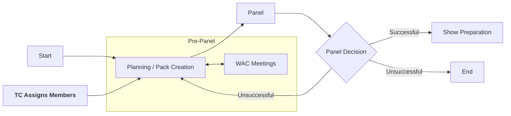

# Pack & Panel

Pack and panel are the first stages of a show at Warwick Drama, consisting of creating a proposal to put on a
production. Generally, most of the tech team will be allocated at this stage, allowing designers to be involved from
the very start and allowing them to give a realistic idea of the tech and its budget to the production team.

:::info
**Pre-Panel Responsibilities**:
* **🧑‍💼 Technical Manager**: Liaise with the WAC and tech team to organise meetings and help the tech team where
  required.
* **💡🎤🎨 Designers**: Design the show and contribute to the pack.
* **📃 Producer**: Add the tech team to relevant groups and chats (we recommend [Discord](https://discord.com/)) and
  discuss the show with the tech team, including budget limitations.
* **🎬 Director**: Discuss with the tech team about the show and your vision.
:::

## Pack
The **pack** is the document that the production team creates to bid for the slot. This is then sent to the respective
society's Production Manager before panel, who will distribute this amongst all panel members to read through.

:::warning
Whilst packs are not strictly confidential, it is considered good practice and etiquette to not share these outside of
the show team unless necessary - especially before panel. There can often be several shows competing for the same slot,
so giving one show team knowledge of another team's pack can give them an unfair advantage.
:::

## Panel
During panel, the production team will present their pack to the panel members - this generally consists of a
presentation followed by a Q&A. The room can sometimes be very crowded, as often most of the production and tech team
will be there in addition to the panelists themselves!

In the DC (although other societies are similar), panel members consist of 5 experienced members of the Warwick Drama
Community, the WAC Technical Director, a representative of Tech Crew and the Diversity and Outreach Officer, Secretary
and Productions Manager of the DC. The exact process and requirements of each panel can be found in each society's
[constitution](https://www.warwicksu.com/resources/dramacollective/Drama-Collective-Constitution-updated-2023/).

After panel, there can be three outcomes (which are emailed to the Producer):
* **Unsuccessful**: The show was not accepted. In some cases the show can re-apply for the same or a different slot, 
  or otherwise the show process can end here (e.g. if there were competing shows).
* **Successful with conditions**: The show was accepted, but with some conditions that need to be met before the show 
  can go ahead.
* **Successful**: The show was accepted and can go ahead as planned.

:::info
**Post-Panel Responsibilities**:
* **📃 Producer**: Let the tech team and Tech Crew Exec know the outcome and any feedback from panel ASAP.
:::

## WAC Meetings and Communication

Throughout the process, it is important to regularly get in contact with our technical representatives at the
Warwick Arts Centre as they have a wealth of experience.
If they don't know the answer, they'll know who to forward it to. They can be contacted via email, however it is often better to schedule regular meetings with them.

:::info
**WAC Meeting Responsibilities**:
* **🧑‍💼 Technical Manager**: Collect availability and organise the meetings.
* **💡🎤🎨 Designers**: Attend the meetings and share and discuss your ideas.
* **🎬 Director**: Attend the meeting to clarify any questions.
:::