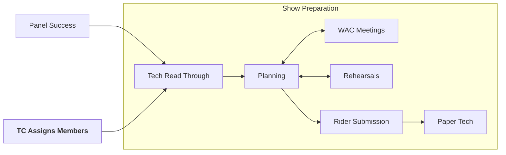

# Show Preparation

:::note
Resources:
* [Working with Tech Crew](https://drive.google.com/file/d/164x5gLOl5e7rA4bZLgeOUALD5Iwn-_PC/view?usp=sharing)
:::

Your show has been accepted - now what? It's now time to properly start preparing for the show...

## Tech Read-Through
This is the initial sit-down meeting between the production team and the tech. It involves going through the script
page by page, penciling in each place the prod team would like a cue. This will probably be the first time you get your
script, exiting! The meeting usually involves the designers and core prod team, so: LX designer, Sound designer,
Technical Manager, Producers, Director, and optionally: Music director, Video designer, DSM, etc.

## WAC Meetings and Communication
As mentioned [previously](panel), email Phil and Amanda at the Warwick Arts Centre to touch base about your thoughts on
design. They have a wealth of knowledge about past student shows, and will be more than happy to offer their 
knowledge & experience. 

## Rehearsals
As the show gets closer, you'll want to start attending rehearsals - this is generally useful for all roles, but is 
most important for the Deputy Stage Manager (DSM) so they understand the script well. This is a great way to get a feel 
for the show and what is suitable when. For the lighting department, this can also be useful to see the actor blocking.

Before show week, most tech members should have attended at least one full run-through.

## The Rider
The Rider is a document that is sent to the Arts Centre detailing all the technical requirements of the show. This 
should typically be sent 3-4 weeks in advance.

A rider should contain:
* Props list
* Set pieces and set drawings
* Lighting plot
* Sound input list
* Show week schedule
* Risk assessment
* Dressing room allocation

An example of a good rider from FAME can be found here:
[FAME Rider](https://drive.google.com/drive/folders/1VXT3K8aHHhs3Dm2CXeaUoXPVI5146VoZ?usp=drive_link).

## Paper Tech
The paper tech will normally take place on the weekend before show week, and is where the tech team runs through the
script telling the DSM where the designers want to be cued. The DSM will mark up their script in pencil for the first
time here.

:::warning
The paper tech and tech read-through are different things!
:::