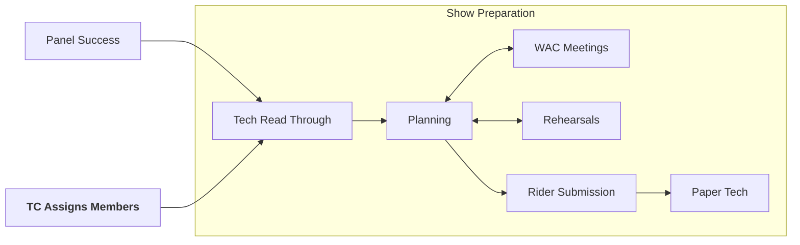

# Show Preparation

Your show has been accepted - now what? It's now time to properly start preparing for the show...

During this stage, Tech Crew may assign additional members to the show if necessary or if roles were not filled
pre-panel. These are often smaller non-designer or assistant roles such as Deputy Stage Manager (DSM), followspot 
operators and sound assistants (sound 2s).

## Staging type

The prod team will decide what staging they wish their play to be in.
Staging refers to where the audience are positioned relative to the performance area.
There are four main types of staging:

| Staging Type | Description |
|--------------|-------------|
| **End on**   | The most common type of staging, where the audience sit on one half of the room with the performers directly opposite. This is the only staging type we can do in the WAC theatre, and the most common to see in the studio. |
| **Traverse** | When audience are on two opposite sides of the stage (like a fashion runway/catwalk). |
| **Thrust**   | Where the audience sits on three sides of the stage, looking in. Often done in the studio by adding two rows of chairs on steeldeck either side of the stage, with the bleachers out. Be careful doing shows in the thrust! Attention should be paid to sightlines and the actors' blocking. |
| **Round**    | Where there is seating on all sides of the stage, with the audience looking in. |

## Tech Read-Through
This is the initial sit-down meeting between the production team and the tech. It involves going through the script
page by page, penciling in each place the prod team would like a cue. This will probably be the first time you get your
script, exiting! The meeting usually involves the designers and core prod team, so: LX designer, Sound designer,
Technical Manager, Producers, Director, and optionally: Music director, Video designer, DSM, etc.

:::info
**Tech Read-Through Responsibilities**:
* **🧑‍💼📃 TM/Producer**: Organise the tech read-through.
* **💡🎤🎨 Designers**: Attend the tech read-through.
* **📃 Producer**: Iron out any safety concerns with the TM/SM and bring printed scripts/libs.
* **🎬 Director**: Communicate the final, firm vision.
:::

## WAC Meetings and Communication

As mentioned [previously](panel), email the Warwick Arts Centre Technicians to touch base about your thoughts on design.
They have a wealth of knowledge about past student shows, and will be more than happy to offer their knowledge & experience.

:::info
**WAC Meeting Responsibilities**:
* **🧑‍💼 Technical Manager**: Collect availability and organise the meetings.
* **💡🎤🎨 Designers**: Attend the meetings and share and discuss your ideas.
* **🎬 Director**: Attend the meeting to clarify any questions.
  :::

## Rehearsals

As the show gets closer, you'll want to start attending rehearsals - this is generally useful for all roles, but is 
most important for the Deputy Stage Manager (DSM) so they understand the script well. This is a great way to get a feel 
for the show and what is suitable when. For the lighting department, this can also be useful to see the actor blocking.

Before show week, most tech members should have attended at least one full run-through.

### Sitzprobe

This is the first rehearsal where the band or orchestra perform with the actors.
It's highly encouraged that the sound designer attend this rehearsal!

:::info
**Rehearsal Responsibilities**:
* **🧑‍💼📃 TM**: Ensure open communication and that the team are completing what is required.
* **🤼 Stage Manager**: Attend as many rehearsals as possible when practising any fights, heights, falls or lifts. Make
  sure that cast know who you are. Source props if needed, with the help of the Producer and Director.
* **💡 Lighting Designer**: Consider attending rehearsals to see the blocking and get a feel for the show.
* **🎤 Sound Designer/MD**: Meet to talk over band requirements, and consider costumes if using mics.
* **🎨 Set Designer**: Consider attending rehearsals to see the blocking.
* **📗 Deputy Stage Manager**: Attend rehearsals to get a feel for the show and understand the script.
* **📃 Producer**: Make sure open communication is happening within the whole team and that cast know who the technical
  team is. Make sure that the tech team are included in any crew marketing releases and in the programme, if applicable.
* **🎬 Director**: Keep in contact with the designers, letting them know of changes as early as possible
:::

## The Rider
The Rider is a document that is sent to the Arts Centre detailing all the technical requirements of the show. This 
should typically be sent 3-4 weeks in advance.

A rider should contain:
* LX:
  * Lighting summary
  * Lighting plot
  * Fly plot (if applicable)
* Sound:
  * Sound input/channel list
  * Mic plot (if required)
  * Details about communications (i.e. cans)
* Set:
  * Set pieces and set drawings
* Stage:
  * Props list
  * Dressing room allocation
* Additionally:
  * Show week schedule
  * Risk assessment
  * Contact details for all key contacts

An example of a good rider from FAME can be found here:
[FAME Rider](https://drive.google.com/drive/folders/1VXT3K8aHHhs3Dm2CXeaUoXPVI5146VoZ?usp=drive_link).

:::info
**Rider Responsibilities**:
* **🧑‍💼📃 TM**: Oversee and assemble the rider as a whole.
* **💡🎤🎨 Designers**: Contribute towards your sections in the rider.
:::

## Paper Tech
The paper tech will normally take place on the weekend before show week, and is where the tech team runs through the
script telling the DSM where the designers want to be cued. Here, the DSM will mark up their script in pencil for the 
first time.

:::warning
The paper tech and tech read-through are different things!
:::

:::info
**Paper Tech Responsibilities**:
* **🧑‍💼📃 TM**: Organise the tech read-through.
* **💡🎤🎨 Designers**: Attend the paper tech and list all your cues.
* **📗 Deputy Stage Manager**: Annotate your script with all the cues.
* **🎬 Director**: Be on hand to answer any questions or address any last minute changes.
:::