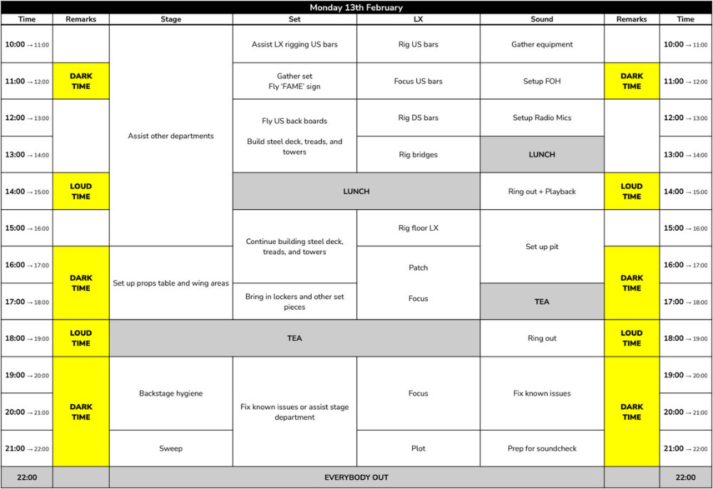
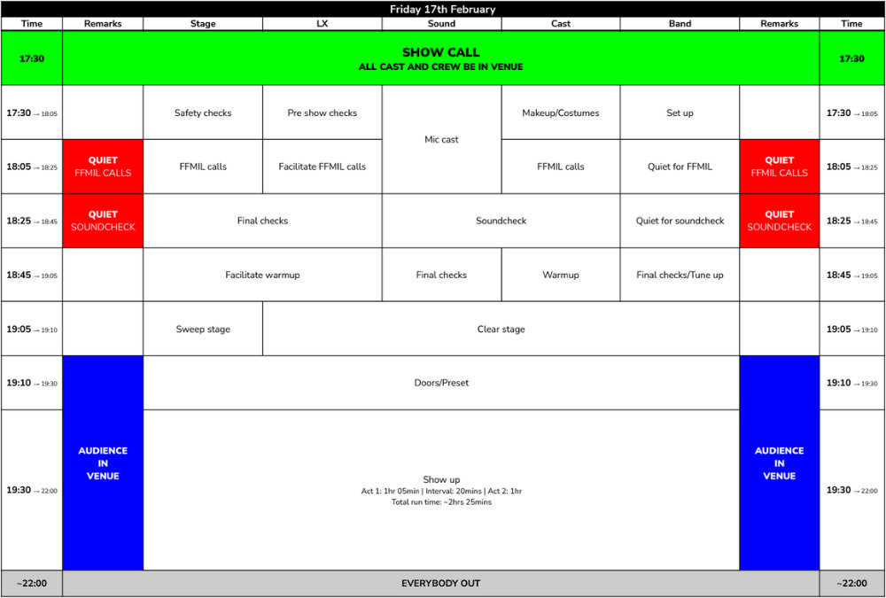

# Show Week

It's now the time everyone has been waiting for - show week! Whilst show week is often the most exciting and busiest
time of the process, make sure to still prioritise your own wellbeing and studies!

The show week schedule should be determined in advance and included in the Rider sent to the WAC. All members of the
show team, including cast, should also have a copy - and it's sometimes useful to have a few printed versions around
too! Whilst exact timings can sometimes change due to unforeseen circumstances, this should be avoided if possible.

:::warning

Whilst help is always appreciated, everyone helping with tech or working on the upper balconies or bridges **must** have
Tech Crew membership for insurance. This includes the Director and Producer, and the rest of the production team. Please
speak to the Technical Manager or Tech Crew Exec if you have any questions.

:::

## Get-in

On a typical schedule, the Get-in will take place from 10am-10pm on the Monday. Designers should be present for most of
the day (whilst their departments have work to do), unless they have other commitments (such as lectures/seminars) which
they have already discussed with the Technical Manager. Get-ins will generally also be advertised to all members of Tech
Crew, and is a great opportunity to get involved with a show you're not on the team for - they are one of the best ways
to gain experience!

The following is an
[example get-in schedule from FAME](https://drive.google.com/file/d/1JpbLyqmiclhpFADqI87xo9ZBldQQrjsI/view?usp=sharing):

## Technical Rehearsal

The technical rehearsal will typically take place in the afternoon of the second day (with the morning dedicated to the
final parts of the Get-in). This is the first time the cast will be on stage with all the tech and can potentially be
dangerous, so it is vital that everyone is paying attention and listening to the tech team.

The tech rehearsal is for the tech team, and not for the cast - cast members should be ready to go, attentive and be
expecting to stop, start and jump through the show as required.

## Dress Run

The dress run is the first performance of the show, and should be run as a normal show would be - i.e. without stopping,
with proper interval times and with requesting clearance at the start of each act.

A member of WAC staff will watch the dress and give the tech team notes immediately after in the auditorium.

## Shows

The following is an
[example show schedule from FAME](https://drive.google.com/file/d/1JpbLyqmiclhpFADqI87xo9ZBldQQrjsI/view?usp=sharing):

### Showcial

The last show of the run is often called the _"showcial"_, and will be advertised to all members of Tech Crew. Tech Crew
will often first have dinner or food at The Duck, followed by watching the show and then attending the get-out and after
party.

## Get-out

Basically the opposite of the get-in, where everything that was put up is taken down.

:::warning

As mentioned before, only those with Tech Crew membership may stay in the space during the get-out. Additionally, anyone
who has had an alcoholic drink **must not** help out in any way, including anyone in the show tech team.

:::

## Debrief

Todo
