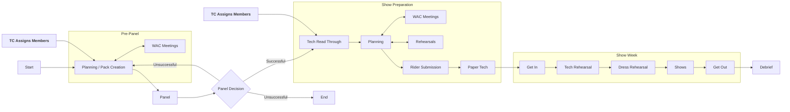

# Show Process

:::info
These pages explain how the Warwick Drama show process works. For general info about shows, please
read [Shows and Hires](../tech-crew/shows-and-hires).
:::

In Tech Crew, the term **show** is a special term referring to a project in the Warwick Arts Centre that follows
this pack/panel process. Other 'shows' are considered [hires](../tech-crew/shows-and-hires#hires) and are generally a much
smaller process.

All shows at Warwick go through a standard submission and show process. The following flowchart shows a [somewhat]
quick overview, however each section is explained in more detail below.

## WAC Show Slots

Each year, Warwick Arts Centre will allocate a fixed number of **slots** to three drama societies - these are weeks in
the Arts Centre's programming where the society may choose to put on a show. As of 2024, these are:

| Society                     | Term 1    | Term 2     | Term 3    |
|-----------------------------|-----------|------------|-----------|
| Drama Collective (DC)       | 2x Studio | 2x Studio  | 2x Studio |
| Music Theatre Warwick (MTW) |           | 1x Theatre | 1x Studio |
| Opera Warwick               |           | 1x Theatre | 1x Studio |

If members of that society would like to use a slot, they form a production team and create a **pack** which
contains information about the show and its logistics. Multiple packs can be created for the same slot by different
teams. This will then go to **panel**, which is when this team will present their pack and a presentation to a panel
formed of society exec members and representatives from Tech Crew and the Warwick Arts Centre.

Following panel, the panelists will discuss all of the packs presented and pick one (or none) which will 'pass' and
use the slot. This is often conditional on accepting and implementing several **conditions**. Next is the show
preparation process. This will consist of lots of planning, meetings and rehearsals and often ends with a **Paper
Tech** on the weekend before show week.

Finally, there is show week - the schedule for this is set by the **Technical Manager** in collaboration with the
producers and tech team. This is where everyone can get into the space, set up, rehearse, run the shows and finally
get out. This is followed by a **Debrief** a few weeks later, where the tech and production team can gather with a
member of Tech Crew exec to discuss what went well and how to improve.

Tech Crew roles will often be first advertised and assigned at the pre-panel stage, so that designers have a chance to
contribute to the pack and panel. If positions are not filled, roles can also be assigned after panel.