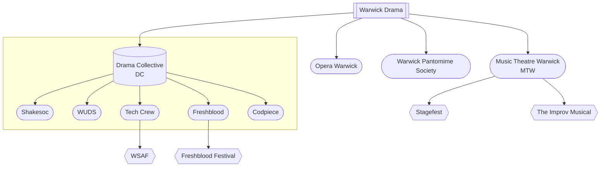

# Warwick Drama

"Warwick Drama" refers to the whole drama society scene at Warwick, and involves many different societies, each with a different purpose.

## [The Drama Collective (DC)](/wiki/warwick-drama/drama-collective)
The Drama Collective are a group of smaller societies that group together to share [show slots](/wiki/warwick-drama/shows)
in the Warwick Arts Centre. As this is quite complex, they have
[their own page on the wiki](/wiki/warwick-drama/drama-collective).

## [Music Theatre Warwick (MTW)](https://www.warwicksu.com/societies-sports/societies/musictheatrewarwick/)
Music Theatre Warwick, as the name suggests, handles musical theatre productions. They are perhaps the most frequent
society that Tech Crew works with as they put on a lot of [shows](/wiki/warwick-drama/shows) each year, often with scope for
a larger tech team and vision - MTW productions typically use lots of lights and our radio mics.

MTW also run The Improv Musical, an improvised musical show where each show is completely different. This operates as
a hire, with multiple 'practise' shows on campus throughout the year which follow up to performing at Edinburgh
Fringe in the summer.

In Term 3, MTW also used to put on Stagefest, a week-long festival full of smaller musical theatre shows, which merged with WSAF in December 2024.

## [Opera Warwick](https://www.warwicksu.com/societies-sports/societies/operawarwick/)
Warwick Opera mainly produce an opera in the WAC theatre in Term 2, in addition to sometimes smaller shows in the
studio. This often involves trying to fit as many people as possible in the orchestra pit below the stage!

## Additional Societies
These societies also perform drama at Warwick, but aren't generally considered part of 'Warwick Drama'.

### [Warwick Pantomime Society](https://www.warwicksu.com/societies-sports/societies/pantomime/)
Warwick Pantomime Society is a much newer and smaller society, often working with Tech Crew as a
[hire](/wiki/tech-crew/shows-hires) rather than a full show. They put on a pantomime each term, which are always
great fun and a much lower commitment than a show with one of the other societies in Warwick Drama.
