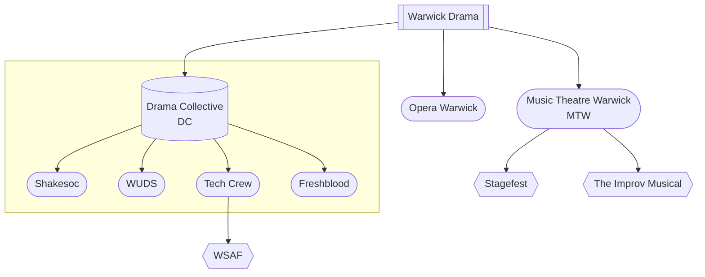

import DocCardList from '@theme/DocCardList';

# Warwick Drama

"Warwick Drama" refers to the whole drama society scene at Warwick, and involves many different societies, each with a different purpose.

## The Drama Collective (DC)
### Shakesoc

### WUDS

### Tech Crew

### Freshblood

## Music Theatre Warwick (MTW)

## Opera Warwick

## Additional Societies
* PantoSoc
<DocCardList />