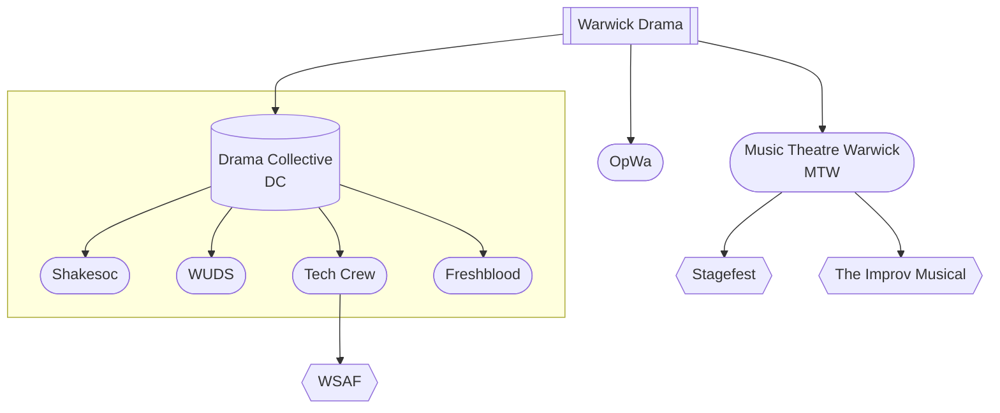

# structure

```mermaid
flowchart TD
    WD[[Warwick Drama]]
    WD --> MTW([Music Theatre Warwick\nMTW])
    WD --> OpWa([OpWa])
    WD --> DC[(Drama Collective\nDC)]
    subgraph \n
        DC --> SS([Shakesoc])
        DC --> WUDS([WUDS])
        DC --> TC([Tech Crew])
        DC --> FB([Freshblood])
    end
    TC --> WSAF{{WSAF}}
    MTW --> SF{{Stagefest}}
    MTW --> IM{{The Improv Musical}}
```