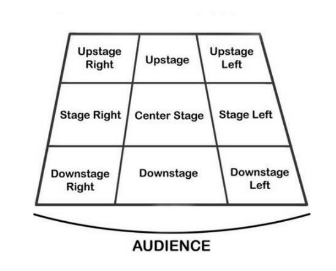

# Stage Terminology

Whilst this likely belongs to the [Stage](/wiki/disciplines/stage) discipline, this has been put in the General category
as it is useful to know for all departments.

## Stage Types

Staging refers to where the audience are positioned relative to the performance area. There are four main types of
staging, which will often be decided by the director or production team:

| Staging Type | Description                                                                                                                                                                                                                                                                                  |
| ------------ | -------------------------------------------------------------------------------------------------------------------------------------------------------------------------------------------------------------------------------------------------------------------------------------------- |
| **End on**   | The most common type of staging, where the audience sit on one half of the room with the performers directly opposite. This is the only staging type we can do in the WAC theatre, and the most common to see in the studio.                                                                 |
| **Traverse** | When audience are on two opposite sides of the stage (like a fashion runway/catwalk).                                                                                                                                                                                                        |
| **Thrust**   | Where the audience sits on three sides of the stage, looking in. Often done in the studio by adding two rows of chairs on steeldeck either side of the stage, with the bleachers out. Be careful doing shows in the thrust! Attention should be paid to sightlines and the actors' blocking. |
| **Round**    | Where there is seating on all sides of the stage, with the audience looking in.                                                                                                                                                                                                              |

## Stage Directions

## Stage Directions Abbreviations

### General Directions

- **DS** = Downstage
- **US** = Upstage
- **SR** = Stage Right
- **SL** = Stage Left
- **CS** = Centre Stage
- **RC** = Right of Centre Stage
- **LC** = Left of Centre Stage

### Specific Positions

- **DR** = Down Right
- **DL** = Down Left
- **UR** = Up Right
- **UL** = Up Left
- **UC** = Up Centre
- **DC** = Down Centre
- **C/L** = Centre Line

### Body Positions

- **FFF** = Full Front – Facing directly downstage
- **FFB** = Full Back – Facing directly upstage
- **4R** = Quarter Right / Left – 45 degrees facing opposite corner stage left or right.
- **PR** = Profile Right / Left – Facing directly offstage, at 90 degrees to the audience
- **3R** = Three-Quarter Right / Left – Facing upstage corners of the stage, mostly turned away from the audience

Content taken from the stage management toolkit on the drive.