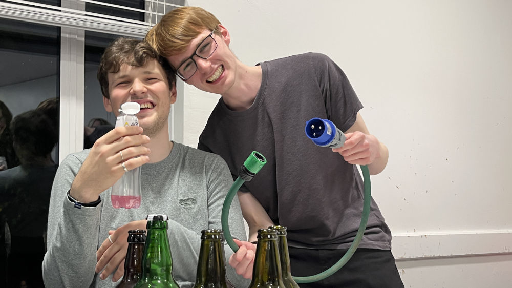

# Cable Registry

While at Tech Crew, you will come across **a lot** of different types of cables. This page should help you identify
them!

Most Tech Crew cables are stored in the [DC Cupboard](/wiki/tech-crew/storage#the-dc-cupboard), on the cable wall. Some
less commonly-used cables may be stored in drawers or storage crates in the cupboard.

<figure>

<figcaption>The DC cupboard cable wall.</figcaption>
</figure>

## Cable Types

* Sound
  * **XLR**
  * **speakON**
  * **Multicores**
  * **BNC**
* Lighting
  * **5-pin DMX**
  * **3-pin DMX**
* Power
  * **IEC**
  * **powerCON**
  * **powerCON TRUE1**
  * **Socapex**
  * **13A**
  * **16A**
  * **32A**
  * **32A-3**
  * **63A**
  * **63A-3**
  * **125A-3**
* Networking
  * **Ethernet/RJ45**
  * **etherCON**

## Cable Lengths

Warwick Tech Crew label all TC cables with coloured tape to denote distance.
The tape rings go on each end of the cable, just below the connector.
We use the same colour scheme as the Warwick Arts Centre for simplicity.

| Length  | Color        |
|---------|--------------|
| 1m      | Green        |
| 2.5m    | Yellow       |
| 5m      | Blue         |
| 10m     | Red          |
| 15m     | Blue and Red |
| 20m     | White        |

We measure cables after cleaning in maintenance.
To do this, we tape down distance markers on the studio floor, and lay cables out one by one on this scale.
The studio is 12m x 12m in size, so for 15m+ cables we go to the 10m mark and fold back down to 5m to get a measurement.
The actual lengths don't always correspond to a tape colour exactly, so we round lengths down.
This stops our cables from tricking people into thinking they're running a 10m, but then coming up a few meters short!

## Cable Ownership

<figure>

<figcaption>A TC asset tag on one of our cables.</figcaption>
</figure>

Warwick Tech Crew cable can often be identified through a Tech Crew asset tag (starting with TC), or from the coloured
tape indicating the cable length.

When working in Warwick Arts Centre, it can be very difficult to identify what cable is Tech Crew's and what cable is
the WAC's. In most cases, cables should have an asset tag from the relevant organisation. When working on shows, it is
highly recommend to **only** use WAC cable where possible, apart from IEC power cables for Tech Crew equipment -
this helps make it easier to sort cables after a get-out.

:::lore
In Term 1 2024, the Equipment Manager (Ethan) made a custom 16A to hosepipe adapter for first place prize in The Big
Fat Tech Crew Quiz.

<figure>

<figcaption>16A to hosepipe adapter with winning team member Matt (right) and Equipment Manager Ethan (left).</figcaption>
</figure>
:::
