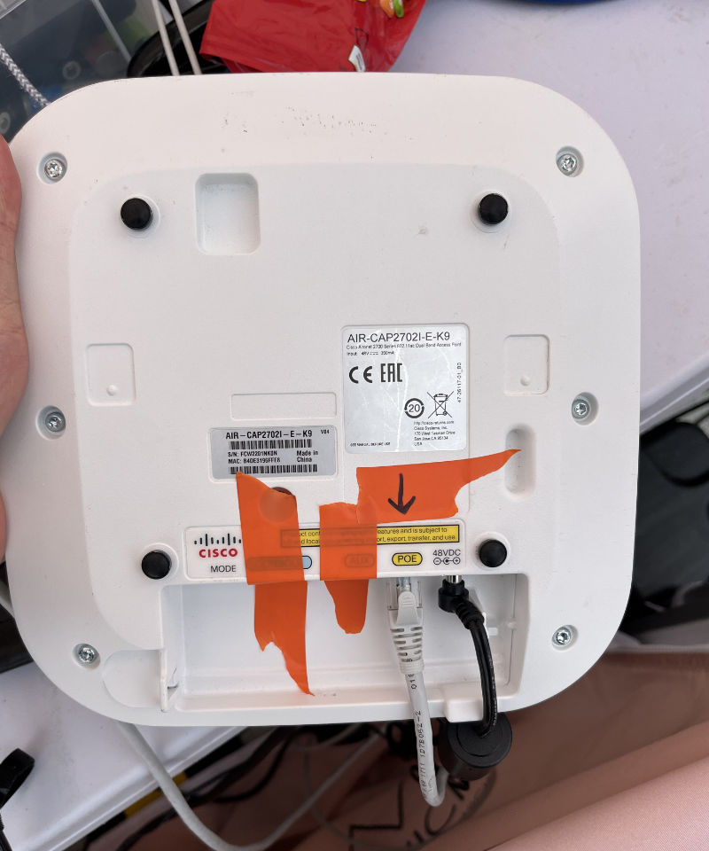

# Networking

Both the SQ5 sound desk and FLX lighting desk can be controlled wirelessly from devices such as personal phones, laptops
and the Tech Crew iPad. These page provides instructions on setting up the Tech Crew access point for this purpose.

We use a Cisco 2702i access point, flashed with a version of the firmware which provides a nicer web interface. This 
does not, however, provide a DHCP server, so all clients must be configured manually.

## Connecting to the Network
:::info
As we do not have a DHCP server, the network will need to be configured manually on all devices. This often requires 
going into the advanced network settings on the device, and setting the device to use a **static IP.**

Note that the network will often not be connected to the Internet, and can only be used to connect to Tech Crew desks.

**Settings:**
* IP Address: `192.168.1.<pick a number between 0-255>`
* Subnet Mask: `255.255.0.0`
* Default Gateway/Router: `192.168.2.1` (note that the network is not connected to the Internet, so this can 
  really be anything and doesn't do anything)
:::

The access point provides a 2.4/5GHz WiFi network with the SSID of `Warwick Tech Crew`. This is configured as WPA2 
and the password can be obtained from an exec member.

The network has a subnet mask of `255.255.0.0`, meaning that it includes all IPs from `192.168.0.0-192.168.255.255`.

All personal devices should have an IP in the range `192.168.1.0-255` - if you have issues with the network, try 
changing the last number as you may have chosen one that collides with someone else.

Tech Crew devices should have the IPs below:

| Device                   | IP            |
|--------------------------|---------------|
| Cisco 2702i Access Point | `192.168.2.1` |
| SQ5 Audio Mixer          | `192.168.2.2` |
| FLX Monitor              | `192.168.2.3` |
| Tech Crew iPad           | `192.168.2.4` |

### SQ5 Audio Mixer
The SQ5 is on the ip `192.168.2.2`. You can use the **Mixing Station** or **SQ5 Mixpad** app, available on the App Store
or Google Play.

### FLX Monitor
The FLX is on the ip `192.168.2.3`. You can use the **Z Remote** or **Z Monitor** app, available on the App Store or
Google Play.

## Setting up the Network

You will need the Cisco 2702i Access Point and power adapter, plus network cables. If you would like to connect more 
than one device to the network (i.e. both the SQ5 and FLX), you will also need a switch and switch power adapter.

1. Connect the desk ethernet port into the **POE** of the adapter.
2. Plug in the power adapter and wait for the AP to start.
3. Connect to **Warwick Tech Crew** using the instructions above.

AP LED Statuses

| LED            | Status                           |
|----------------|----------------------------------|
| Flashing Green | Starting                         |
| Green          | Online (but no wireless clients) |
| Blue           | Online (with wireless clients)   |