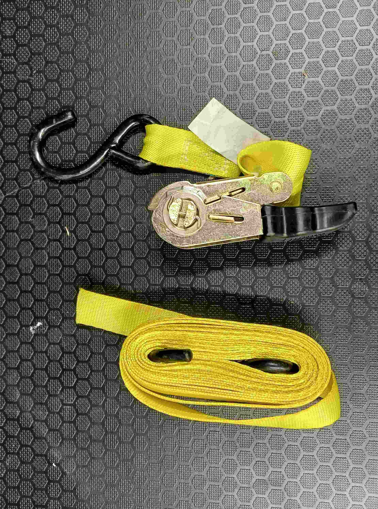
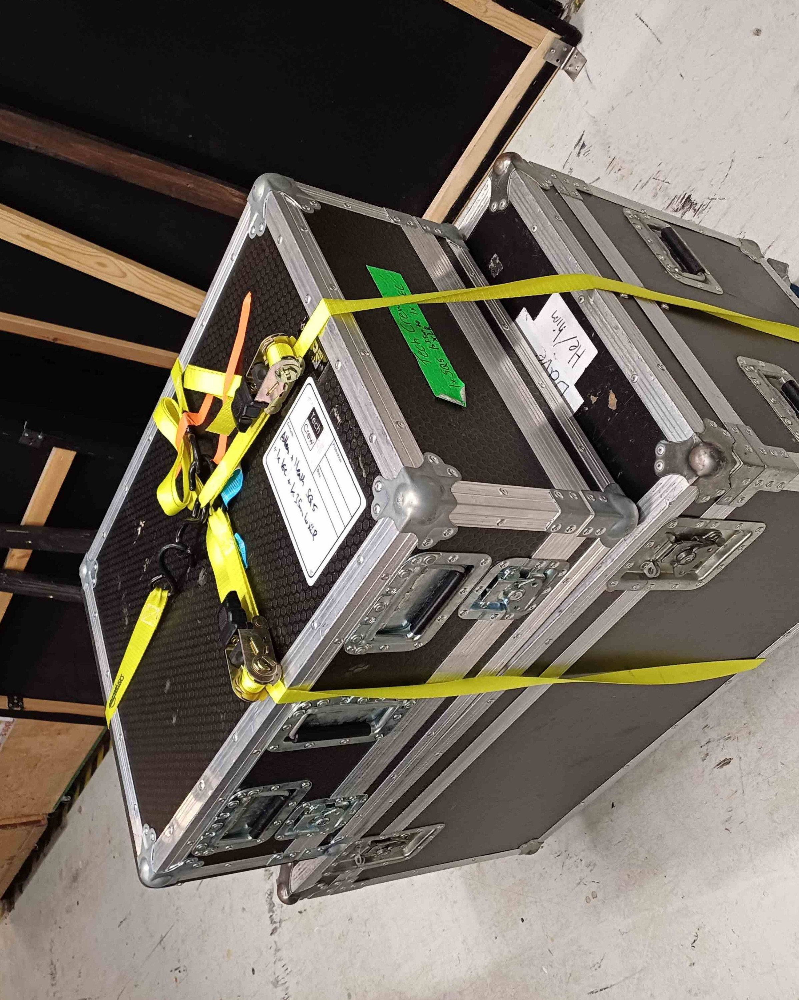

# Ratchet Strap Guide

<fig>

<figcaption>
Left: How the cord and the ratchet should be stored. Right: Example use case for transporting the SQ5 on top of Dave the box.
</figcaption>
</fig>

## Step 1

Wrap the cord around the flight case, and hook the ratchet on using the S hooks. Pull the cord tight.

## Step 2

Thread the cord through the slit in the ratchet barrel as per the image. The cord starts beneath the black handle of the
ratchet, then comes up through the barrel and out the top. Pull the cord fully through the slit.

## Step 3

Thread the cord back through the ratchet, in the gap below the barrel and above black "release" handle. Again pull the
cord fully through.

<fig>

<figcaption>
Left: Threading the cord back through the ratchet. Right: Then pulling the cord tight all the way through.
</figcaption>
</fig>

## Step 4

Ratchet the ratchet in and out, not holding the "release" button. Because you pulled the cord tight, you should only
have to do this a few times until there is enough tension in the cord.

## Step 5

To release the strap, hold the "release" button and open the strap fully. Then, pull on the cords and the barrel should
spin, releasing the strap. You might have to pull hard! Then wrap up the cord as shown below for storage.

