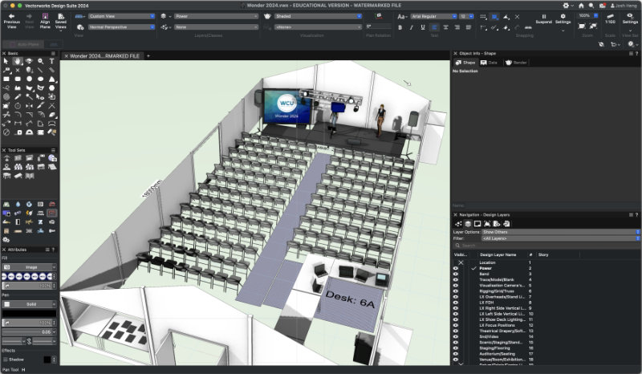
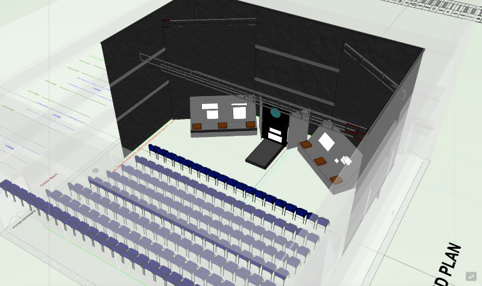
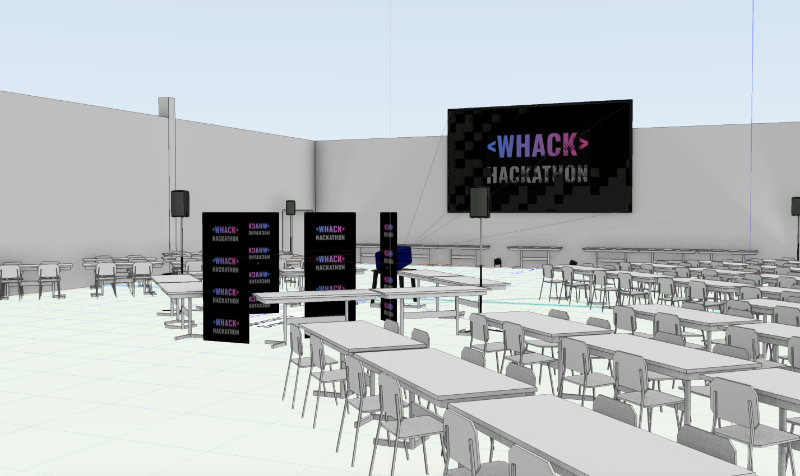
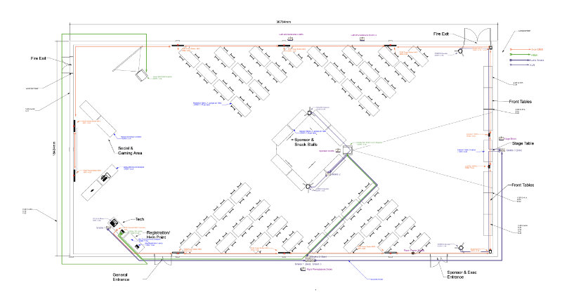
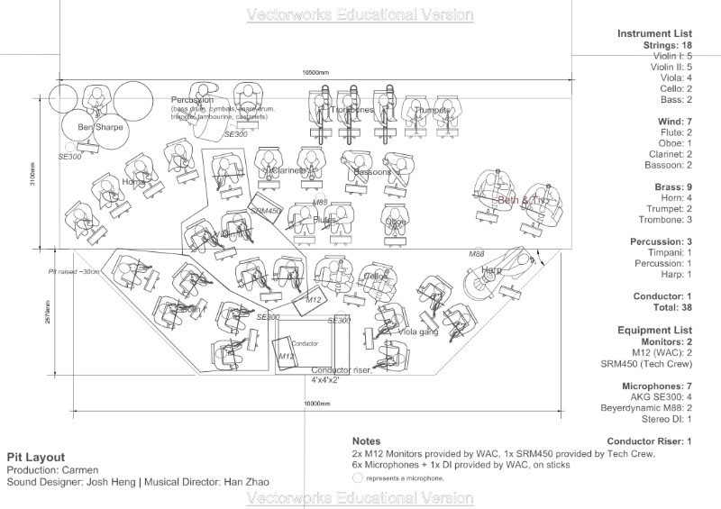
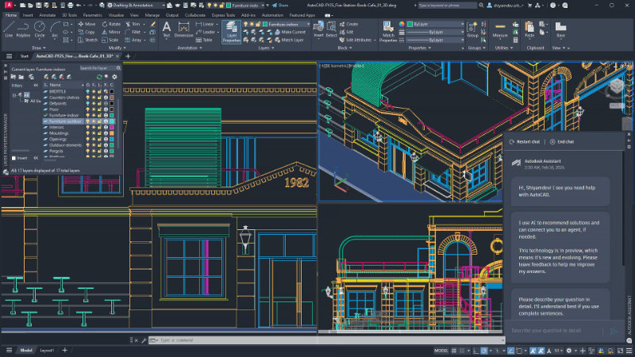

# Computer-Aided Design (CAD)

Computer-Aided Design (CAD) is the use of software to create 2D or 3D models and diagrams of your design. They can be
a great way to visualise your designs and how things fit together, especially when working with complex sets or trying
to fit a lot of things into a small space such as the studio.

Whilst many may think this is only applicable to the [set discipline](../../03-set/index.md), this is not the case. In
addition to visualising sets, CAD can be useful for:
* Creating LX plots/plans without doing this by hand.
* Creating sound pit/band layouts, especially for tight spaces.
* Calculating cable lengths for large rooms or outdoor events.
* Running LX pre-visualisation ('pre-vis') software for programming or designing LX cues in advance.

:::warning
Whilst CAD software can be a great tool, it is not always necessary and is often overkill! CAD designs can take much
longer to create than a simple pencil diagram, and the programs often have a large learning curve.

For Tech Crew shows, CAD should be considered more as an optional skill that should only be used if you have the
time and motivation to do it.
:::

Popular software for technical-design CAD include:
* [Vectorworks](https://www.vectorworks.net) - has many features dedicated to lighting and stage design, including
  symbols and model libraries for several common fixtures.
* [Autodesk AutoCAD](https://www.autodesk.com/products/autocad/overview) - more general CAD software, but more popular
  in industry.

Ultimately (or at least for Tech Crew), the choice for which software to use is a personal one - there isn't a clear
winner. Most software is also very expensive for commercial use, but provides free plans for students/full time
education.

## [Vectorworks](https://www.vectorworks.net)
<figure>

<figcaption>Screenshot of the Vectorworks CAD model for
[Warwick CU's Wonder 2024 Event](https://joshheng.co.uk/blog/wonder-2024)</figcaption>
</figure>

Vectorworks contains [several individual products](https://www.vectorworks.net/en-US/products) which are each tailored
to different industries. The most relevant is Spotlight (for lighting and stage design), but this can also be used with
Braceworks (for rigging and load calculations), ConnectCAD (for designing how everything connects together) and Vision
(for pre-visualisation and programming). These are all provided for
[free to students](https://www.vectorworks.net/en-US/education/) through your `.ac.uk` email address and student
status letter.

<figure>

<figcaption>Various Vectorworks plans and models that were created in 2024</figcaption>
</figure>

## [Autodesk AutoCAD](https://www.autodesk.com/products/autocad/overview)
<figure>

<figcaption>Screenshot of AutoCAD from [their website](https://www.autodesk.com/sg/products/autocad/)</figcaption>
</figure>

AutoCAD is a product by Autodesk, who also create many other 3D design, engineering and construction programs.
Engineering students may be familiar with [Autodesk Fusion](https://www.autodesk.com/products/fusion-360), and other
well-known products include [Maya](https://www.autodesk.com/products/maya/) and
[3DS Max](https://www.autodesk.com/products/3ds-max) for 3D animation. All these products are available for free to
students on their [student plans](https://www.autodesk.com/education/edu-software/overview).

Whilst AutoCAD provide less dedicated features for lighting/stage design than Vectorworks, it seems much more popular in
industry, perhaps due to its (and Autodesk's) reputation within the wider community. You may also find it easier to use
(or simpler to install etc.) if you have already used other Autodesk products in the past.