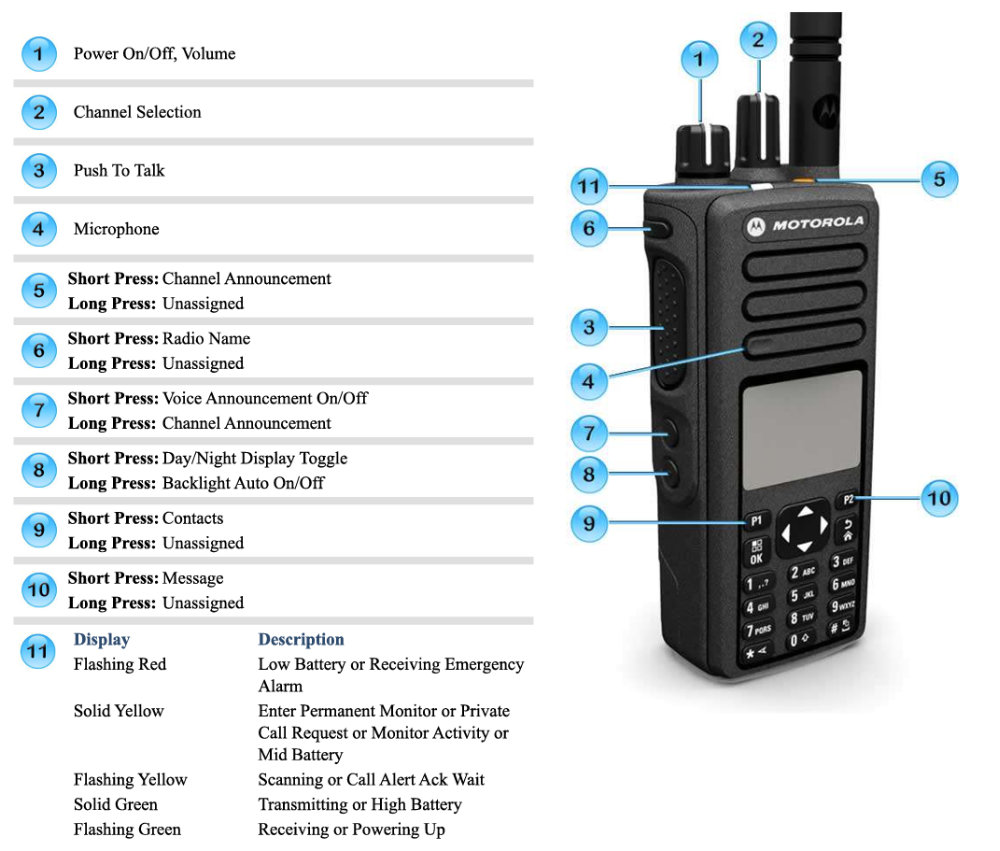
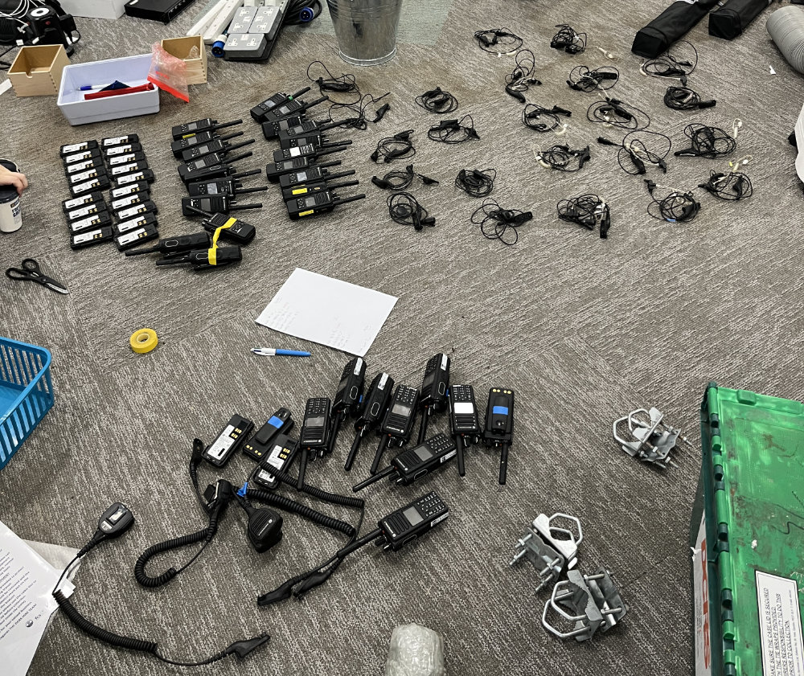
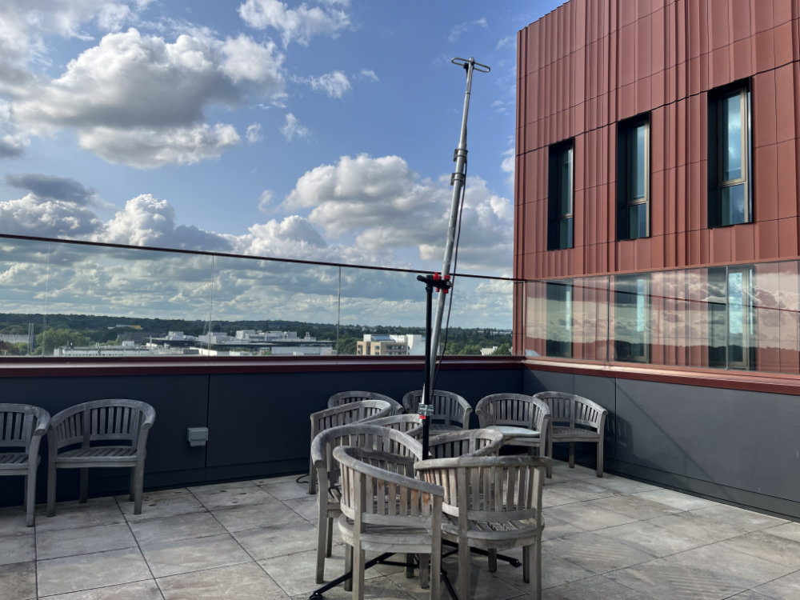
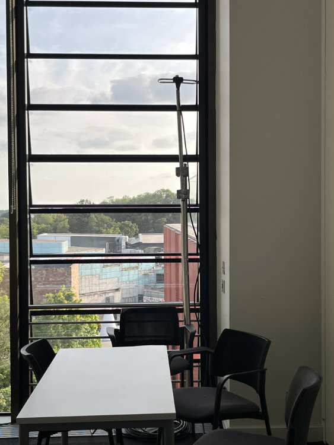

# Tech Crew MOTOTRBO Business Radio

Tech Crew owns a fleet of 11 MOTORTRBO DP4800e/DP4801 radios for communication during larger events and shows. These
radios are digital, operate on UHF frequencies and are licensed for use across the UK.

<figure>

<figcaption>Tech Crew radio configuration diagram as of Oct 2025 (generated from [CPS](./programming.md))</figcaption>
</figure>

## Inventory

As of October 2025, Tech Crew owns the following radios and accessories:

* 10x DP4800e MOTORTRBO radios
* 1x DP4801 MOTORTRBO radio
* 13x radio batteries
* 13x belt clips (attached to each battery)
* 2x single-unit chargers
* 11x d-shape earpieces ('d-clips')
* 3x remote speaker mics/headphone adapters
* 1x programming cable

:::lore
The original fleet of 10x DP4800 radios were purchased on an eBay auction in 2025 on a France Skiing holiday. Whilst
most of the [TechXec](../../../01-tech-crew/02-democracy/01-exec.md) were on the trip, an emergency meeting was held
online to meet quorum and approve the purchase.
:::

## Licensing

Tech Crew owns
an [Ofcom Business Radio (BR) Suppliers Light License](https://www.ofcom.org.uk/siteassets/resources/documents/manage-your-licence/business-radio/licence-templates/business_radio_suppliers_light_licence_template.pdf).
This license is valid for 5 years and permits Tech Crew to hire out these radios to third parties for usage across the
UK.

## Frequency and Channels

Tech Crew radios operate on UHF frequencies using digital transmission. Please contact Tech Crew for further information
on the specific frequencies and channels used if required, as this can change.

### University Network

:::note
As our radios cannot communicate with University-network radios, if you need to liase with University staff during an
event (e.g. the [Christmas Lights Switch-on](../../../07-case-studies/03-christmas-lights/index.md)) you will need to
request to borrow one of theirs.
:::

Whilst Tech Crew's radios are technically compatible with the University of Warwick's radio network, after discussion
with Estates we decided that it would be best to operate completely separately.

The main reason for this is so that we can retain full control over how we program our radios (such as their
configurations
and channels), and so that we can easily use them off-site without needing to reprogram. This also gives us more
flexibility
in how we use them and who we can hire them out to, and also allows us to hire in more radios (e.g.
from [DCRS](../../../06-directories/01-services.md)) without needing to liase with Estates. The main downside to this,
however, is we aren't able to communicate directly with University staff (e.g. Community Safety or Estates), and we are
subject to distance and signal limitations due to not being on the repeater network.

## Hiring Additional Radios

There are certain occasions where additional radio equipment is needed beyond Tech Crew's own fleet, such as the
[Warwick Student Arts Festival](https://wsaf.org.uk). In this case, additional equipment (including repeaters) can be
hired from [DCRS](../../../06-directories/01-services.md), and Tech Crew's radios programmed to work alongside these.

<figure>

<figcaption>The radio fleet for WSAF 2025, including both Tech Crew and DCRS equipment.</figcaption>
</figure>

## Repeaters

Repeaters can be used to extend the range of radios by receiving and retransmitting signals. These are basically two
handheld radios connected together in a fancy box along with a big antenna.

During the WSAF 2025, we placed a repeater on the FAB terrace to try and get better coverage. Whilst we were able to
cover most of campus (including the FAB, Milburn House and Avon) and even reached Costco, the signal was patchy inside
the WSAF HQ in the SU/Rootes Retail Space. More experimentation should be done in future events to try and find the best
placement.

<figure>
    

    
    
    

    <figcaption>Radio repeater placement during WSAF 2025 - starting inside FAB5.01, and then moving onto the terrace to try and get better coverage.</figcaption>
</figure>