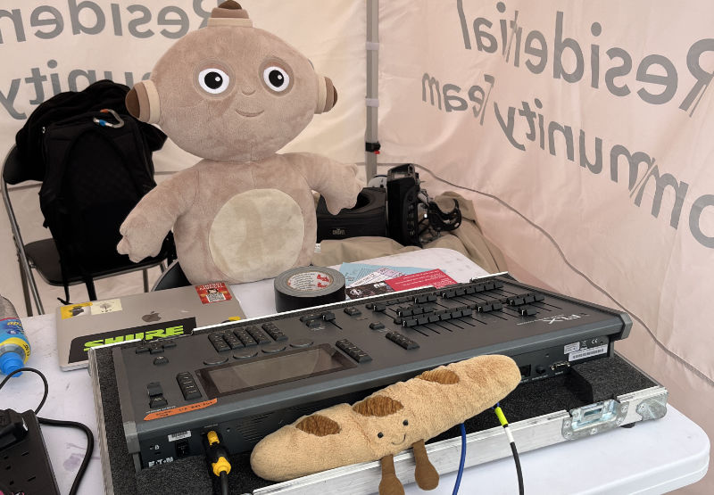
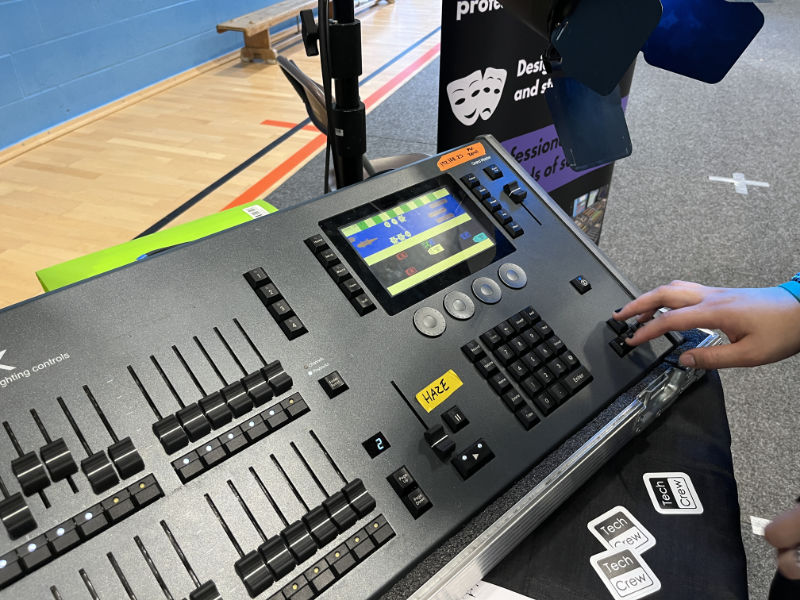

# Zero 88 FLX Lighting Desk

<figure>

<figcaption>The FLX at Arrivals Stage 2024, being operated by Makka Pakka and Barry the Baguette</figcaption>
</figure>

The Zero 88 FLX lighting desk is the main lighting console that we use in Tech Crew for hires. It runs the ZerOS
operating system, whose manual can be found [here](https://www.zero88.com/manuals/zeros?filter=3).

## Wireless Control

Similarly to the SQ5 sound desk, the FLX can be wirelessly controlled using a phone or the Tech Crew iPad using the
Zero88 Remote or Monitor apps - this is particularly helpful when busking outside or when patching or diagnosing issues.
To set this up, please follow the [Networking Guide](/wiki/disciplines/general/networking).

## Frogger Game

The FLX has a secret crossy-road-like game called Frogger which can be activated at any time. When the game is open,
only the screen and arrow keys are used and the rest of the console (e.g. the keypad and faders) can be used as normal.

### Starting Frogger

To start Frogger, first open the Z-menu by pressing the Z key (1). Then tap the right of the screen, just under the
halfway point (2).

Frogger can be closed by tapping the Z key again.
