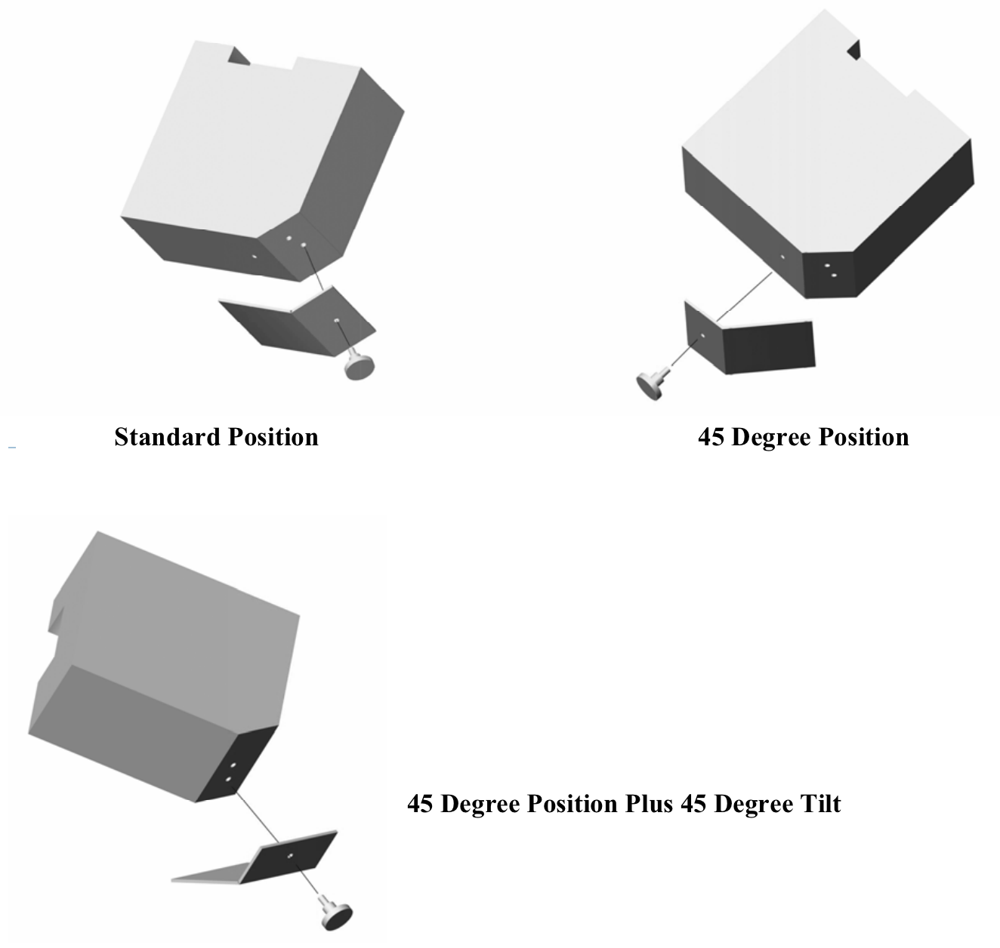
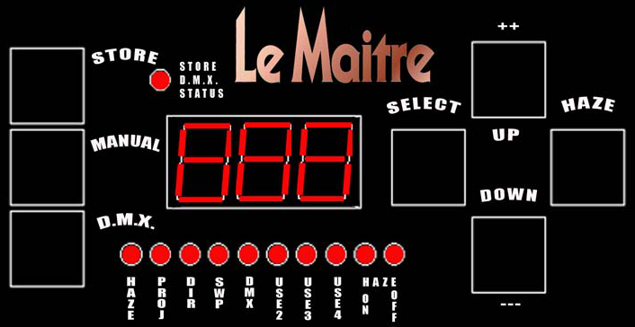

The MVS (stands for Multi Venue System) is Tech Crew's very own hazer. It's a great machine but slightly eccentric in a
couple of ways which are good to know about before using it.

[The manual](https://lemaitreltd.com/products/smoke-fog-haze/smoke-fog-haze-machines/mvs-hazer/mvs-manual-pdf/) is
pretty decent but can be confusing to navigate around as it seems to have been written in Word 20 years ago. This wiki
page is an attempt to explain the important parts of operation from the manual in a more simple to understand way.

Features:

- Two fans which can be adjusted to change the direction of output or automate a sweep
- Very low fluid usage with sugar-based haze fluid (weird, I know)
- 1-4 channel DMX control
- A mounting plate that can hold the hazer up in a variety of different orientations, according to the needs of the
  venue

## Usage

When turning on the hazer, it will take 2 minutes to start up as it runs a cleaning cycle. This (probably) involves the
hazer pumping air through the tube without any haze fluid, while heating the tube more than usual, with the aim of
clearing out any deposits in the tube. There'll sometimes be a puff of haze during the cycle if there was any fluid left
in the system.

Similarly, when you turn off the haze output it will pump some air through without extra fluid to clean it out. For this
reason you should always let it run without any haze for a few minutes before cutting power. **DO NOT** turn off the
power to the hazer while using it to switch it off without stopping the output first - this is different to the WAC's
DF-50 which is designed to just be switched on and off at the wall.

## Controls

To change any settings, press the MANUAL button on the left. You can then iterate though the various options
(illuminated by a red LED on the bottom) by pressing select. Each setting can be changed by pressing the ++ and --
buttons. The HAZE button switches the output on and off.

To save any settings, press MANUAL and STORE together.

### Settings available

- HAZE - amount of haze output
- PROJ - strength of the blower fans (how far the haze will be "projected")
- DIR - angle of the haze output (set by proportionally adjusting the two blowers)
- SWP - Speed of direction sweep (usually off)
- DMX - First DMX address (of 4)
- USE2 - Use PROJ from DMX. If off, value from manual control will be used.
- USE3 - Use DIR from DMX. If off, value from manual control will be used.
- USE4 - Use SWP from DMX. If off, value from manual control will be used.

### DMX

Once any settings have been chosen in manual mode, press D.M.X. to change to DMX mode. Once in DMX mode you can't use
the select button (but can switch to manual to change things).

If the display says DoF, this means the hazer is in DMX mode but not receiving valid DMX signal.

One of the most confusing things about the MVS is that it doesn't always default to DMX mode. To default to DMX on
start-up: Disconnect any DMX cables and select DMX mode until “DoF” is displayed and the LED blinks. Press DMX and STORE
buttons together and hold. The LED will blink quickly and store this setting. To revert back, select the manual mode and
press the MANUAL and STORE buttons at the same time.

### Sweep Mode

One of the unique features in the MVS is its ability to sweep the output angle, thanks to the two blowers at right
angles. If the hazer is mounted at an angle or placed flat on the ground (with vents facing up), you can sweep the
output side to side!

The sweep setting controls how fast the sweep is. When set to 0, the output does not sweep but is set to the angle from
DIR. When not 0, the range of the sweep is defined by DIR as follows:

- 0 degrees - sweep will be from 0 to 45 degrees
- 45 degrees - sweep will be a full 0 to 90 degrees
- 90 degrees - sweep will be from 45 to 90 degrees

## Troubleshooting

### DMX Control not working

1. Check that the hazer is in DMX mode (select button won't work). Often it won't be set to default to DMX on start -
   you can make it following the [instructions above](#dmx).
2. Check the hazer is getting DMX input (status LED will be flashing very quickly).
3. Look at the number on the display. This corresponds to which setting is selected (look at the small LEDs below the
   screen). Usually this will be HAZE, so show the amount of haze set to be output.

### Not enough haze coming out

This is usually due to bubbles in the fluid tube. Run the hazer on full for 10 minutes or so to get through most of the
tube. If you don't have time, you can speed prime the hazer by switching to DMX control without an actual dmx connection
input, and pressing the SELECT and HAZE buttons at the same time.

### ERROR: CHECK TUBE

This means that the heating tube isn't connected correctly. To fix:

1. Open up the blower side of the machine.
2. Disconnect the temperature sensor from the big circuit board (there's a nice molex connector). These are the thin
   wires that go to the heating tube.
3. loosen the bolts on the side of the tube mounts, and remove the tube
4. Clean the oxidation from the tube mounts and the tube. The rough green part of a kitchen sponge is really good for
   this.
5. Put it all back together.

If this hasn't fixed it, you might need to buy a new tube. They're pretty readily available online.

### The whole thing has frozen

This hasn't really happened since we had Le Maitre repair the control board, but if it does then you have no choice but
to switch the power off and on again. If it keeps happening, contact Le Maitre to have it repaired again.
