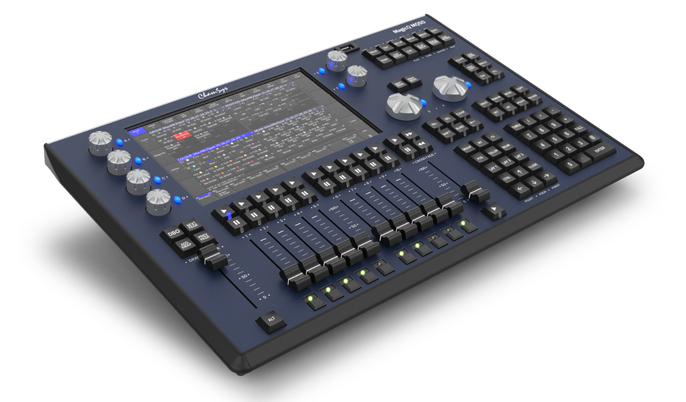
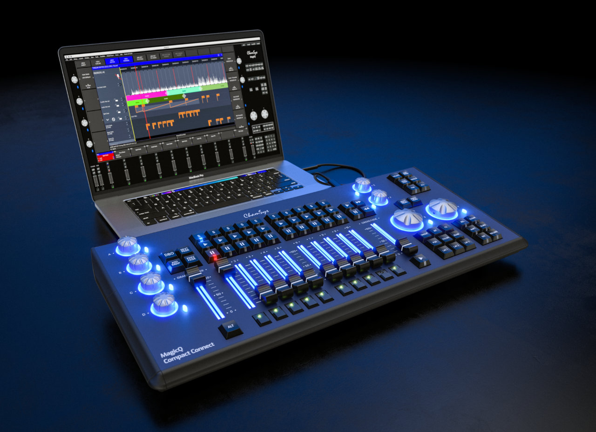

# Lighting Desk Proposal 2025

Tech Crew is looking at purchasing a new ChamSys MagicQ MQ50 lighting desk in its continued investment into providing
technical support for shows and hires, and providing more opportunities for its members to learn.

This proposal has been prepared by Ben Hammond, Josh Heng and Ethan Graham.

## Background

### Investment into the LX Department

As many of you know, Tech Crew has had limited investment in recent times into lighting stock. Solutions have been
reviewed and liaised with both members and Warwick Arts Centre staff. Over this time, a list of suggested fixtures have
been collected: some options here included LED profiles, LED pars and wash moving lights. As an exec we have decided to
hold of purchasing any of these options for the following reasons:

* Over the Summer, Warwick Arts Centre is set to have an LED stock upgrade. This is likely to include new stock of LED
  profiles, Fresnel’s/LED wash lights and moving LED profiles. Exec’s view here is to hold fire until this is purchased
  and then Tech Crew purchases equipment that can supplement these fixtures and add additional value to this stock. This
  avoids Tech Crew purchasing LED profiles or other stock that would then have little used in the Art Centre due to them
  now having such fixtures. It should be noted that this would be an expensive purchase costing upwards of £10,000 for
  2-4 certain fixtures.
* Tech Crew has also recently gained four conventional generic profiles that are working well for hires in Avon and
  alike of which some of these purchase ideas have been targeted towards.
* Many recent shows and hires have made extensive usage of festoon. It is likely that this could still be purchased this
  year in addition to this proposal.
* A lot of the larger fixtures that would be useful would be difficult to store within our limited storage space.

### Why a Lighting Desk?

Our current control systems include a Zero88 FLX, Jester and ETC Nomad. These are simple desks and as part of the new
system, would be kept. The simple side of the desks limits their capabilities, and as Tech Crew becomes involved in more
outdoor stage events (where we hire in additional lighting kit) a more comprehensive busking desk would be useful.
Improv also suffers from the lack of effective busking ability.

We also propose that should further lighting stock be purchased in the next few years, these desks are further limited
in their ability to effectively control them should such fixtures be pixel controlled or intelligent.

Out of the options of equipment that we could buy, a Lighting Desk currently seems to be the best option.

## Proposed System

The new system proposal is for the following:

* 1x [ChamSys MagicQ MQ50 Compact Console](https://chamsyslighting.com/product/magicq-mq50-compact-console/)
* 1x Flightcase for the MQ50

This has been quoted new for £4,320, or is available
on [10K New Gear for £3,600](https://www.10knew.com/product/chamsys-magicq-mq50-compact-console-w-flightcase/).

As an optional extra, we could add a node:

* 1x [ChamSys GeNetix GN5 5-Port Ethernet Art-NET sACN DMX Node](https://chamsyslighting.com/product/genetix-gn5/)

This has been quoted new for £849, and can also be obtained
from [Thomann for £845](https://www.thomann.co.uk/chamsys_genetix_gn5_5_port_node.htm).

This would total in a complete figure of £4,445-£5,169.

## MagicQ MQ50 Lighting Desk

Benefits we expect from the new desk include:

* Use of a professional industry standard desk, valuable for development
  but also easier to port over to other systems such as MA or AVO.
* The desk has the capability to be used in the SU or
  WAC, such events could be Band Soc or if you wanted to use it for a musical you could.
* Although Chamsys is primarily a
  busking desk, it also has great cue abilities built in.
* Chamsys also includes media server capabilities as well as the
  ability to previsualise, similar to augmented 3d.

### Other Options

It should be noted additional options have been explored, these include AVO systems however, these are more expensive
and older systems, an example was an AVO quartz. The Quick Q series has also been explored but was conclude its no
real upgrade over the FLX. We have also explored on PC system, however, our view here is this is too vulnerable and
does not offer the same benefit of control as a physical desk with all buttons and outputs necessary. A physical desk
setup is also simpler, as just the desk can be brought and placed on a desk and you're ready to go!

#### ChamSys MagicQ Compact Connect

Ethan has proposed purchasing the [MagicQ Compact Connect](https://chamsyslighting.com/product/magicq-compact-connect/)
as a cheaper alternative to the MQ50 and building this into a flight case with a mini PC and monitor. However, there is
a concern that this will still not provide as much benefit to the MQ50, is more complicated and is more likely to fail.

It could also be argued that this is a similar situation to the ETC Nomad (albeit that doesn't have any physical
surface), which Tech Crew has now owned for over a year.

## GN5 DMX Node

* Currently Tech Crew only has the option of two DMX chain runs and only really one DMX at long distances. The DMX node
  will be used to distribute network from stages/were convenient saving time and complexity.
* The node also ties into the Chamsys desk with the ability to edit the output universe straight from the desk and does
  not require an additional computer.
* The node is also capable of running the on-PC Chamsys software via USB so it could be used like the ETC nomad that TC
  owns.

Note the desk includes 4 DMX outputs natively.

## Tech Crew Finances

Current Tech Crew finances are good and could comfortably make this purchase whilst keeping enough float for other
activities this year and going into next. With this purchase, we should also be able to spend £1-2k on additional
lighting stock in the near future if required. Whilst we also recently purchased
the [new radio mic system](../../02-sound/04-microphones/10-radio-mics-2024/index.md), we have had a higher income this
year due to a more generous SU grant and additional hire work with the University. More information can be provided on
request.

## What’s Next?

We welcome any feedback and further suggestions. Feedback will be correlated and reviewed for the exec meeting WC 10th
of Feb, where a final decision will be made.
