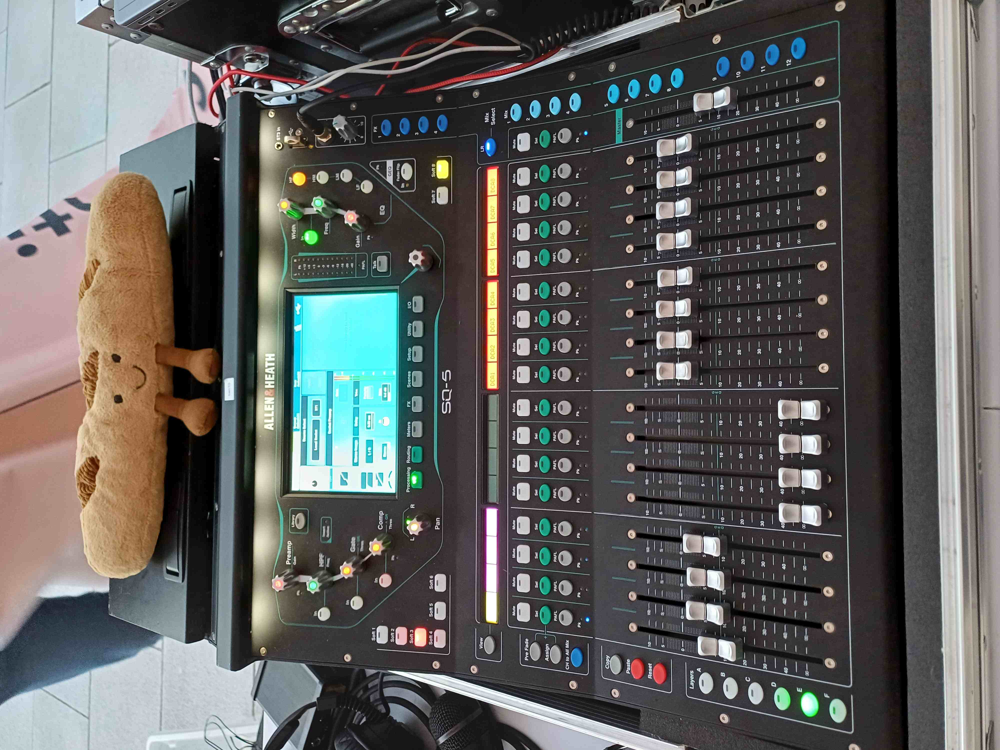
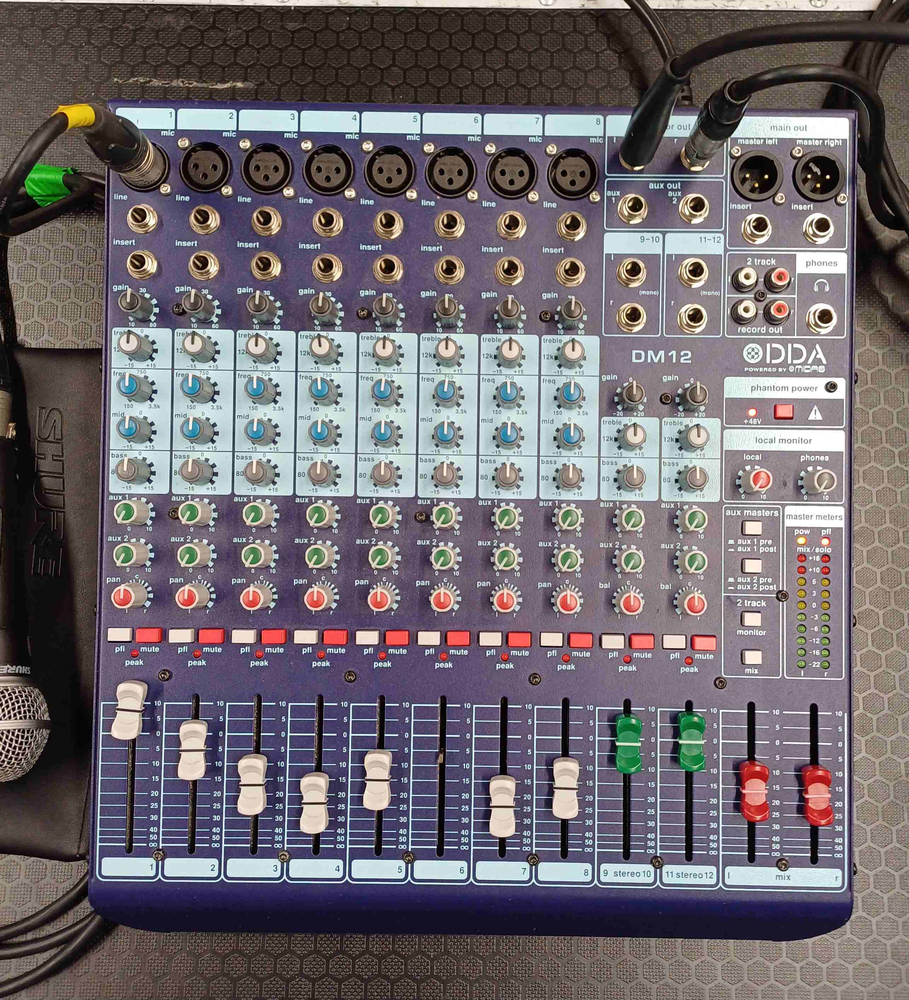
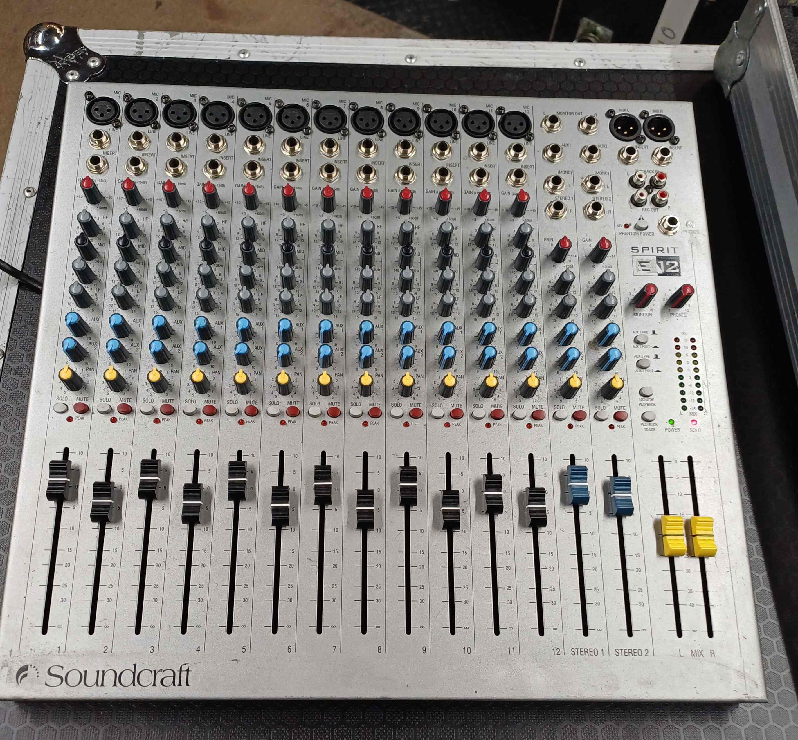
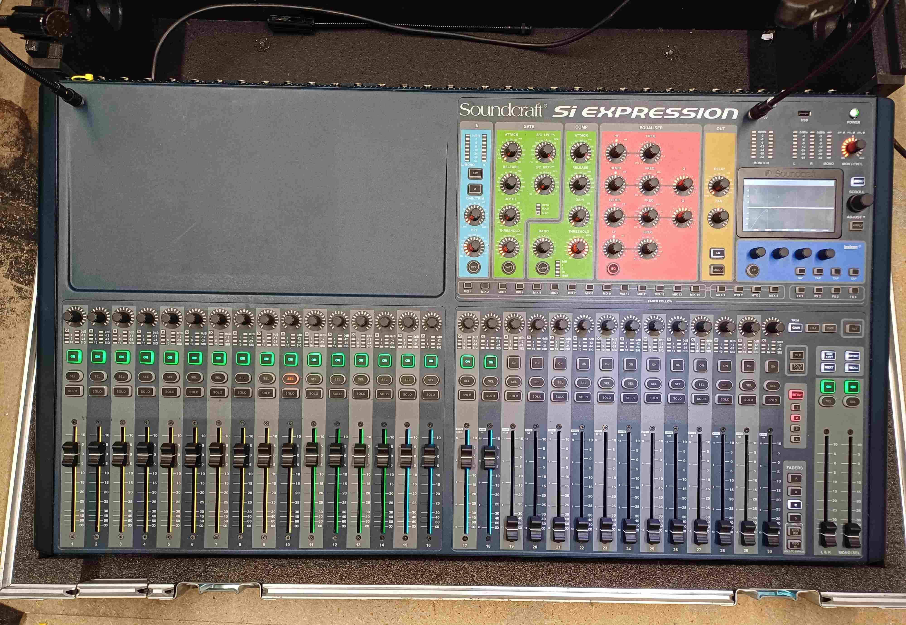
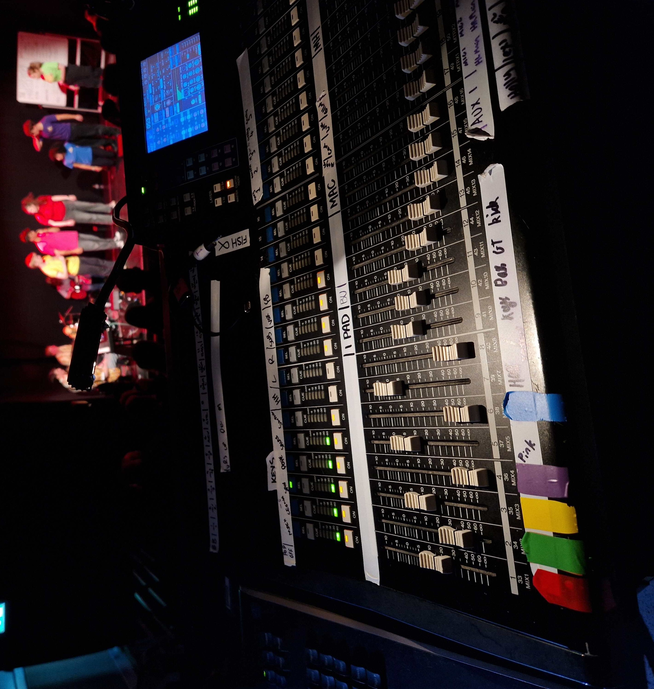

# Sound Desks

We currently own 5 sound desks! The SQ5, DM12, E12, Si Expression 3, and the O1V96. This page also talks about the
DiGiCo S21 which is used in WAC and FAB, and the Gilded Balloon's LS9.

## Allen&Heath SQ5

This is the fanciest and newest sound desk that Tech Crew own! Bought in January 2023, it's a digital mixing desk that
can handle 48 channels, 16 preamps and 12 line outputs. The tech crew iPad can be used to
[mix this desk remotely](/wiki/disciplines/general/networking#sq5-audio-mixer) while walking around the venue. The desk
has dedicated knobs for all processing which makes it quick to navigate and use during live mixing. This is the desk we
use for all substantial sound activities outside of WAC! You can use this for WAC shows too if you (like me) prefer it
over an S21.

:::warning

Our SQ5 does not yet have a Dante expansion card! So you'll need to stick to USB input for playback, or use the WAC's
S21 instead.

:::

## DiGiCo S21

This is the digital sound desk found all over WAC and FAB. 48 channels, 16 onboard preamps, 12 outputs. It has maximal
touchscreen minimal physical buttons/knobs. Supposedly more beginner friendly, with the touchscreens having nicer
diagrams for how audio is being routed about the desk. You can request to use one with a Dante card from WAC. See its
[datasheet](https://digico.biz/wp-content/uploads/2020/04/DiGiCo-S21-Data-Sheet-1.pdf)! Note that this desk gets a bit
laggy if you cram too many scenes into it (you know who you are). Would recommend looking into TheatreMix if you want to
mix on DCA's during a show! It is suspected WAC and FAB own about 12 of these sound desks. WAC also own an S31, which
just has more channels if you need.

:::lore

The area of campus encompassing WAC and the FAB has has 378 DigiCo S21s per square km.

:::

## Midas DM12

One of the two analogue sound desks we own!

8 Mono XLR inputs, 2 Stereo jack inputs, 2 Auxes and a Main LR out. This is a lovely little desk, its super lightweight
and portable with a minimal layout. This desk has two insert slots which can supposedly be used for an outboard FX rack,
however you need some special jack-jack splitter for the input and output that I couldn't work out. The approach that
worked for me was sending channels to the outboard FX using one of the auxes, then taking the FX return back into the
desk through one of the stereo input channels (green fader). ~~Sadly the channel 6 fader cap has despawned :(~~ It has
respawned albeit looking slightly different!

## Soundcraft Spirit E12

Our second analogue desk, with four more inputs than the DM12. The main LR on this desk has a scale from 0 to -infinity
(instead of the normal design of +10 to -infinity), this doesn't affect anything in a meaningful way... but I guess
that's something to say about this desk.

## Soundcraft Si Expression 3

This desk has the most onboard preamps (32!) out of all the desks we own. It also has super cool RGB backlit faders. The
fader colour represents what type each channel is (Group, DCA, FX etc). However, the flightcase is pretty massive and
its heavy, please don't try unpack this desk on your own! (speaking from experience..) Its also the only desk we own
that still has its dust cover lol.

:::lore

This desk is called Sibyl! We are trying to sell Sibyl. They take up too much space in the cupboard! and are not very
practical to use compared to the SQ5 :(

:::

## Yamaha O1V96

This desk has a little LCD digital display. This desk is in the middleground between our more powerful digital SQ5, and
our simpler analogue desks. We keep this desk around for training as it is similar to the LS9.

## Yamaha LS9

This is the sound desk installed in the Gilded Balloon's Big Yin, the MTW Improv Musical's fringe venue for the last few
years (as of 24/25). We don't own one of these, so we have used our O1V96 to practice for fringe mixing, given its
similarity (same manufacturer) to the LS9. See how the tape colours correspond to the performers teeshirt colour!

## Glossary

### Channels

The number of _channels_ in a sound desk represents the number of simultaneous inputs that the desk can process at a
time. For example a 48 channel desk could handle 12 cast radiomics + 8 drum mics + 14 orchestra mics + 2 offstage mics +
4 boundary mics + 5 FX groups + 2 playback channels + 1 god mic, channels get used up fast!

### Preamps

The number of _preamps_ on a desk/stagebox is the number of weak, unamplified, "mic-level" signals (such as the signal
from a normal microphone) that the desk/stagebox can lift up to a "line-level" signal suitable to be processed by a
desk.

:::note

The number of preamps on a digital desk is normally much lower than the total number of channels a desk can handle! For
example, once you've used up the 16 SQ5 onboard preamps, you'll have to find other ways (stagebox's preamp, soundcard,
etc) to provide line level signal to the remaining 32 channels.

:::

:::info

The signal from a microphone is produced by movement in a tiny diaphragm that vibrates due to the sound pressure waves
from the source. This signal is weak and contains background noise, it isn't able to unable to undergo processing (fx,
compression etc) from a sound desk unless it is first brought up to a higher amplitude by a preamp.

:::
