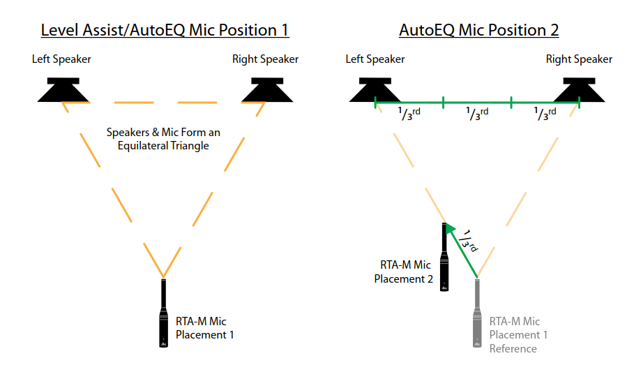
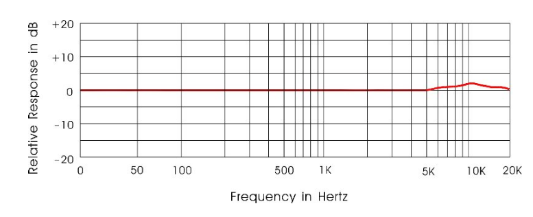

# DBX DriveRack PA2

## Setup

To start, you need to inform the wizards of your speaker setup. Click the wizard button, then "Run Setup Wizard" and
follow the instructions to tell the wizards if you're using a mono or stereo speaker setup. Connect the LR out of the
desk into the LR inputs at the back of the PA2, then connect your main PA to the "high" output, and your subs to the "low"
if you're using them. When you play audio out the desk, you should see metering appear in PA2 front display. Make sure 
that the mute buttons are not engaged!

## Feedback Suppression (AFS)

The "Advanced Feedback Suppression" (AFS) is probably the most important wizard and the one that will have the largest
positive effect on mix quality. It lets you push radio mic vocals up to a reasonable level without worrying about
feedback. It does this in two steps, first during soundcheck, where you purposely make the speakers feed back ("ringing
them out") which lets the wizard figure out the initial problem frequencies, and notch them out using "fixed EQ
filters". Then secondly, during live performance, if the PA2 detects feedback it will automatically use "Live filter" EQ
notches to destroy the feedback, often before it becomes audible.

Select Wizard->Run AFS Wizard and follow the on screen instructions. You should begin to hear feedback at some
frequency, the PA2 should then notch it out, and a different frequency will then begin to feed back, and the PA2 will
destroy this and so on. This repeats until all the fixed filters are used up, and the remaining live filters will be
saved for use during performance if it begins to feedback. These live filters will change depending on what's currently
causing feedback, whereas the fixed filters act more like a graphic EQ that you set and forget.

## Auto Room EQ (AEQ)

This is the mode which uses the special "Real-Time Analyser" (RTA) reference mic! Place it on a stand and connect it to
the "RTA Mic input" port on the PA2. Click Wizard->Run AEQ Wizard. I have only tried "AutoEQ only" but "Level assist"
also exists and probably does something. Place the mic stand in the two positions in the images below when instructed by
the wizard. By the power of equilateral triangles, the wizard should have applied a small amount of EQ which will bring
your room closer to having a flat-frequency response

<figure class="img-small">

<figcaption>Where the AEQ wizard wishes you place the RTA mic.</figcaption>
</figure>

:::info

The RTA mic is special because it has an almost flat frequency response and has an omnidirectional pickup pattern! I
guess this means its more sensitive to the quirks in the room and can best help auto-eq the room back to flat.

:::

## Subharmonic Synthesis (SUB)

This feature allows the PA2 to push more low end frequencies out the subs even when the audio source does not have very
much low end information. "Using traditional EQ to enhance this extremely low frequency region can increase noise
potential and stage rumble (low-frequency feedback)", whereas Subharmonic Synthesis will generate brand new low
frequency information based off of the higher frequencies.

## Networking

The PA2 can be connected to a network, to allow for use through its mobile app or PC program.

:::warning 

The PA2 for some reason cannot do static IP addresses or link-local, so you will need a DHCP server in the network.

:::
