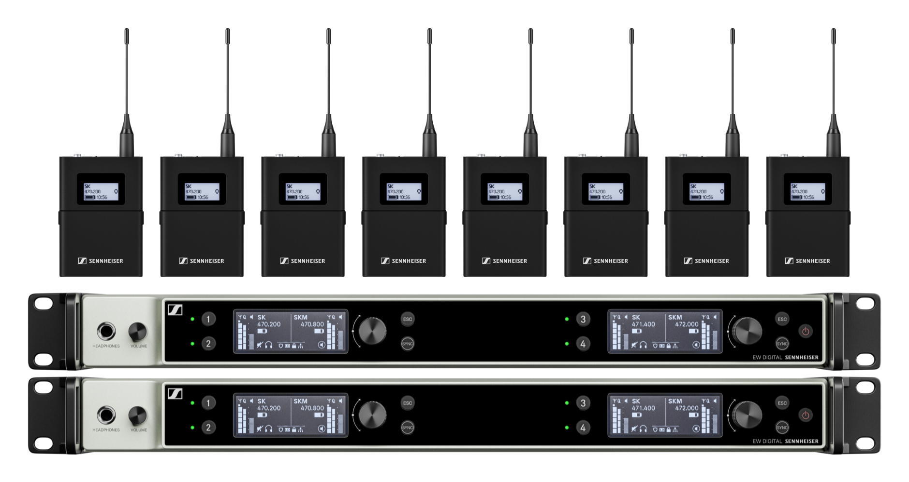
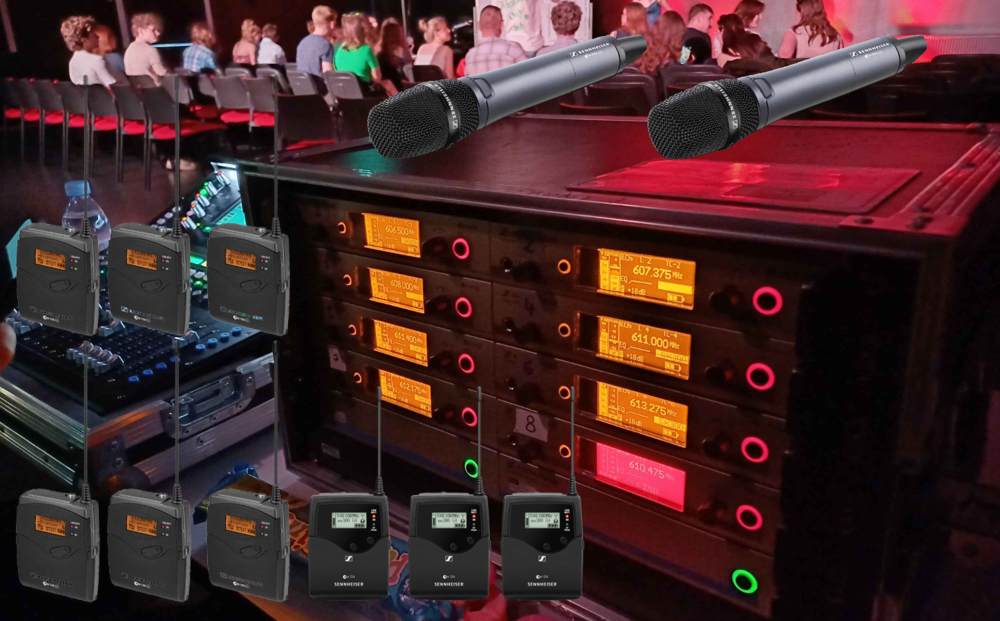

# Radio Mic System Proposal 2024

Tech Crew is planning to purchase a new 8-channel Sennheiser EW-DX radio mic system before the start of the 
2024/2025 academic year for the cost of £9,500. This is due to our current system, the Sennheiser EW300 G3, 
starting to become less reliable due to being 14 years old (with an expected lifespan of 10 years).

:::info
As of 09/08/2024, the Tech Crew Exec have unanimously voted to go ahead with this radio mic purchase. As it stands,
this purchase will be made before the start of Term 1 2024, but everyone is welcome to look at our thought process and
ask any questions.
:::

## The System

The new system will be an 8-channel [EW-DX](https://www.sennheiser.com/en-gb/product-families/ew-dx-professional) EM 4
Dante Sennheiser system. This uses 3-pin LEMO connectors instead of our existing 3.5mm jack connectors, which should
be more reliable and less prone to damage. Out of our 12 existing MKE2 lavalier microphones, 7 will be reterminated to
the 3-pin LEMO and the remaining 5 are realistically broken beyond repair. We will purchase 5 new MKE 
Essential microphones with a 3-pin LEMO connector, totalling to 12 lavalier microphones and 8 channels.

This will have the following advantages:
* (The main advantage is that the new system won't be breaking all the time).
* The 2 receivers are much lighter and have inbuilt power distribution compared to the heavy receiver rack we currently
  own.
* 3 pin LEMO connectors are more rugged, waterproof, and more reliable than the 3.5mm screw in jack.
* The new system has Dante, which can be used in WAC (WAC are trying to move fully Dante). This reduces the number of 
  cable runs and has a lower noise floor than XLR. *Note that the SQ5 does not currently have a Dante card, however we
  would be able to use Dante for the WAC S21 desk.
* Because of the lack of antenna distribution, the new system can be split up into 2 4ch systems 
* There are lots of nice quality of life features with the newer system
* We will likely still be able to use the existing system for some shows with hire wear and tear or if more than 8 
  channels are required, saving the £65/mic cost to the WAC.

The new radio mic system will consist of and cost the following:
* 2x [Sennheiser EW-DX EM4 Dante Receivers](https://www.sennheiser.com/en-gb/catalog/products/wireless-systems/ew-dx-em-4-dante/ew-dx-em-4-dante-q1-9-509370)
  (4 channels each, totalling 8): 2x £2,400
* 8x [Sennheiser EW-DX SK 3-Pin LEMO Bodypack Transmitters](https://www.sennheiser.com/en-gb/catalog/products/wireless-systems/ew-dx-sk-3-pin/ew-dx-sk-3-pin-q1-9-509398):
  8x £400
* 5x Sennheiser MKE Essential Microphones (3-pin LEMO connector): 5x £193
* 7x MKE2 Retermination from 3.5mm to 3-Pin LEMO: 7x £55
* Radio Mic Rack Patch Panels (XLR, Powercon, Antenna, Ethernet): 1x £125
* Sennheiser Wave Dipole Antenna Rod: 1x £25
* **Transmitter/Receiver Total: £8,000**
* **Grand Total: £9,500**

This equates to a total cost of £1,020 per channel, excluding radio mics - assuming these last another 10 years, this
is £102 per channel per year.

### Repairs, Maintenance & Insurance

We will hopefully be purchasing the new system on an American Express credit card which gives us 90 days of theft or
accidental damage protection (up to £2,500, with a £50 excess). However, this will also be covered under
[SU insurance](https://www.warwicksu.com/societies-sports/exec-resources/administration/insurance/).

The new system will also be covered under the Sennheiser 24-month warranty. After this expires, we will be able to
send transmitters to Sennheiser for repair or replacement for
[€135 exc. VAT](https://spares.sennheiser.com/catalog/product/509405-ew-dx-sk-3-pin-u1-5).

With the current system, we are able to send these to Sennheiser for repair or replacement for €118 exc. VAT
([G3](https://spares.sennheiser.com/catalog/product/503531-ek-100-g3-b) or
[G4](https://spares.sennheiser.com/catalog/product/509521-ek-100-g4-b)).

### Current System

The current system is an 8-channel Sennheiser EW300 G3 system, which was purchased in 2010:
* Currently, 8 channels with a theoretical maximum of 12 and realistic maximum of 10.
* Fully analogue
* Uses the unreliable 3.5mm jack connector
* Uses fixed antennas that are complex or expensive to replace
* Not water-resistant in any way
* Needs a 6u flight case rack which is bulky and heavy
  * Takes up 1u of rack space per 2 channels
  * Needs the use of a distribution amplifier

We will keep the current radio mic system as a backup system and to be used for environments with higher wear and tear,
such as The Improv Musical. These will be used with the current two handheld microphones and existing 12 headset 
microphones (mini XLR with a 3.5mm adapter). In the future, we may also purchase four 3-pin LEMO to 3.5mm adapters 
so that the old system and new system can be used concurrently to avoid hiring from the WAC.

This will likely be continued until maintenance costs become too high, but the aim is that if this system fails (which
we feel that it might), we will have something else that we can use/fall back on without having to hire in or wait for
repairs.

### Alternatives

Whilst we have looked at a range of systems, we have seriously considered the following alternatives due to these 
being within budget and having our desired feature set:
* Shure ULX-D: ULXD4, ULXD4D, ULXD4Q
* Sennheiser EW-DX: EW-DX EM2, EW-DX EM2 DANTE, EW-DX EM 4 DANTE

A full feature comparison can be provided upon request, but in general Sennheiser was chosen over Shure because:
* It is a newer system so likely to be in support for longer
* It has better documentation
* Lower latency (1.9ms)
* Cheaper
* Longer battery life
* Full metal construction of the receivers
* Daily chain networking, so no switch is required
* Better e-ink displays for transmitters

We have also compared these systems against the lower-end Shure SLX-D and Sennheiser EW-D systems but have concluded not
to go with these for the following reasons:
* Shure SLX-D and Sennheiser EW-D are a pure plastic construction and given what our radio mics go through (e.g. people
  landing on them and being sat on, etc.), I don't think that's right for us.
* Sennheiser EW-D has no controls on the transmitters so making quick changes during a show is quite difficult as the
  packs need to be re-synced every time there is a change.
* These systems wouldn't be much more compact or lighter than our current system, which is one of our objectives to
  minimise.
* EW-D doesn't have the capability to monitor levels etc. from Ethernet/data and doesn't show battery level or the
  channel on the packs themselves. It also doesn't have a headphone listening jack on the front like our current system.
* Neither of these have the higher density either or the option of Dante. EW-DX has everything we want in a system.
* Shure QLX-D and ULX-D are both more expensive and are feature equivalent to EW-D and EW-DX respectively.

## Why Now?

Tech Crew have been discussing the purchase of a new radio mic system for the past few years as we've been aware of our
current system slowly becoming less reliable and requiring more repairs. During The Improv Musical at Fringe 2024, for
example, three of the transmitters had issues towards the end of the run (pending investigation) and had to be swapped
out with spares. The current system was purchased in 2010, with an expected lifespan of 10 years.

> **What's happening to the old radio mic system - given they still work and are supported by Sennheiser (repair of a
> transmitter is only £95 when they do occasionally die)? Seems silly to be duplicating kit especially when it's so
> spenny!**
> 
> Whilst it is cost-effective to maintain, the old system will be used in conjunction with the new system when needed, 
> but as a secondary system (apart from the specific setup for The Improv Musical which will remain on the old system 
> due to the increased wear and tear).

> **Why don't we just wait until the old system gives up completely? Hiring is always an option in an emergency?**
>
> We have budget to do it now, and the old system would probably give up in the next couple of years at a guess, at 
> any point. We don't want it to break just before we actually need them for something and then have to go through the
> whole process of getting and testing new mics (also assuming we have budget for it).
> 
> Hiring with little notice may also not be an option for events like Fringe, when everything is already being hired for
> other Fringe shows.

## Finance

The cost of the system will be covered by our existing Tech Crew reserves and hopefully partially from a grant from the
SU (although this is not guaranteed). We have enough reserves to safely purchase this in full without being in danger of
not being able to pay for other expenses or having enough reserves for repairs or floats in shows - this is mainly due
to us having saved up for this purchase over the past few years, and due to the success of recent shows and larger 
hires.

> **Shouldn't buying more lighting stuff be a bigger priority? Especially given that the last major investment TC made 
> was the £4/5k on SQ5 and stagebox, as well as random other stuff like the PA2. The last time any real amount of 
> money was spent on lighting was when the LEDs and FLX were bought in 2016! We constantly have to hire lighting stuff,
> whereas with sound there's just a couple extra radio channels hired occasionally.**
> 
> In the current budget, we should still have £1-3k left over which could reasonably be spent on lighting equipment 
> this year. We're always open to suggestions on what equipment we could upgrade or purchase.

### Hire Cost

Currently, we charge £15/day/channel for the usage of radio mics (subject to our other discounts, such as a day rate
for any week-long WAC show, a 3-day=1 week rate for hires and a 50% discount for self-funded society events). In the
previous year, the following events used the radio mics, totalling to ~£300 to Tech Crew:
* Company (8 channels + the show paid for 4 WAC mics at £65/mic)
* Carmen (8 channels)
* Godspell (8 channels)

The Improv Musical also used the radio mics for their several shows throughout the year and then for a
month at Edinburgh Fringe (6 lavalier radio mics and 1 handheld radio mic), totalling around ~£1,500 to Tech Crew.

We will therefore likely need to increase the price of hiring the radio mic system for hires and shows, however this 
still needs to be finalised. With the whole system costing around £10k, we would likely want to make at least £1,000 -
£1,500 back per year from usage of the new system for this to recoup the costs within the mic lifespan.

> **I think it's also important to consider for the theatre shows will this increase their tech costs and is that 
> fair/realistic given they're already have limited budgets?**
> 
> If (for example) we increase prices to £25/channel instead of £15/channel, this would increase the price for Company by
£80 to TC. But, Company also had to pay for 4 additional WAC mics at £65/mic, so this would still be cheaper.
>
> For other shows, yes there may be quite a significant price increase, but this is still much cheaper than hiring from
WAC or externally and I think it's a cost increase that will always come at some point as the existing system won't last
forever.

:::info
Questions? Please ask in the **New Radio Mic System Purchase** thread in the Discord #projects channel.
:::