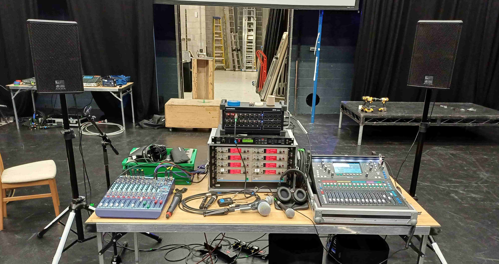

# Sound

:::info
Information about a Sound Designer's responsibilities throughout the show process can be found on the
[Shows](/wiki/warwick-drama/shows) pages.
:::

## Sound Desks

### [Allen&Heath SQ5](https://www.allen-heath.com/hardware/sq/)

This is fanciest sound desk that tech crew own! It's a digital mixing desk that can handle 48 channels, has 16 preamps and 12 line outputs. The tech crew IPad can be used to [mix this desk remotely](/wiki/disciplines/general/networking#sq5-audio-mixer) while walking round the venue. The desk has dedicated knobs for all processing which makes it quick to navigate and use during live mixing. This is the desk we use for MTW improv, and all substantial sound activities out side of WAC!

:::warning

Our SQ5 does not yet have a dante expansion card! So you'll need to stick to USB input for playback, or use the WAC's S21 instead.

:::

### [DiGiCi S21](https://digico.biz/consoles/s21/)

This is the desk found all over WAC. 48 channels, 16 onboard preamps, 12 outputs. You can request for one with a Dante card. See its [datasheet](https://digico.biz/wp-content/uploads/2020/04/DiGiCo-S21-Data-Sheet-1.pdf)!

## Glossary

### Channels

The number of *channels* in a sound desk represents the number of simultaneous inputs that the desk can process at a time. For example a 48 channel desk could handle 12 cast radiomics + 8 drum mics + 14 orchestra mics + 2 offstage mics + 4 boundary mics + 5 FX groups + 2 playback channels + 1 god mic, channels get used up fast!

### Preamps

The number of *preamps* on a desk/stagebox is the number of weak, unamplified, "mic-level" signals (such as the signal from a normal microphone) that the desk/stagebox can lift up to a "line-level" signal suitable to be proessed by a desk. 

:::note

The number of preamps on the desk is normally much lower than the total number of channels a desk can handle! For example, once you've used up the 16 SQ5 onboard preamps, you'll have to find other ways (stagebox's preamp, soundcard, etc) to provide line level signal to the remaining 32 channels.

:::

:::info

The signal from a microphone is produced by movement in a tiny diaphram that vibrates due to the sound pressure waves from the source. This signal is weak and contains background noise, it isn't able to unable to undergo processing (fx, compression etc) from a sound desk unless it is first brought up to a higher amplitude by a preamp.

:::
