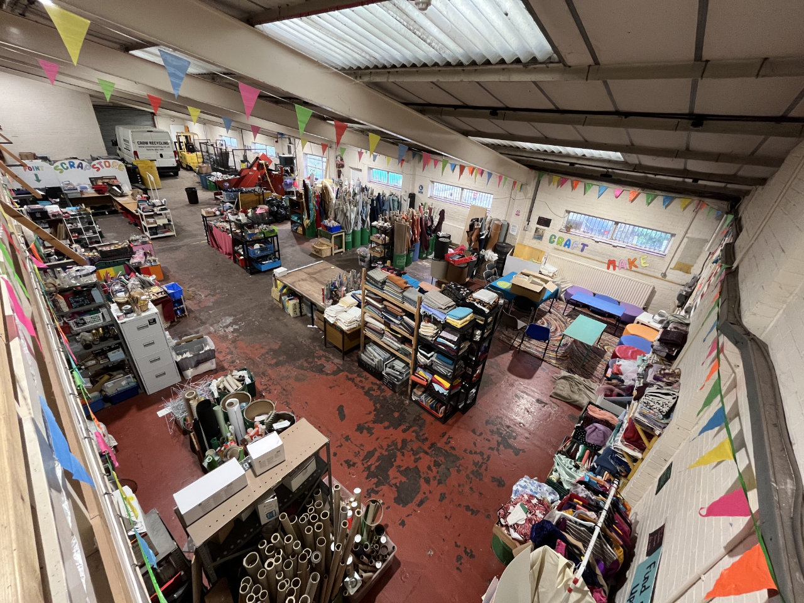
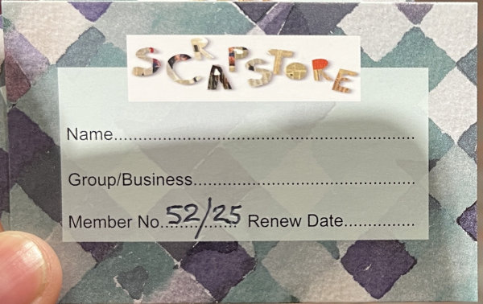
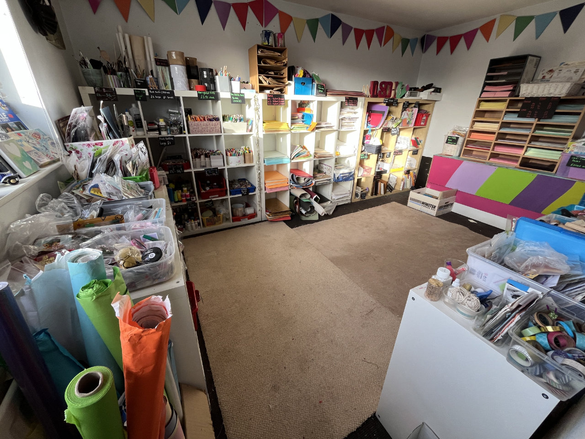
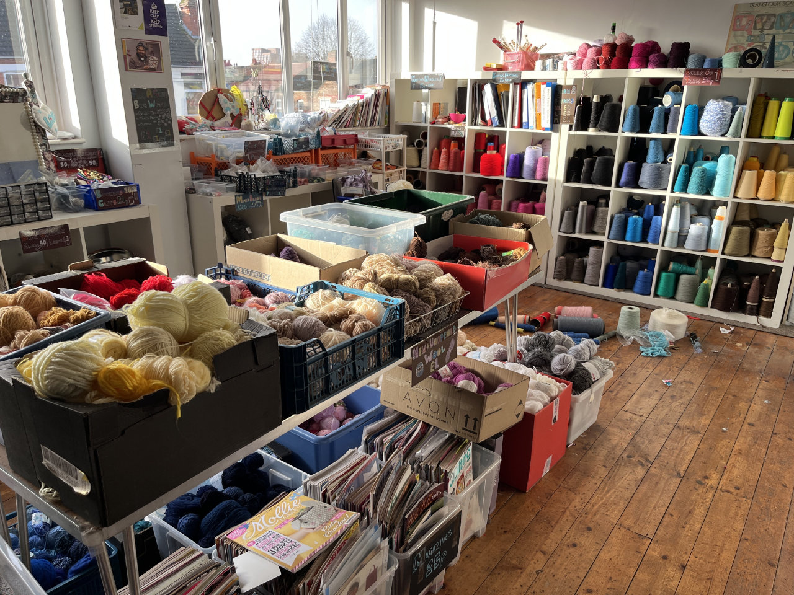
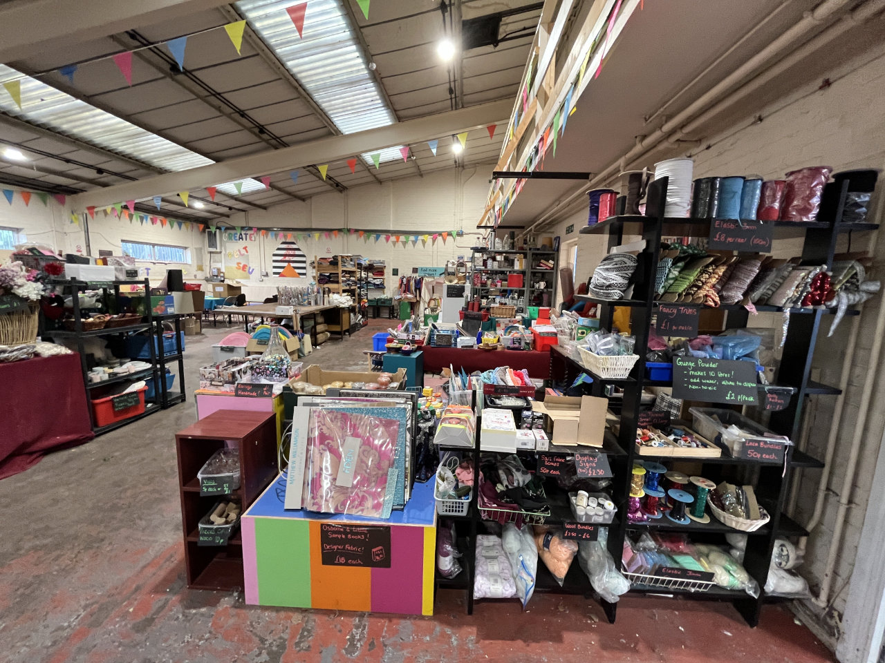
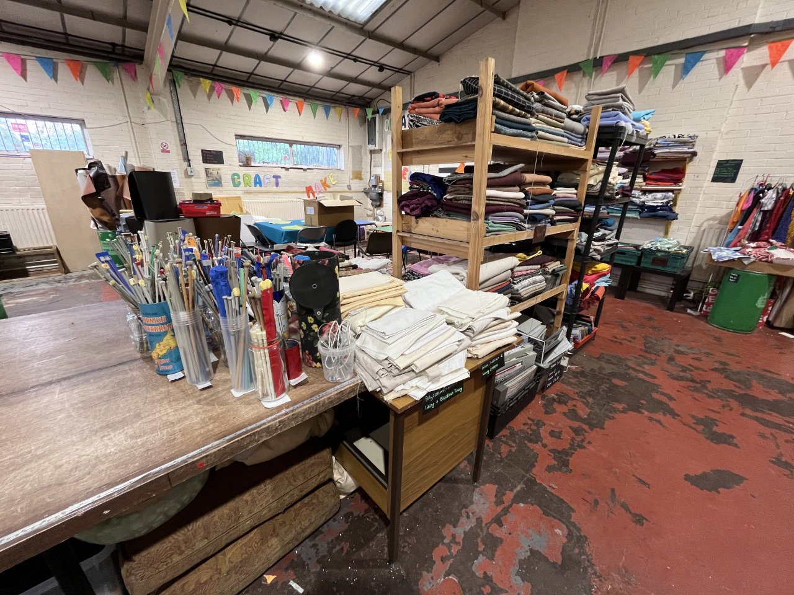
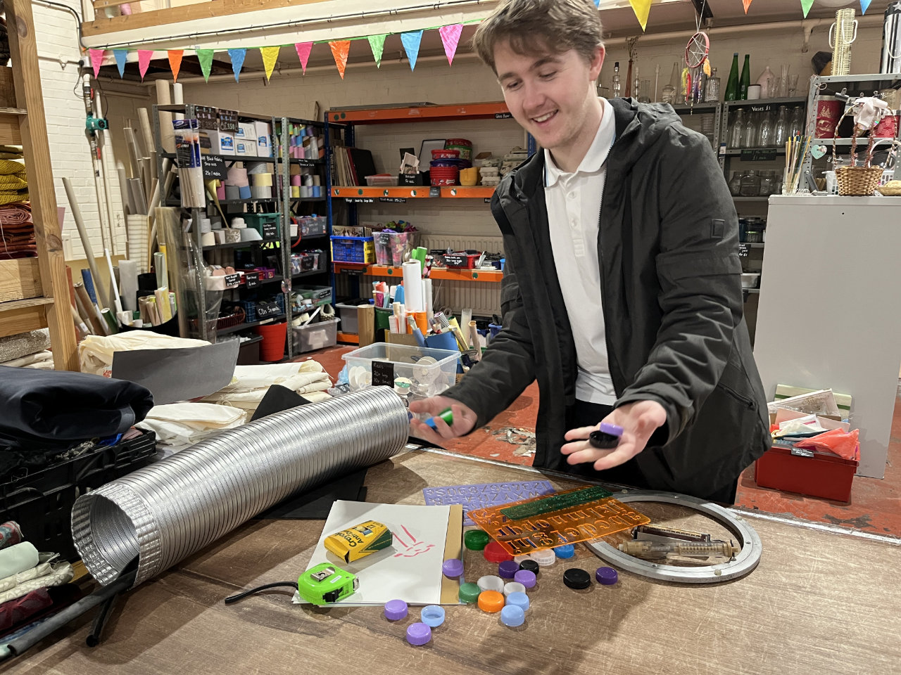
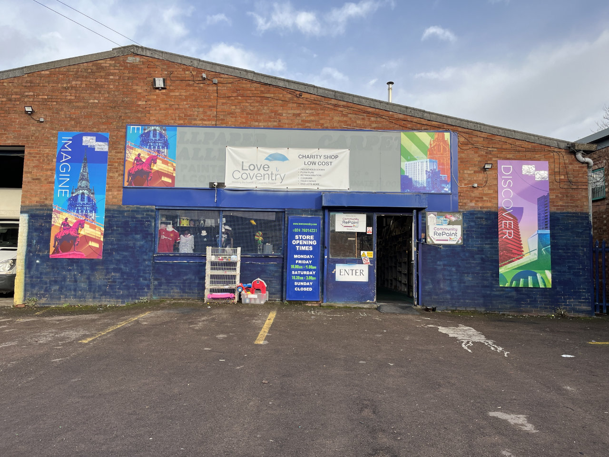
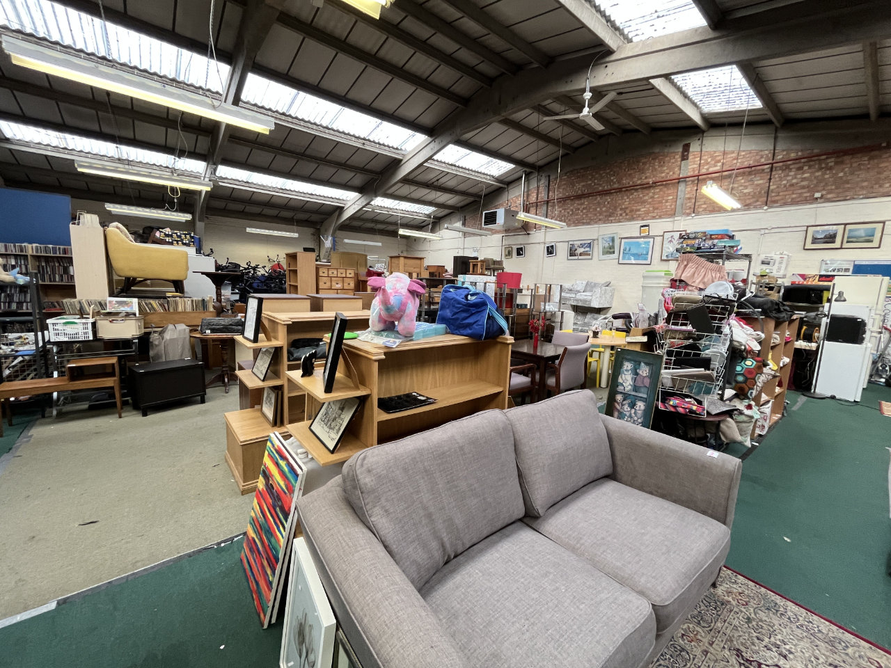
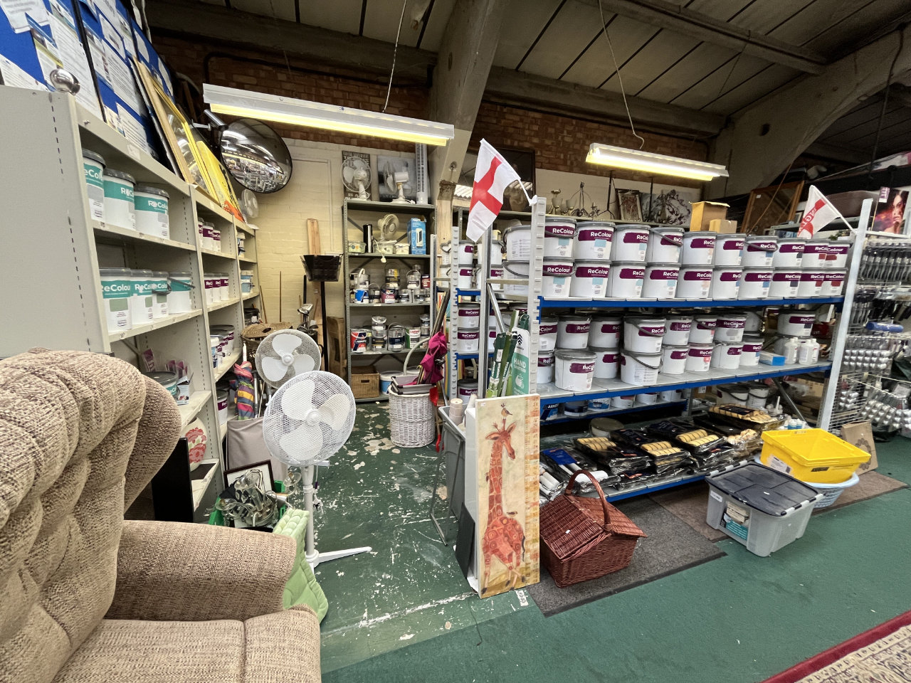

# Sourcing Set & Props

One of the responsibilities of the Set Designer or Stage Manager is to source set and props for a show. There are a
wide variety of different shops that may be beneficial for this, several of which are listed here.

## [The Scrapstore](https://www.crowrecycling.co.uk/crow-recycling-scrap-store/)

<figure>

<figcaption>View of The Scrapstore from the balcony</figcaption>
</figure>

[The Scrapstore](https://www.crowrecycling.co.uk/crow-recycling-scrap-store/) is an initiative by social enterprise
Crow Recycling to resell art and craft supplies which would have otherwise gone to landfill at a low cost. It contains
materials such as fabrics and haberdashery, paper and card, yarn and beads, and more.

:::info
The Scrapstore operates on a membership basis, with a yearly £10 fee before anything can be purchased. Tech Crew owns a
group membership (purchased 20 Feb 2025), number 52/25. The membership card can be found in the front of the Tech Crew
Admin Folder.

:::

Address: Crow Recycling, Sparkbrook Street, Coventry, CV1 5LB.

## [Love Coventry](https://www.facebook.com/LoveCoventryCharityShop/)

<figure>

<figcaption>Love Coventry's Storefront</figcaption>
</figure>

Love Coventry is a charity shop located next to The Scrapstore which sells furniture, clothing, bric-a-brack and
re-used paint.

Address: Love Coventry Charity Shop, Sparkbrook Street, Coventry, CV1 5LB.

## [B&Q](https://www.diy.com/)

A fairly standard store all over the UK - B&Q is good for things like paint.

## Online Shops

As always, online shops exist which are often a lot easier to browse and purchase from - especially as they can
[normally ship directly to the Warwick Arts Centre](../../../01-tech-crew/05-logistics/index.md).

These include:

* [Amazon](https://www.amazon.co.uk/)
* [eBay](https://www.ebay.co.uk/)