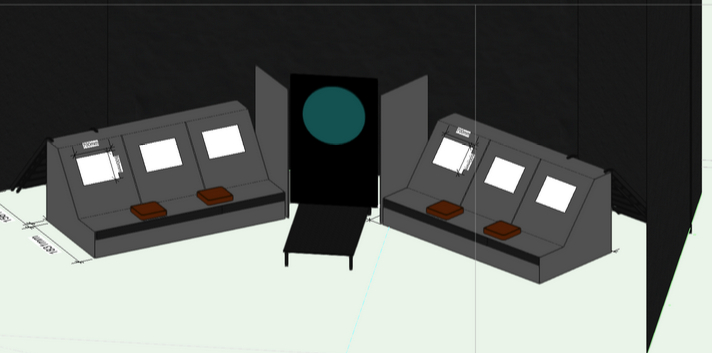
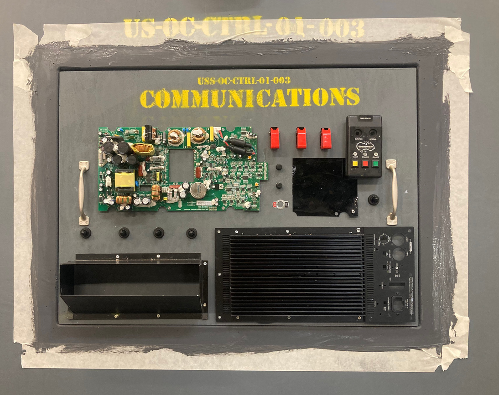
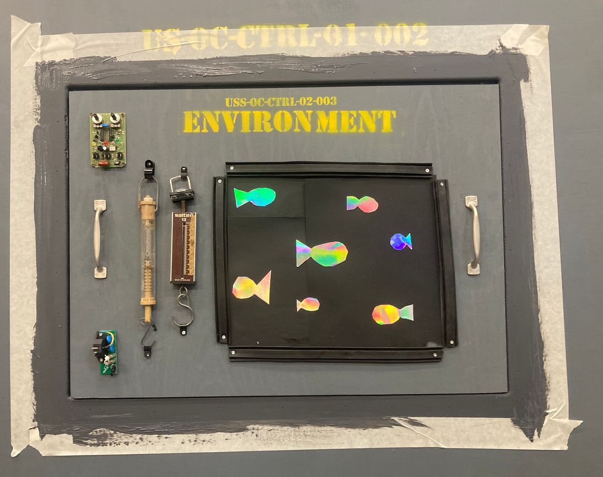

# Control Panels

## Planning Documents

## COMMUNICATIONS PANEL (USS-0C-CTRL-01-003)

Fabricated control panel for facilitation of communication between external naval command, surface ships, and
satellites.

| Position     | Description                                                                                                    |
| ------------ | -------------------------------------------------------------------------------------------------------------- |
| Top Left     | Motherboard for ultra high frequency (UHF) two-way communications when surfaced or at periscope depth.         |
| Bottom Left  | Post box for paper mail communications with the outside world. Please remember to waterproof any letters sent. |
| Bottom Right | Antenna lines for SATCOM high-bandwidth secure communications. Also functions as heat sink radiator.           |
| Top Right    | Hydrophones for acoustic communications, rate limited due to water's physical properties.                      |

## ENVIRONMENT CONTROL PANEL (USS-OC-CTRL-02-003)

Fabricated control panel for vitals and monitoring of the internal environment of the submersible.

| Position     | Component Description                                                                                   |
| ------------ | ------------------------------------------------------------------------------------------------------- |
| Top Left     | Sensor module to detect humidity inside and outside the submarine.                                      |
| Center Left  | Glass tube for pressure measurement and water salinity monitoring of the ocean water.                   |
| Bottom Left  | PSU (Power Supply Unit).                                                                                |
| Middle Right | Holographic interactive ultraviolet fish frequency scanner. Use with caution as it may be hot to touch. |
