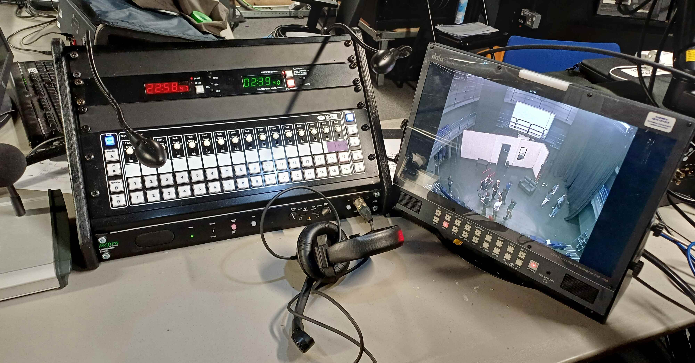

# Deputy Stage Manager (DSM)

<figure>

<figcaption>The DSM cue light desk, video monitor and cans in the studio tech box. Picture taken during 24/25 Accidental Death of an Anarchist get out.</figcaption>
</figure>

The Deputy Stage Manager:
* Is in charge of running the show and should be aware of all cues.
* Is heavily involved in the tech run, calling cues and adjusting them as required.
* Communicates with the tech team via 'cans' headsets.
* Times the show
* Attends the [paper tech](/wiki/warwick-drama/shows/show-preparation#paper-tech), where they will go over the cues from
  each department.
* Needs to be familiar with the script so they can 'fix the show' if things go wrong (e.g. cast missing lines).

:::info
Information about a DSM's responsibilities throughout the show process can be found on the
[Shows](/wiki/warwick-drama/shows) pages.
:::

## Example DSM Schedule
| Time                 | Activity                                                          |
|----------------------|-------------------------------------------------------------------|
| 35m before show open | Show calls                                                        |
| Show open            | Request clearance from FoH  Start show Start show timer |
| Interval start       | Write down time and restart timer  Calls                     |
| Interval end         | Request clearance from FoH  Start show Restart timer    |
| Show end             | Write down time and stop timer                                    |

## DSM Calls

Calls refer to PA announcements made by the DSM (or another technician such as the TM in lieu of a DSM). These are made
to either Front of House (FOH) (all public areas in the WAC, including the toilets and just outside) or Back of House
(BOH) (all backstage areas including corridors, dressing room and toilets).

In general, calls should be repeated twice and should end with *'thank you'*. Calls to BoH should start with *"For the
attention of the [SHOW] company"*. Back of House calls are always 5 minutes ahead of actual time - e.g. the 'half'
call is given 35 minutes before the show is supposed to open, not half an hour.

:::note
The following calls are just an example, modified from the calls given for MTW Company, 2024 (Jon K) (a Music
Theatre Warwick show in the theatre). 
:::

| Time               | Type & Name             | Call                                                                                                                                                                                                 |
|--------------------|-------------------------|------------------------------------------------------------------------------------------------------------------------------------------------------------------------------------------------------|
| -                  | BoH Mic-up Call         | Good evening members of the [SHOW] company, cast to be mic'd please come to stage left when in costume and makeup, cast to be mic'd please come to stage left when in costume and makeup, thank you. |
| -                  | BoH Principals Call     | For the attention of the [SHOW] company, please can [PRINCIPALS] come to the stage for calls, that's [PRINCIPALS] for calls, thank you.                                                              |
| -                  | BoH Warmup Call         | For the attention of the [SHOW] company, your call please cast for warmup; cast for warmup, this is your call, thank you.                                                                            |
| -                  | BoH Soundcheck Call     | For the attention of the [SHOW] company, your call please band for soundcheck; band for soundchecks this is your call, thank you.                                                                    |
| Show Up - 35m      | BoH Half Call           | For the attention of the [SHOW] company, this is your half hour call, that's your half hour call, thank you.                                                                                         |
| Show Up - 20m      | BoH Quarter Call        | For the attention of the [SHOW] company, this is your quarter hour call, that's your quarter hour call, thank you.                                                                                   |
| Show Up - 10m      | BoH 5-Minute Call       | For the attention of the [SHOW] company, this is your 5-minute call, that's your 5-minute call, thank you.                                                                                           |
| Show Up - 10m      | FoH 10-Minute Call      | Hello and welcome to Warwick Arts Centre, this evening's performance of [SHOW] in the [VENUE] will begin in 10 minutes, please take your seats. Thank you.                                           |
| Show Up - 5m       | BoH Beginners Call      | For the attention of [SHOW] company, this is your beginners call, that's your beginners call, thank you.                                                                                             |
| Show Up - 3m       | FoH 3-Minute Call       | Hello and welcome to Warwick Arts Centre, this evening's performance of [SHOW] in the [VENUE] will begin in 3 minutes, please take your seats. Thank you.                                            |
| Show Up - 2m       | FoH 2-Minute Call       | Hello and welcome to Warwick Arts Centre, this evening's performance of [SHOW] in the [VENUE] will begin in 2 minutes, please take your seats. Thank you.                                            |
| Show Up - 1m       | FoH Starting Call       | Hello and welcome to Warwick Arts Centre, this evening's performance of [SHOW] in the [VENUE] is starting shortly, please take your seats. Thank you.                                                |
| Show Up            | BoH Lights Up Call      | Lights up on Act [ACT] of [SHOW], lights up on Act [ACT] of company, thank you.                                                                                                                      |
| Interval Start     | BoH Interval Start Call | For the attention of the [SHOW] company, your call please for the interval, that's your call for the interval, Act [ACT] time [TIME]. thank you.                                                     |
| Interval End - 20m | BoH Quarter Call        | For the attention of the [SHOW] company, this is your quarter hour call, that's your quarter hour call, thank you.                                                                                   |
| Interval End - 10m | BoH 5-Minute Call       | For the attention of the [SHOW] company, this is your 5-minute call, that's your 5-minute call, thank you.                                                                                           |
| Interval End - 5m  | BoH Beginners Call      | For the attention of [SHOW] company, this is your beginners call, that's your beginners call, thank you.                                                                                             |
| Interval End - 5m  | FoH Starting Call       | This evening's performance of [SHOW] in the [VENUE] will resume in 5 minutes, please take your seats. Thank you.                                                                                     |
| Show Up            | BoH Lights Up Call      | Lights up on Act [ACT] of [SHOW], lights up on Act [ACT] of company, thank you.                                                                                                                      |
| Show End - 5m      | BoH Curtain Call        | For the attention of [SHOW] company, your call please for the end of Act [ACT] curtain calls, that's the end of Act [ACT} curtain calls, thank you.                                                  |

## Requesting Clearance

Once the show is supposed to open (either at the start or after an interval), the DSM should request clearance from
Front of House to start the show. There are two main methods to do this, which should be determined with the WAC
duty-technician before the show starts.

* **Cue Lights**: Once the show is ready to start, the DSM can cue the FoH cue light on their prompt desk. FoH will then
  click the 'standby' button on their light, after which the DSM can click 'go' and start the show.
* **Radio**: The WAC duty technician will be in the control room at the show start and will be able to radio FoH for
  clearance.

