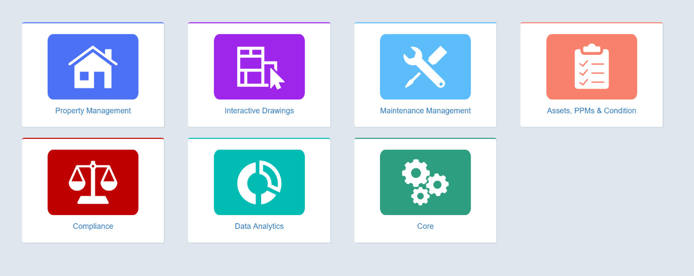
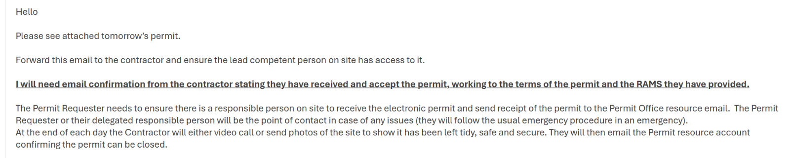

# Flying Drones
Drones (also known as Unmanned Aerial Vehicles (UAVs) or Small Unmanned Aircraft (SUA)) are a great way to capture
footage from a unique, aerial perspective. However, there are a few procedures that need to be followed before being
able to use these on campus.

## Acquiring Live Drone Feeds
For most DJI drones the only supported live output is to an
[RTMP Server](https://en.wikipedia.org/wiki/Real-Time_Messaging_Protocol). For this you will need the drone and a
laptop/PC on the same network (I would advise not using eduroam). To set up an RTMP server on a computer, use either
[MonaServer](https://www.reddit.com/r/mevocamera/comments/bd5182/how_do_i_turn_my_pc_into_a_local_rtmp_server_so/) for Windows or [MistServer](https://docs.mistserver.org/protocol/realtimestreaming/rtmp/) for MacOS/Linux. Then set the url of the rtmp server on the drone. To
easily view the state of the rtmp server, use [VLC](https://www.videolan.org/) and its network view feature (Media->Open Network Stream). Once
you have a reliable stream, this can be imported to [OBS](https://obsproject.com/) using the dedicated import
(Sources->Add->VLC Video Source). Note this requires a fast WiFi network to run reliably with a high quality,
test beforehand!

The other method of live recording is to get an output straight from the controller. Most controllers unfortunately
cannot do this, as of writing the known ones are
[DJI RC2](https://dji-retail.co.uk/products/dji-rc-2-remote-controller-with-screen) or
[DJI RC Pro](https://www.dji.com/uk/rc-pro). The Pro is nice as it has a dedicated HDMI out. The RC2 requires a USB C to
HDMI adaptor with a certain chip. Note you cannot use solely USB-C as the video cable as the controller will not
recognise that as a video output. Once you have video out, it mirrors the stream of the controller, meaning all cropping
is added, so you may need to pass the input through OBS to crop the stream to remove them.

## Flying Drones on the University of Warwick Campus

There are limitations on where drones can be launched and landed, and where they can be operated from. There are fewer
limitations on where drones can be flown over once they are airborne, but there are still restrictions set by the
Civil Aviation Authority in the [Drone and Model Aircraft Code](https://register-drones.caa.co.uk/drone-code).

Ultimately, wherever you fly, you must ensure that you are doing so safely and legally. If Community Safety or the
University request that you stop flying (even if from public land), it's often in your best interests to do so.

### Flying From Public Land
The main road through campus (Gibbet Hill Rd) is public land, so you should be able to fly from there.

### Flying From University of Warwick Land
:::info
This option is only available to University of Warwick staff, although a staff member may issue a permit on a student's
behalf.
:::

:::info
Note that a permit is not required for flying drones indoors (however you will still need to take the necessary safety
precautions).
:::

To fly a drone outdoors on University of Warwick Land, you must first obtain a permit from the Estates Office. This must
be done at least [20 working days](https://warwick.ac.uk/services/estates/service_centre/permit_to_work/guidance/)
(i.e. 4 weeks) from the requested date - and if you've not submitted a permit before, you will need to attend a permit
training to gain access to the system before that.

Obtaining a drone permit consists of the following steps:

1. Fill in a [SUA Flight Plan](https://docs.google.com/document/d/11EYMdkDxBtDWU_WL6zFi1U5V4v5KZUE2/edit) and
   [Risk Assessment](https://docs.google.com/document/d/1tMQIJgSFG6ZGgF3hOdsR_h5VBxQrhB5g/edit). Examples can be found
   on the [Tech Crew Google Drive](https://drive.google.com/drive/folders/1FpMKoTum_fMmCvmprGQaDXqVgqQ825kD).
2. Obtain access to the [Q2 Permit Application System](https://warwick.ac.uk/services/estates/service_centre/permit_to_work/)
   
   1. Email [permitrequest@warwick.ac.uk](permitrequest@warwick.ac.uk) to arrange an online (Teams) training session.
   2. Attend the training session - this should take less than an hour.
   3. Once you have completed the training, you will be given access to the system on your staff account.
   4. Note that the Q2 Permit Application System is only accessible on the University network
     (i.e. a University computer, excluding Eduroam) or on the
     [University VPN](https://warwick.ac.uk/services/its/servicessupport/networkservices/vpn/). Access to this can be
     granted to staff through the
     [ITS Help Desk](https://warwick.service-now.com/sp?id=sc_cat_item&sys_id=2b153b64696c9100da143a11648fa8aa).
3. Create a new permit on the [Q2 Permit Application System](https://q2.estate.warwick.ac.uk/Q2/permits), following the
   guidance in the training and the
   [Permit SOP](https://warwick.ac.uk/services/estates/service_centre/permit_to_work/q2_permit_system_applying_for_a_permit.pdf).
   
   1. Add a **Linked Permit Type** of **Permit to Operate a UAV (drone)**, filling in the relevant details and uploading
      the risk assessment, flight plan and SU public liability insurance documents.
4. The Estates Permit Office may schedule a Teams meeting to talk through the permit and safety procedures.
5. A day before the event, you will receive the permit via email.
   
   1. You must reply to this email to confirm the permit has been issued.
   2. You must call Community Safety on 024 7652 2083 to inform them of your flight plan - you may also need to provide
      your permit number.
6 Just before flight, you must call Community Safety again on 024 7652 2083 to inform them that you are about to fly.