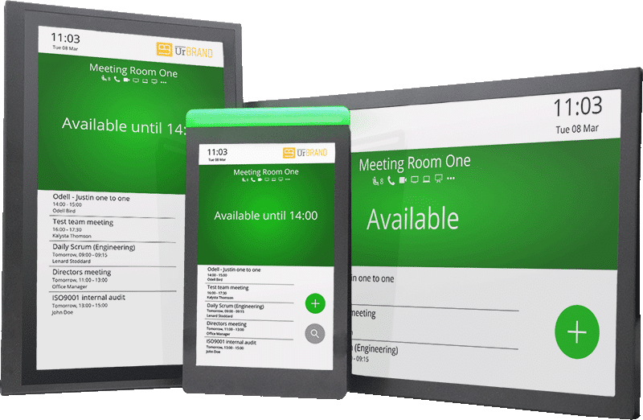

# Centrally Timetabled Rooms

The majority of rooms on campus are managed by the
[Central Timetabling Office](https://warwick.ac.uk/services/academicoffice/centraltimetabling/). These can be booked by
any member of student or staff, and are often useful for meetings.

:::warning

All room bookings are subject to the
[Room Usage Terms and Conditions](https://warwick.ac.uk/services/academicoffice/centraltimetabling/webroombooking/roombookings/termsandconditions).

In particular, these include:

- Rooms must be kept in a clean and tidy state, with all furniture returned to the appropriate layout
- Eating or drinking is not permitted.
- Noise must be kept to a reasonable level to not disturb neighbouring rooms. See the
  [Alternative Venues List](https://warwick.ac.uk/services/academicoffice/centraltimetabling/roominformation/alternativevenues)
  for approved performance spaces.

:::

## Viewing Room Timetables

Timetables can be viewed by going to [https://warwick.ac.uk/timetablereports](https://warwick.ac.uk/timetablereports)
and logging in with your Warwick ITS account.

Students have access to view timetables by:

- Programmes (courses)
- Modules
- Locations (rooms)

In addition to the above, staff can also view:

- Timetables by Departments or Staff
- Department Activity Lists (a list of all bookings within a department, including those by students)
- Security Lists (a list of all non-standard bookings).

### Booking Codes

Each room booking will have a respective **booking code**. For academic modules, these are typically just the code or
name of the module. For other bookings, they are often in the following format:

```txt
X.[PERSON_TYPE].[DEPARTMENT].[INITIALS].[NUMBER]
```

- **Person Type**: Either `Staff`, `UG` (undergraduate), `PG(R)` (postgraduate research) or `PG(T)` (postgraduate
  teaching).
- **Department**: A two-letter abbreviation of the booking person's department, e.g. `CS` for computer science or `WM`
  for WMG.
- **Initials**: The initials of the booking person.
- **Code**: A number uniquely identifying the booking.

An example code for a room booking is `X.UG.CS.JH.003076`.

### Reserva Panels



Several rooms are equipped with a
[ONELAN Reserva Room Booking Panel](https://warwick.ac.uk/services/its/servicessupport/av/lecturerooms/roominformation/roombookingpanels)
outside the door, which displays the room's schedule and if it is in use.

This will mainly display the **booking code**, which can be deciphered using the section above.

More information about this (and an outdated list of which rooms have these) can be found on the
[IT Services Webpage](https://warwick.ac.uk/services/its/servicessupport/av/lecturerooms/roominformation/roombookingpanels)

## Booking Rooms

To book a performance space, log into the [Web Room Booking System](https://warwick.ac.uk/roombooking) at
[https://warwick.ac.uk/roombooking](https://warwick.ac.uk/roombooking) with your Uni ID (`uXXXXXXX` where the `X`'s are
your ID number) and your Warwick ITS password.

:::warning

You're only allowed to perform in certain rooms, due to noise limits. See:
[Performance Rooms](https://warwick.ac.uk/services/sg/spa/centraltimetabling/roominformation/alternativevenues) for a
full list.

:::
