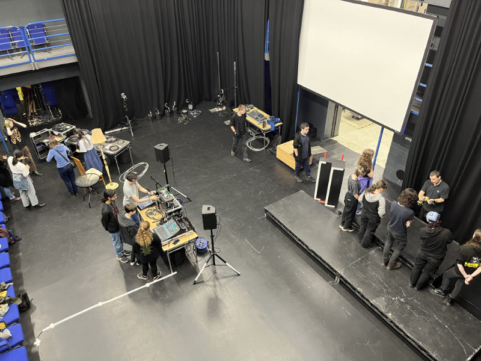
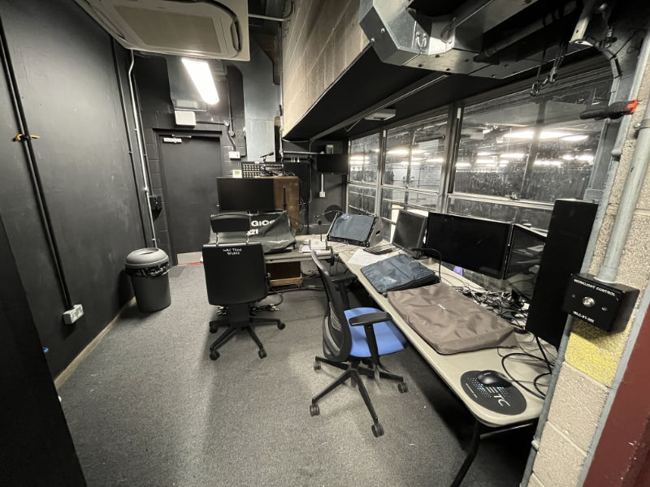
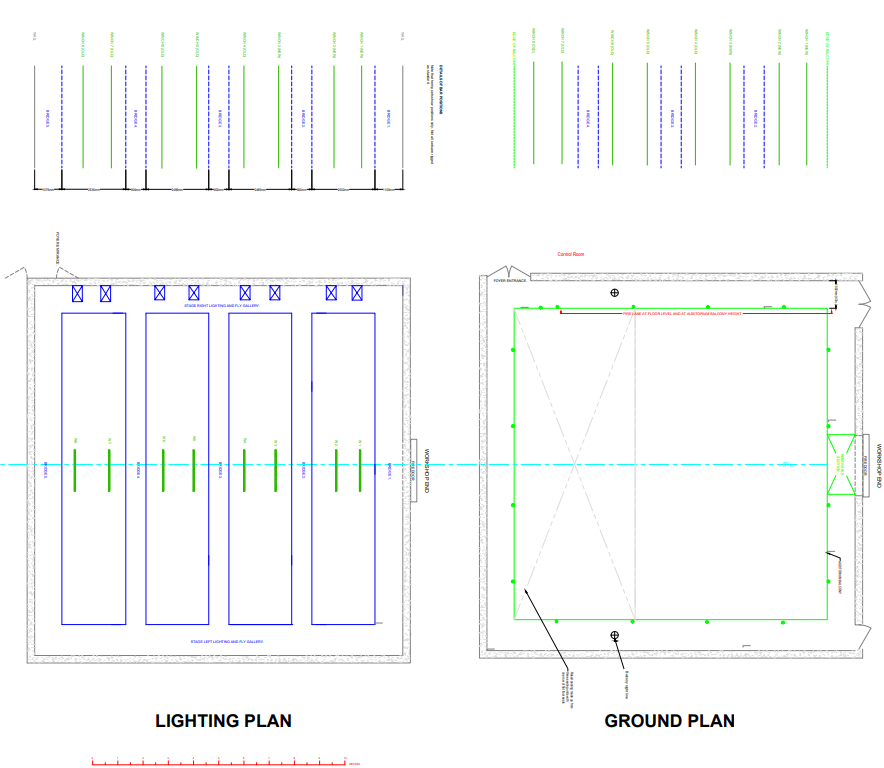
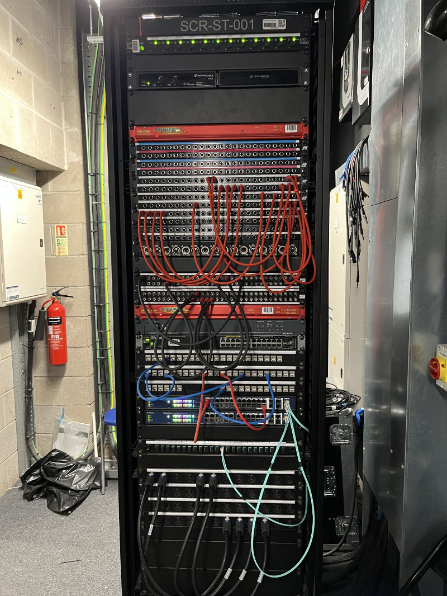
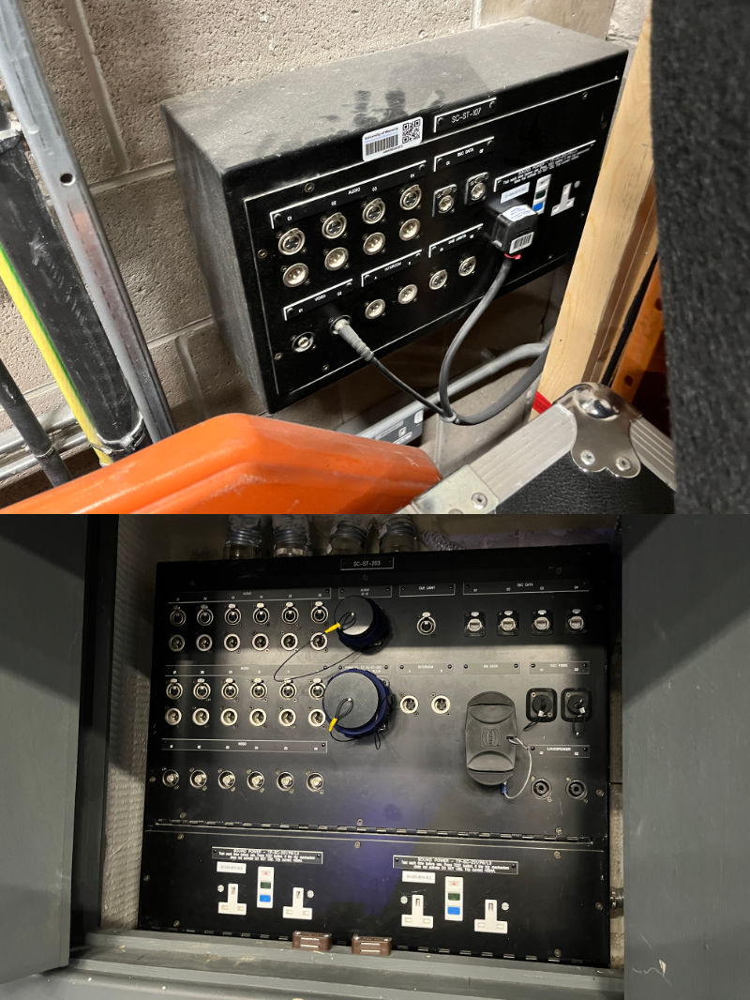
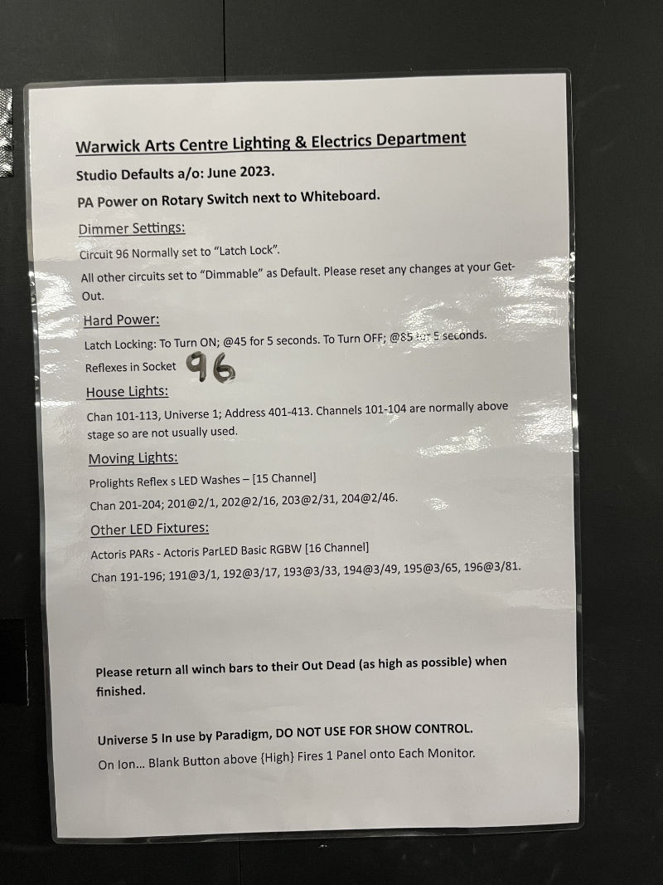
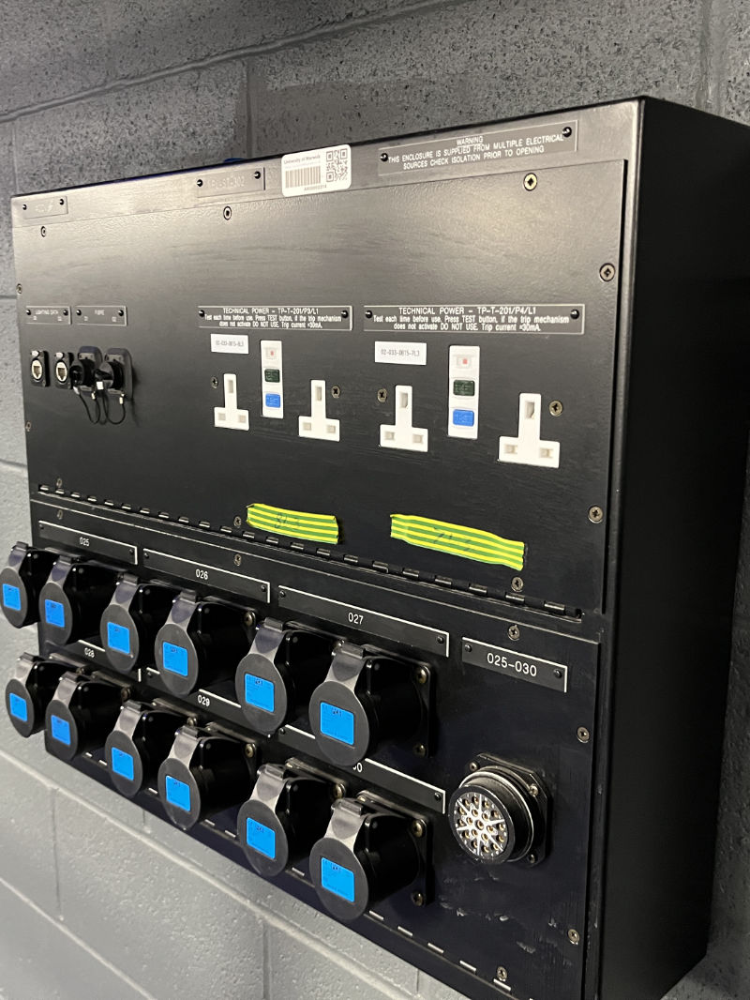

# Studio
The WAC Studio is our main performance space, seating up to 150 people. We will typically have 2-3 shows here each term,
along with most of our trainings.

<figure>

<figcaption>The WAC Studio floor and control room</figcaption>
</figure>

## Layout & Seating

### 360 Camera View

The WAC provides a 360 view of all its venues on its
[website](https://www.warwickartscentre.co.uk/our-venues/studio/).

<iframe src="https://my.matterport.com/show/?m=gyBcoRB4m7u&play=1&qs=1&hl=0&brand=0&sr=-.54,-1.47&ss=411" width="100%" height="600" >
</iframe>

### Blank LX Plan

### Levels

There are four levels in the studio. Apart from the main floor, there is a performance balcony, tech balcony and the
bridges. The tech balcony and bridges are only accessible to TC members (for insurance purposes) and cannot be used by
cast during the show. When working on the bridges, the floor area below (including bleachers seating) must be kept clear
of people.

The control room is accessible by the tech balcony, although this can be loud/obvious when walking on so avoid this
during a show. There is a toilet located just outside the control room, however these lights are controlled by the
theatre so you may need to use a torch if the theatre is in use. There is also an alternative route to the control room
through the WAC theatre, however this should be avoided if possible and cannot be used if there is a theatre show on.

### Seating

The [seating plan](https://www.warwickartscentre.co.uk/download/file/THFUeFg2QkJSQUVseW41UDJpU3dBdz09/) can be found on 
WAC's website. The seats in the back row can be taken out in sets of 3 - if you'd like to mix at the Front of House
position, you'll have to take out 6 seats to make space for the sound mixing desk (known as "front of house holds").

Rows A to D are made up of three columns of removable bleachers. These can be taken out of the venue and stored in the
dock (and additional chairs added), allowing for shows in the round/thrust or having the audience stand
(e.g. for music gigs).

### Studio CAD

The public drive has a [CAD file](https://drive.google.com/file/d/14TwSrr7mwapPVbPDDN8Pqs9k-5upM8-4/view?usp=drive_link) of the studio, which can be uploaded to this [online CAD viewer](https://viewer.autodesk.com/) so you can
inspect and measure the space yourself.

## Working in the Space

As with any venue in the Warwick Arts Centre, it is important to be mindful and respectful of other users (especially
in the theatre, which is connected via the dock). For those working on a show, the studio can be accessed via
Back of House - the code to access this changes weekly and can be given on request to Tech Crew exec.

When getting out, please follow the WAC's
[get out checklist](https://drive.google.com/file/d/1a4Ue4wrthyAD1Y5ajFlXJ34QVE7Oq-Y1/view?usp=drive_link).

## Technical Specifications

### Lantern Stock

| Lantern                        | Beam Angle              | Quantity |
|---------------------------------|-------------------------|----------|
| Robert Juliat 1K Fresnel        | 6 to 46 degree           | 28       |
| Selecon Rama Fresnel            | 7 to 50 degree           | 6        |
| Altman Shakespeare              | 15 to 35 degree          | 22       |
| Selecon Acclaim                 | 24 to 44 degree          | 14       |
| Strand SL fixed                 | Fixed 19 degree          | 6        |
| Strand SL                       | 15 to 32 degree          | 6        |
| Strand SL                       | 23 to 50 degree          | 10       |
| Parcan                          | CP 60/61/62 as required  | 18       |
| Strand Coda floods              | N/A                      | 8        |
| ProLights Reflex Led Washes      | 10 to 60 degree          | 4        |

The winch bars are drill driven and have a max capacity of 250kg.

### Sound

The studio comes stock with:

- 2x Meyer UPA (Main PA "tops")
- 2x Meyer USW (Subwoofer)
- 1x DiGiCo S21 in the control room (this can be moved to Front of House for a small fee)

### Patch Panels
Patch panels are located on the walls around the Studio and allow for the easy patching of data cables.

In the tables below, note that e.g. USL stands for Upstage Left, DSC stands for Downstage Center and SR stands for Stage Right.

#### Sound, Video and Comms

A [list of all the patch panel numbers](https://drive.google.com/file/d/11x5CvrBdcfXjkRJ9nkfqovJU4wu2ljn0/view?usp=sharing)
can be found on the wall in the control room, next to the SCR-ST-001 patching rack. Make sure to make a note of the 
patching before changing anything, so this can be reverted during the get-out.

When patching, use the black patch cables stored on the ducting next to the rack. Red patch cables should never be
touched (where possible) - if you need to change these, make sure to revert them back during the get-out.

Note that unless patched, patches with a red label will automatically link to the matching red label patch below it. 

In the Studio, the sound patch panels are:

| Name      | Location                  | Male & Female XLR | speakCON | S&C Data (Ethernet) | S&C Fibre | Video (BNC)  | Intercom (A/B) | Cue Lights | Power (13A)   | Extras                                        |
|-----------|---------------------------|-------------------|----------|---------------------|-----------|--------------|----------------|------------|---------------|-----------------------------------------------|
| SC-ST-101 | USL                       | 1-12 with VEAM    | 1-4      | 1-4                 | 1-2       | 1-4          | Yes            | 1          | 4             | SM Desk                                       |
| SC-ST-102 | USR                       | 1-12 with VEAM    | 1-4      | 1-4                 | 1-2       | 1-4          | Yes            | 1          | 4 (2 working) |                                               |
| SC-ST-103 | DSR                       | 1-12 with VEAM    | 1-4      | 1-4                 | None      | 1-4          | Yes            | 1          | 4             |                                               |
| SC-ST-104 | DSL                       | 1-12 with VEAM    | 1-4      | 1-4                 | None      | 1-4          | Yes            | 2          | ?             |                                               |
| SC-ST-105 | Backstage Lobby SL        | ?                 | ?        | ?                   | ?         | ?            | ?              | ?          | ?             |                                               |
| SC-ST-106 | Backstage Lobby SR        | ?                 | ?        | ?                   | ?         | ?            | ?              | ?          | ?             |                                               |
| SC-ST-107 | Dock                      | 1-4               | None     | 1-2                 | None      | 1-2 (1 free) | Yes            | 2          | 2 (1 free)    |                                               |
| SC-ST-201 | Balcony SL                | 1-12 with VEAM    | 1-2      | 1-2                 | None      | 1-2          | Yes            | 1          | 2             | Next to 16A Clean Sound Power                 |
| SC-ST-202 | Balcony SR                | 1-12 with VEAM    | 1-2      | 1-2                 | None      | 1-2          | Yes            | 1          | 2             | Next to 16A Clean Sound Power                 |
| SC-ST-203 | FOH Mixing Position (DSC) | 1-12 with VEAM    | 1-2      | 1-4                 | 1-2       | 1-6          | Yes            | 1          | 4             | SM Desk, FoH Mix VEAM (Parallel to SC-ST-305) |
| SC-ST-301 | Tech Balcony USC          | 1-4               | 1-2      | 1-2                 | None      | 1-2          | Yes            | 1          | 2             |                                               |
| SC-ST-302 | Tech Balcony SR           | 1-4               | 1-2      | 1-2                 | None      | 1-2          | Yes            | 1          | 2             |                                               |
| SC-ST-303 | Upstage Left SL           | 1-4               | 1-2      | 1-2 (1 free)        | None      | 1-6 (5 free) | Yes            | 1          | 2 (1 free)    |                                               |
| SC-ST-304 | Upstage Left DSC          | 1-4               | 1-2      | 1-2                 | None      | 1-2          | Yes            | 1          | 2             |                                               |
| SC-ST-305 | Control Room              | 1-12 with VEAM    | None     | 1-8 (7 free)        | 1-2       | 1-8 (7 free) | Yes            | 2          | 8 (6 free)    | SM Desk, FoH Mix VEAM (Parallel to SC-ST-203) |
| SC-ST-401 | Bridges USC               | ?                 | ?        | ?                   | ?         | ?            | ?              | ?          | ?             |                                               |
| SC-ST-402 | Bridges SR                | ?                 | ?        | ?                   | ?         | ?            | ?              | ?          | ?             |                                               |
| SC-ST-403 | Bridges DSC               | ?                 | ?        | ?                   | ?         | ?            | ?              | ?          | ?             |                                               |
| SC-ST-404 | Bridges SL                | ?                 | ?        | ?                   | ?         | ?            | ?              | ?          | ?             |                                               |
| SC-ST-405 | Bridge 3                  | ?                 | ?        | ?                   | ?         | ?            | ?              | ?          | ?             |                                               |

When using the Front of House mixing position (SC-ST-203), you will also need to unplug the sound multipin snake from
the control room (SC-ST-305).

When using the 16A sound power on the balconies (used for the stock Meyer PA), make sure to turn these on or off 
using the red 'PA POWER' isolator switch next to the sound rack.

Note that the studio uses **Intercom Channel A**, and the theatre uses Intercom Channel B.

#### Lighting
:::info
This still needs to be completed!
:::

In the studio, the lighting patch panels are:

| Name      | Location         | Dimmer Channels (16A Pairs + 6ch Spiders) | Lighting Data (Ethernet) | Fibre | Power (13A) |
|-----------|------------------|-------------------------------------------|--------------------------|-------|-------------|
| PL-ST-102 | SR Alcove        | 1-6                                       | 1-2                      | 1-2   | 2           |
| PL-ST-103 | DSR              | 13-18                                     | 1-2                      | None  | 2           |
| PL-ST-104 | DSL              | 7-12                                      | 1-2                      | None  | 2 (1 free)  |
| PL-ST-301 | Tech Balcony USC | 31-36                                     | 1-2                      | None  | 4           |
| PL-ST-302 | Tech Balcony SR  | 25-30                                     | 1-2                      | 1-2   | 4           |