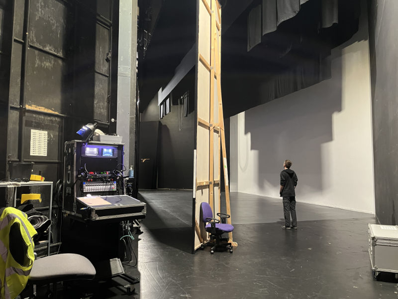
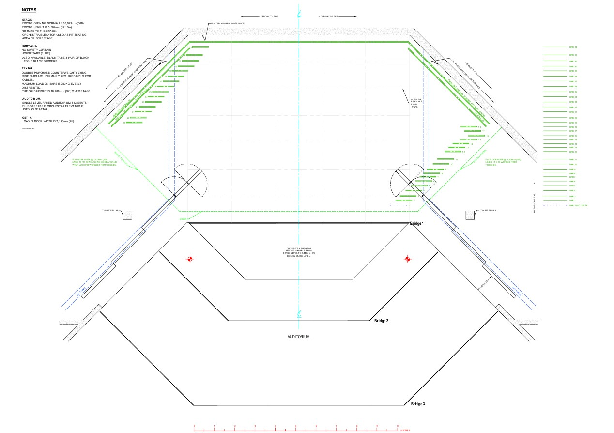
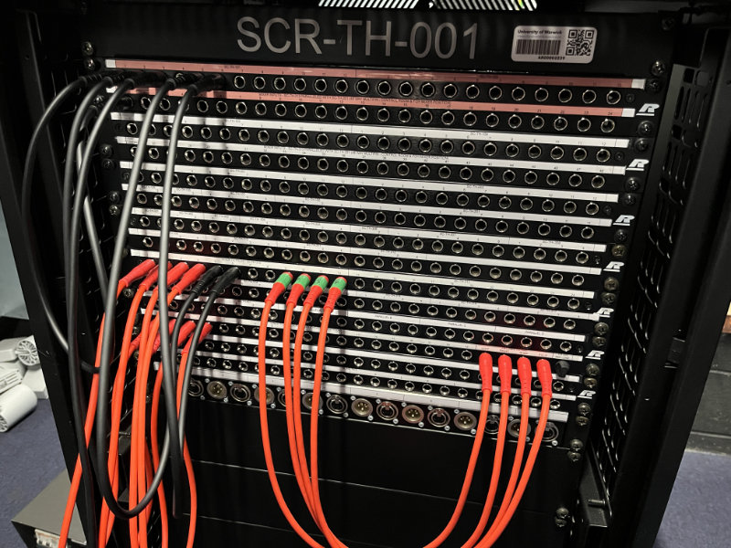
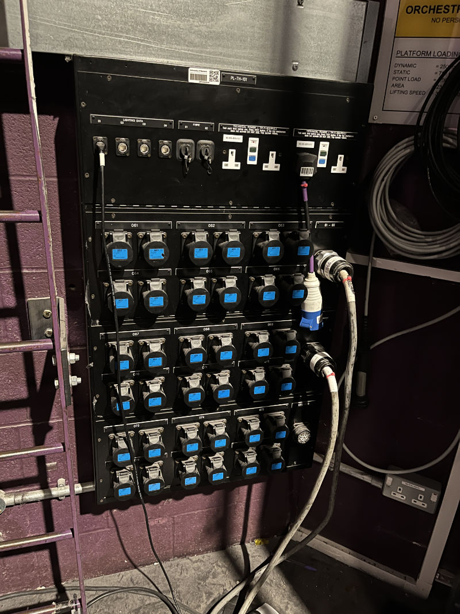

# Theatre

The WAC Theatre is our largest performance space, seating up to 575 people. In term 2, we will typically have a show
here by both Warwick Opera and Music Theatre Warwick.

<figure>

<figcaption>Stage Left of the WAC Theatre</figcaption>
</figure>

## Layout & Seating

### 360 Camera View

The WAC provides a 360 view of all its venues on its [website](https://www.warwickartscentre.co.uk/our-venues/studio/).

<iframe src="https://my.matterport.com/show/?m=gyBcoRB4m7u&play=1&qs=1&hl=0&brand=0&sr=-.26,.39&ss=706" width="100%" height="600" ></iframe>

### Blank LX Plan

### Seating

## Working in the Space

As with any venue in the Warwick Arts Centre, it is important to be mindful and respectful of other users. For those
working on a show, the studio can be accessed via Back of House - the code to access this changes weekly and can be
given on request to Tech Crew exec.

When getting out, please follow the WAC's
[get out checklist](https://drive.google.com/file/d/1V3--hqdy2GujzzLPbnORoPKkkl1umAva/view?usp=sharing).

## Technical Specifications

### Orchestra Elevator/ Forestage Riser

The theatre has a moving forestage. It can be moved to three heights allowing it to be in line with either the stage,
the front row audience, or the pit. We use the lift to move heavy instruments or equipment in and out of the pit, as the
only other access to the pit is through the narrow corridor and staircase. There is an info panel in the pit with the
following stats:

| Specification   | Value                |
|-----------------|----------------------|
| Dynamic Load    | 250 kg/m²            |
| Static Load     | 750 kg/m²            |
| Point Load      | 1000 kg              |
| Lifting Speed   | 3 m/min or 50 mm/sec |

### Lantern Stock

| Lantern                                   | Beam Angle              | Quantity |
| ----------------------------------------- | ----------------------- | -------- |
| Selecon SPX Narrow                        | 15 to 35 degree         | 8        |
| Selecon SPX Wide                          | 25 to 50 degree         | 14       |
| Selecon Pacific wide                      | 23 to 50 degree         | 20       |
| Selecon Pacific narrow                    | 14 to 35 degree         | 6        |
| Strand SL Wide                            | 23 to 50 degree         | 8        |
| Strand SL Narrow                          | 15 to 30 degree         | 14       |
| Robert Juliat 614 Profiles                | 16 to 35 degree         | 6        |
| Robert Juliat 1Kw Fresnels                | 6 to 46 degree          | 40       |
| Robert Juliat 2Kw Plano Convex            | 16 to 72 degree         | 10       |
| Selecon Rama Fresnel                      | 7 to 50 degree          | 10       |
| Parcans                                   | CP 60/61/62 as required | 40       |
| Altman Spectra Cyc 200 LED cyc floods     | N/A                     | 6        |
| Robert Juliat Korrigan (1200W) Followspot | N/A                     | 2        |
| Boom Bases                                | N/A                     | 12       |

### Patch Panels

Patch panels are located on the walls around the Studio and allow for the easy patching of data cables.

In the tables below, note that e.g. USL stands for Upstage Left, DSC stands for Downstage Center and SR stands for Stage
Right.

#### Sound, Video and Comms

A
[list of all the patch panel numbers](https://drive.google.com/file/d/1me_DVrEaxsSUcurCd-MGxp_9FndEu_dc/view?usp=sharing)
can be found on the wall in the sound control room, next to the patching rack. Make sure to make a note of the patching
before changing anything, so this can be reverted during the get-out.

When patching, use the black patch cables stored next to the rack. Red patch cables should never be touched (where
possible) - if you need to change these, make sure to revert them back during the get-out.

Note that unless patched, patches with a red label will automatically link to the matching red label patch below it.

:::info

This still needs to be completed!

:::

Sound patch panels in the theatre are:

| Name      | Location            | Male & Female XLR           | speakCON     | S&C Data (Ethernet) | S&C Fibre | Video (BNC)  | Intercom (A/B) | Cue Lights | Power (13A) | Extras                                    |
| --------- | ------------------- | --------------------------- | ------------ | ------------------- | --------- | ------------ | -------------- | ---------- | ----------- | ----------------------------------------- |
| SC-TH-001 | Pit SL              | 1-12 with VEAM              | ?            | ?                   | ?         | ?            | ?              | ?          | ?           |                                           |
| SC-TH-002 | Pit SR              | 1-12 with VEAM              | ?            | ?                   | ?         | ?            | ?              | ?          | ?           |                                           |
| SC-TH-101 | SL Pillar           | 1-12 with VEAM              | 1-4 (1 free) | 1-8                 | 1-2       | 1-8 (6 free) | Yes            | 2          | 4           | SM Desk (default position), Paging Mic    |
| SC-TH-102 | SR Pillar           | 1-12 with VEAM (11 working) | 1-4 (1 free) | 1-8                 | 1-2       | 1-8 (6 free) | Yes            | 2          | 4           | SM Desk, Paging Mic                       |
| SC-TH-103 | USL                 | 1-12 with VEAM              | ?            | ?                   | ?         | ?            | ?              | ?          | ?           |                                           |
| SC-TH-104 | USR                 | 1-12 with VEAM              | ?            | ?                   | ?         | ?            | ?              | ?          | ?           |                                           |
| SC-TH-105 | Stage Trap SL       | 1-2                         | ?            | ?                   | ?         | ?            | ?              | ?          | ?           |                                           |
| SC-TH-106 | Stage Trap SR       | 1-2                         | ?            | ?                   | ?         | ?            | ?              | ?          | ?           |                                           |
| SC-TH-107 | DSL Wall            | 1-4                         | 1-2 (1 free) | 1-4                 | 1-2       | 1-4          | Yes            | 2          | 4           |                                           |
| SC-TH-108 | DSR Wall            | 1-4                         | 1-2 (1 free) | 1-4                 | 1-2       | 1-4          | Yes            | 2          | 4           |                                           |
| SC-TH-201 | FoH Mixing Position | 1-12 with VEAM              | ?            | ?                   | ?         | ?            | ?              | ?          | ?           | FoH Mix 1-48 VEAM (Parallel to SC-ST-313) |
| SC-TH-202 | Door A Lobby        | ?                           | ?            | ?                   | ?         | ?            | ?              | ?          | ?           |                                           |
| SC-TH-203 | Door B Lobby        | ?                           | ?            | ?                   | ?         | ?            | ?              | ?          | ?           |                                           |
| SC-TH-301 | Bridge 3 SL         | 1-2                         | 1-2          | 1-2                 | None      | 1-2          | Yes            | None       | 2 (1 free)  |                                           |
| SC-TH-302 | Bridge 3 C          | 1-2                         | 1-2          | 1-2 (? free)        | 1         | 1-6          | Yes            | 1          | 2           |                                           |
| SC-TH-303 | Bridge 3 SR         | 1-2                         | 1-2          | 1-2                 | None      | 1-2          | Yes            | None       | 2           |                                           |
| SC-TH-304 | Bridge 2 SL         | 1-2                         | 1-2          | 1-2                 | None      | 1-2          | Yes            | None       | 2 (1 free)  | Infra Red port (in use)                   |
| SC-TH-305 | Bridge 2 C          | 1-4 (? free)                | 1-2          | 1-2 (? free)        | 1         | 1-6          | Yes            | 1          | 2           |                                           |
| SC-TH-306 | Bridge 2 SR         | 1-2                         | 1-2          | 1-2                 | None      | 1-2          | Yes            | None       | 2 (1 free)  | Infra Red port (in use)                   |
| SC-TH-307 | Bridge 1 (Movable)  | 1-6                         | ?            | ?                   | ?         | ?            | ?              | ?          | ?           |                                           |
| SC-TH-313 | Sound Control Room  | 1-24                        | ?            | ?                   | ?         | ?            | ?              | ?          | ?           | FoH Mix 1-48 VEAM (Parallel to SC-ST-201) |
| SC-TH-315 | LX Control Room     | 1-4                         | ?            | ?                   | ?         | ?            | ?              | ?          | ?           |                                           |
| SC-TH-316 | Slot SL             | 1-4                         | 1-4          | 1-2                 | None      | 1-2          | Yes            | 1          | 2           |                                           |
| SC-TH-317 | Slot SR             | 1-4                         | 1-4          | 1-2                 | None      | 1-2          | Yes            | 1          | 2 (1 free)  |                                           |
| SC-TH-319 | High Level Walkway  | 1-4                         | None         | 1-2                 | None      | 1-4          | Yes            | 2          | 2           | SM Desk, Paging Mic                       |

When using the Front of House mixing position (SC-ST-201), you will also need to unplug the sound multipin snake from
the sound control room (SC-ST-313).

The theatre and the studio are on separate cans circuits. They both have their own channel A and B for cans, labelled
"intercom" on the patch panels.

#### Lighting

:::info

This still needs to be completed!

:::

LX patch panels in the theatre are:

| Name      | Location           | Dimmer Channels (16A Pairs + 6ch Spiders) | Lighting Data (Ethernet) | Fibre | Power (13A) |
| --------- | ------------------ | ----------------------------------------- | ------------------------ | ----- | ----------- |
| PL-TH-101 | SL Pillar          | 61-78                                     | 1-4                      | 1-2   | 4           |
| PL-TH-102 | SR Pillar          | 25-42                                     | 1-4                      | None  | 4           |
| PL-TH-301 | Bridge 3 SL        | 247-252                                   | 1-2                      | None  | 4           |
| PL-TH-302 | Bridge 3 C         | 241-246 (Possibly more, needs checking)   | 1-2                      | 1-2   | 4           |
| PL-TH-303 | Bridge 3 SR        | 235-240                                   | 1-2                      | None  | 4           |
| PL-TH-304 | Bridge 2 SL        | 229-234                                   | 1-2                      | None  | 4           |
| PL-TH-305 | Bridge 2 C         | 223-228 (Possibly more, needs checking)   | 1-2 (? free)             | 1-2   | 4 (? free)  |
| PL-TH-306 | Bridge 2 SR        | 217-222                                   | 1-2                      | None  | 4           |
| PL-TH-317 | High Level Walkway | None                                      | 1-4                      | 1-2   | 4 + 2 UPS   |
