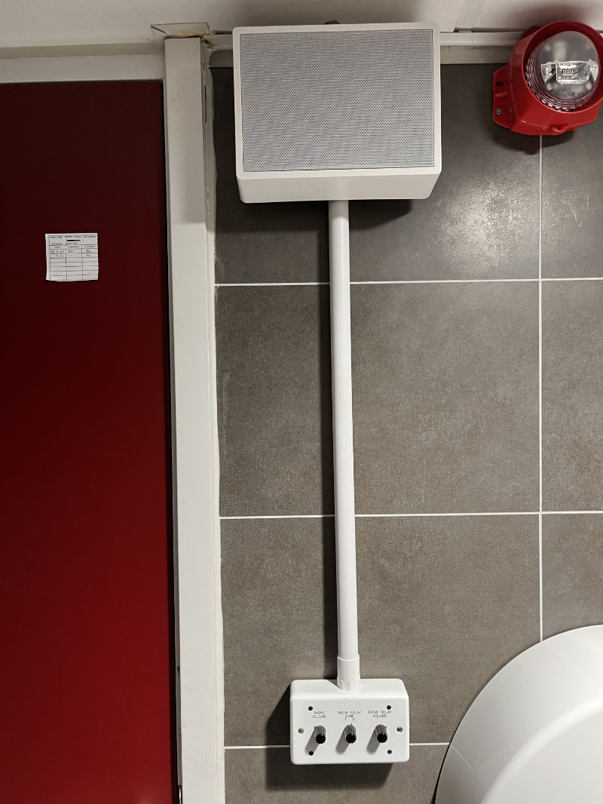
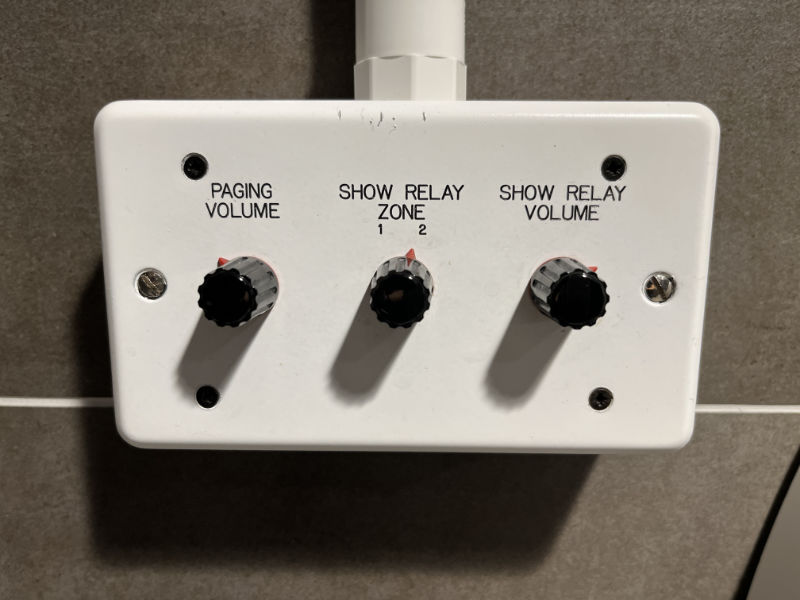

# Warwick Arts Centre

The Warwick Arts Centre is the main building that Tech Crew is based in, as it where all the shows take place. It is,
however, also a professional touring venue with regular events, so it is important to be respectful of staff and other
users of the space at all times.

All of our storage locations are in a closed-off area known as 'Back of House' (BOH), which is only accessible via a
code which changes every week. This code is given on a need-to-know-basis by the exec, such as when you are on a show.

:::info

Looking for information about WAC storage locations, such as the dock, DC cupboard or COSHH cupboard? Check out the
[Storage Locations](/wiki/tech-crew/storage) page.

:::

## Show Relay

Both the Warwick Arts Centre theatre and studio are equipped with a **show relay** system that allows people in Back of
House (BoH) to listen in on what's happening in the spaces - this includes the green room, dressing rooms and
toilets/showers.

Other places in Back of House such as corridors do not have show relay, but are still equipped to listen to BoH calls
made by the [DSM](/wiki/disciplines/stage/dsm).

:::warning

One of the disadvantages of the show relay system is that you never know who may be listening when you're working in
these spaces! Please be mindful with anything you say, especially if it may sound heated and confuse/concern cast in
dressing rooms.

:::

<figure>

<figcaption>An example show relay box in Back of House.</figcaption>
</figure>

A show relay control box has three knobs. As this can sometimes get confusing (resulting in the paging volume being set
to 0 instead of just turning the show relay volume off), generally these should be checked each night by the
[Stage Manager](/wiki/disciplines/stage/sm) and these should not be touched by non-tech company.

- **Paging Volume**: This sets the volume at which BoH calls are broadcast.
- **Show Relay Zone**: This sets the space that the show relay box is listening to. This is **1** for the studio, or
  **2** for the theatre (to be confirmed!).
- **Show Relay Volume**: This sets the volume of the show relay.
