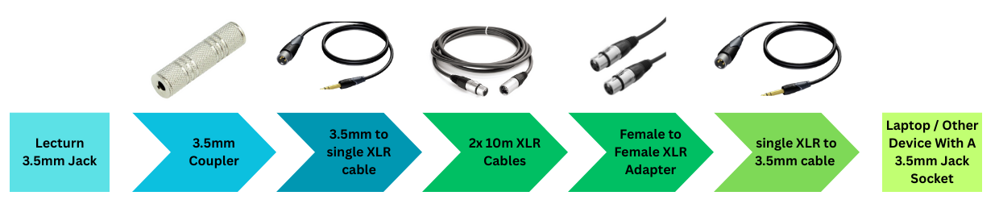

# Millburn House

Formerly home to the [CAPITAL Centre](https://warwick.ac.uk/fac/cross_fac/capital/), then Theatre and Performance
studies, Millburn House is one of the strangest buildings on campus. We fairly regularly use G55, as one of the two
centrally timetabled drama studios (alongside [Avon](./03-avon.md)), with G56 and G57 providing nice white-walled
rehearsal/studio spaces.

## [G55](https://warwick.ac.uk/services/its/servicessupport/av/lecturerooms/roominformation/g55)

### Technical Information

As a purpose built drama space, the room offers a lot of useful amenities (very similar to FAB studios, just a bit
older).

Most visible is the lighting grid accessible by tension grid, which is hard patched to 24 channels of Zero88 Chilli Pro
dimmers. Annoyingly we can't use this (lore to be added), so it just sits there. There are other nice things you can use
though!

:::warning

The shiny power sockets around the room marked "DB Clean" don't actually work. You have to use the normal sockets.

:::

The room has 4 passive speakers rigged up on the lighting grid, with 2 processor/amps for them in the booth. There's
also some DMX splitters in there. The tech equipment in the booth runs off a dedicated consumer unit, which can be
powered on with the switch at floor level. Annoyingly, switching it on with this seems to trip the breaker for the
sockets the amps and DMX splitters are on (presumable from inrush current on the amps). For this reason I wouldn't
recommend using the rigged speakers for a show unless you're particularly familiar with how everything there works.

### Patch Panels

:::warning

At some point between March and November 2024 the patch panel was vandalised, with the XLR patch being ripped out and
cut back by a metre. This makes much of the info below no longer relevant. The DMX, Comms, and Video lines are still
intact.

:::

Around the room there are 4 wall panels. These all tie in to patch panels in the control booth.

| Name | Location (facing the projector screen) | In/Out Tie Lines (Male & Female XLR) | Tie Lines (Female XLR) | DMX In/Out | Video (BNC) | Comms | SpeakON |
| ---- | -------------------------------------- | ------------------------------------ | ---------------------- | ---------- | ----------- | ----- | ------- |
| 1    | Lectern                                | 1-4                                  | 1-4                    | 1          | 1-2         | A, B  | 1-2     |
| 2    | Front Right                            | 5-8                                  | 5-8                    | 2          | 3-4         | A, B  | 3-4     |
| 3    | Rear Right (by entrance)               | 9-12                                 | 9-12                   | 3          | 5-6         | A, B  | 5-6     |
| 4    | Rear Left                              | 13-16                                | 13-16                  | 4          | 7-8         | A, B  | 7-8     |

As access to the control booth is pretty restricted, the patch is setup in a way to be generally useful for how shows
happen in there. Tie lines 9-12 are patched into amp channels 1-4 (though see above for notes on this). 9 and 10 on the
bidirectional ones are patched across to 1 and 2, going across to the lectern panel so you can use the AV services
speakers. 

#### XLR Solution
To run sound from the back of the room rather than from the lecturn (like for Panto) you need two single XLR to 3.5mm cables, a 3.5mm coupler, two 10m XLR cables and a F-F XLR adaptor.

<figure>

<figcaption>Milburn House Cable Setup</figcaption>
</figure>

## G56 and G57

These rooms are rehearsal spaces with white walls. The sizes are a bit awkward as they're quite long and narrow vs the
more square shape of G55. G56 is a bit worse as it doesn't have the double height ceiling the other rooms have. These
rooms have no particular technical installations other than all having a 63amp 3-phase socket if you ever need lots of
power.

G57 in particular is not likely to be at risk as a room as the University marketing team do all their photo and video
shoots in there - keep an eye out in promo videos and you can recognise the distinctive patterns of the ventilation
system.

## Building History

As mentioned above, Millburn houses G55, a fully fitted drama studio with tension grid, many dimmers, patching, etc...
G53 used to be a mirror image of G55 until it got turned into a physics lab in 2023. As a consequence, the control booth
is split into two, one room for each studio, though the window to G53 has been boarded over and the dimmer disconnected.

Elsewhere in the building is a wing that was the former home of Film and TV studies, another area that was created for
Warwick Writing Programme, as well as the the physics NMR (Nuclear Magnetic Resonance) facility.

:::lore

Millburn House was originally a distribution warehouse before the University took it over as _space_ to do anything with,
which is why it's so weird. There was a great video explaining this (as a big sustainability success story), but it
seems to have disappeared so you'll just have to trust me on this one...

:::

After the arts and humanities departments moved to the FAB, much of this space became vacant in 2022. This led to a
speedy space grab (as Warwick has a chronic shortage of space...) and now it houses a bunch of physics department spaces
(mostly astro), some engineering space, and some obscure centrally timetabled rooms. Most of it seems like an unloved
child of the uni, with none of the space making sense - with some very inconsistent one-way card access routes to get to
certain parts of the building.

During the early stages of the [STEM Connect programme](https://warwick.ac.uk/about/strategy/connect/stem/), the
architects had Millburn House marked out on the new plans. When asked if they had any plans for it (e.g. refurbs), they
said they had no actually plans and knew nothing about the building, but had been told they could use it as overspill
space for anything they couldn't fit in the main development...

The one part of the building that continues to receive investment is the NMR halls, which apparently have the most
powerful instruments in the country as a "National Research Facility". In 2020 they added a
[1 GHz spectrometer](https://deeley.co.uk/deeley-construction-completes-950k-university-of-warwick-lab-extension/), and
a [1.2 GHz one in 2024](https://www.quantem.co.uk/2024/05/20/start-on-site-for-milburn-house-at-warwick-university/). I
have no idea what this means but it costs a lot and sounds impressive (and is very entertaining to have next to a drama
studio). It is also annoying (as of Term 1 2024) as the building work blocks off the cut-through to Westwood.
