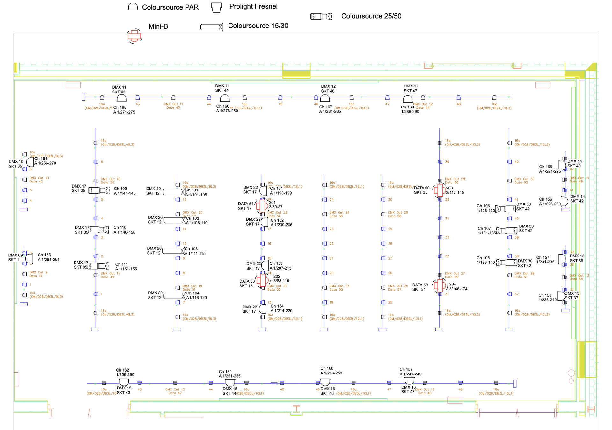
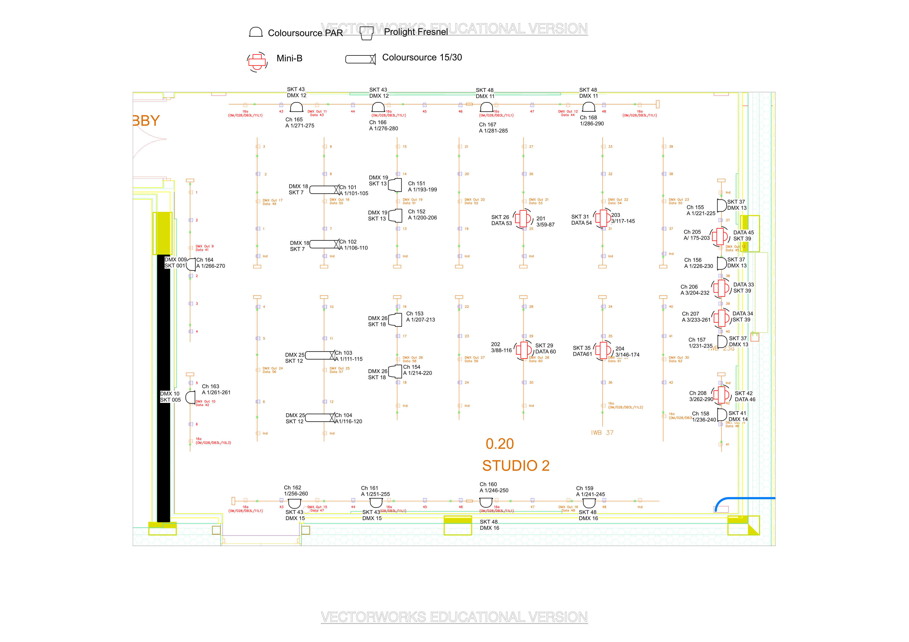

# FAB

Both studios come equipped with and ETC Ion Xe 20, a DiGiCo S21 and a Mac with QLab5.

Note that the colour on the Mini-Bs is inconsistent between the fixtures as they are set with different dimming curves.
This can be changed using non-RDM DMX though (consult DMX personality document), so could be fixed easily.

## FAB0.19

<!-- ### [Campus Map](https://campus.warwick.ac.uk/search/623c8961421e6f5928c0fb67?projectId=warwick)

<iframe width="100%" height="600" src="https://campus.warwick.ac.uk/search/623c8961421e6f5928c0fb67?projectId=warwick"></iframe> -->

The FAB0.19 lighting plan is available on the Google Drive
[here](https://drive.google.com/file/d/1EaH2392dtF6lZvB4KbhHHYr4gnK4AxtC/view?usp=sharing):

Note:

- ETC Coloursource 25/50s are no longer in place.
- Bars around the edge are below the tension grid, the others are above it.

## FAB0.20

Note:

- Bars around the edge are below the tension grid, the others are above it.
- There's a 63Amp socket in the top right corner

<!-- ### [Campus Map](https://campus.warwick.ac.uk/search/623c8961421e6f5928c0fb6a?projectId=warwick)

<iframe width="100%" height="600" src="https://campus.warwick.ac.uk/search/623c8961421e6f5928c0fb6a?projectId=warwick"></iframe> -->

## Agora Engagement Space
