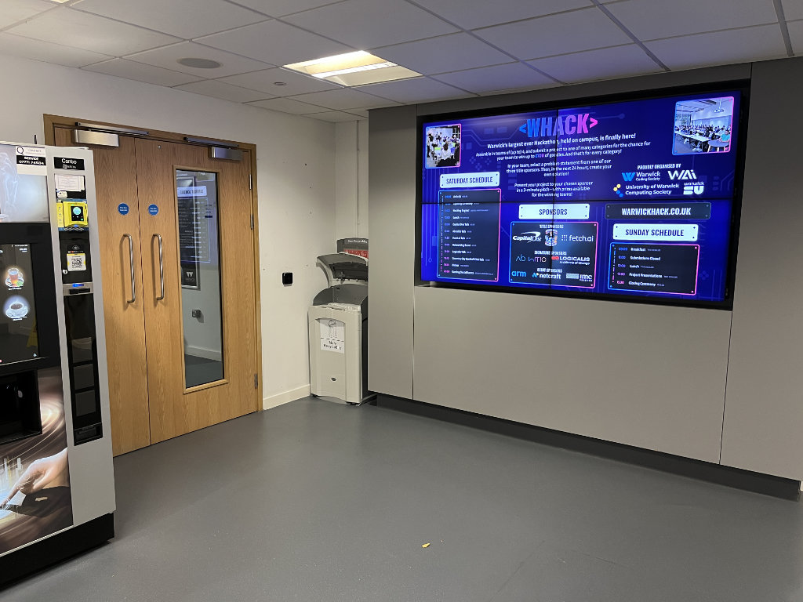
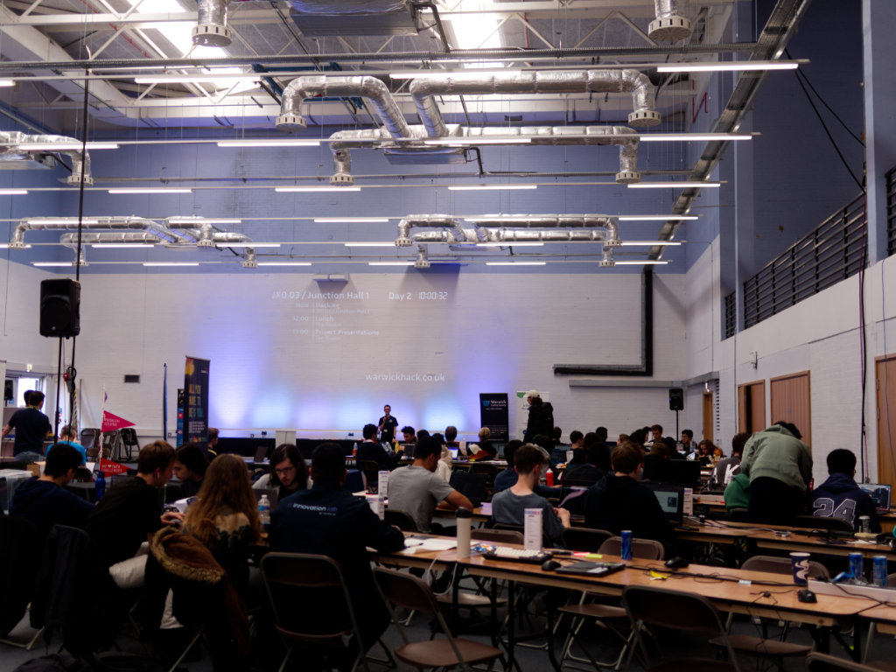
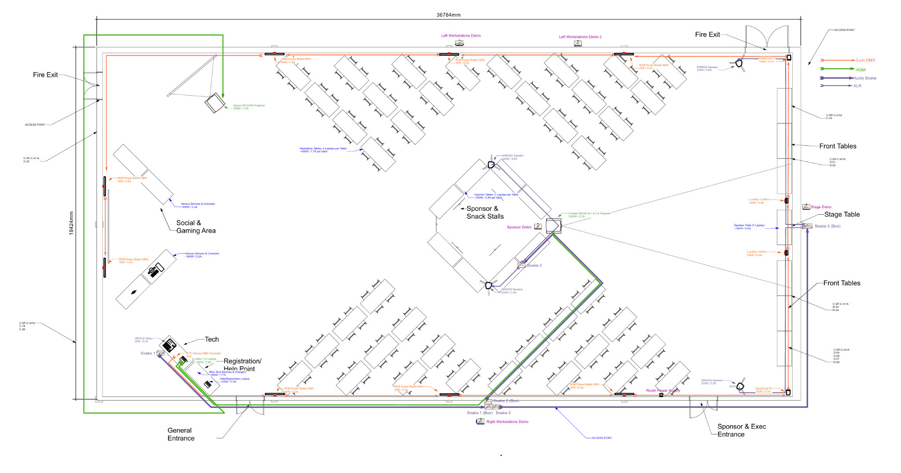
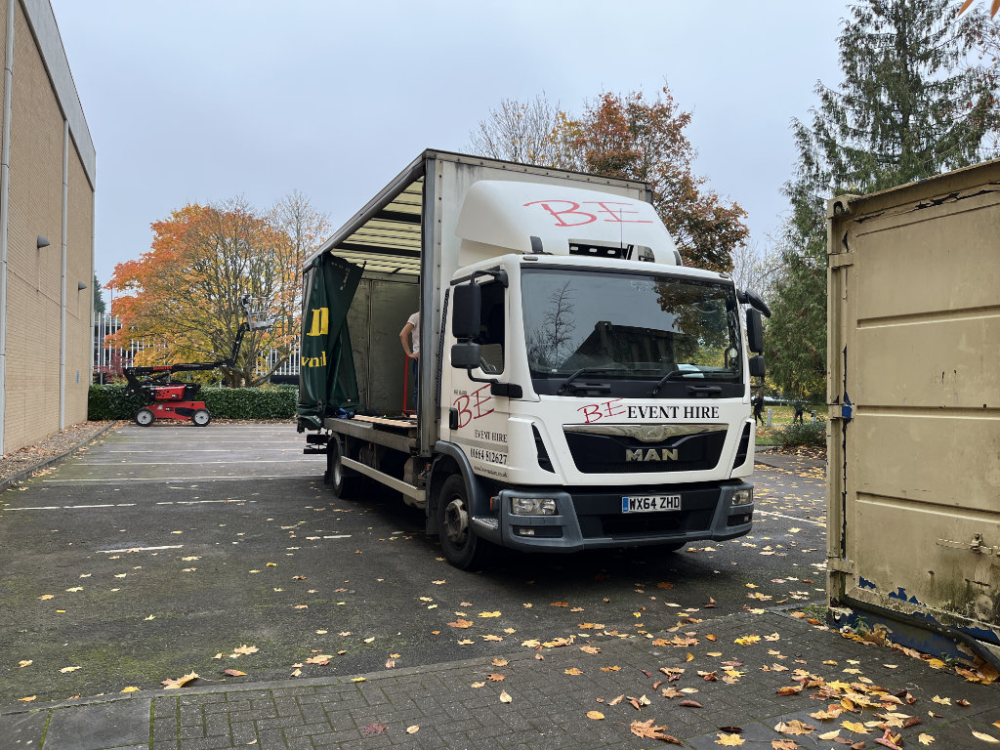
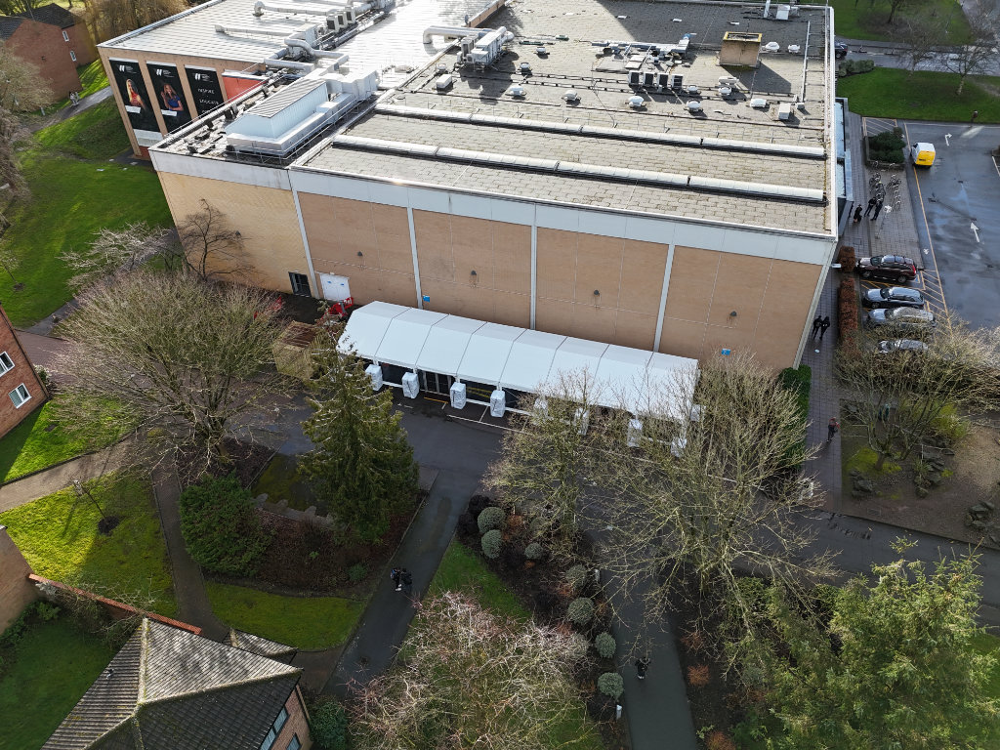
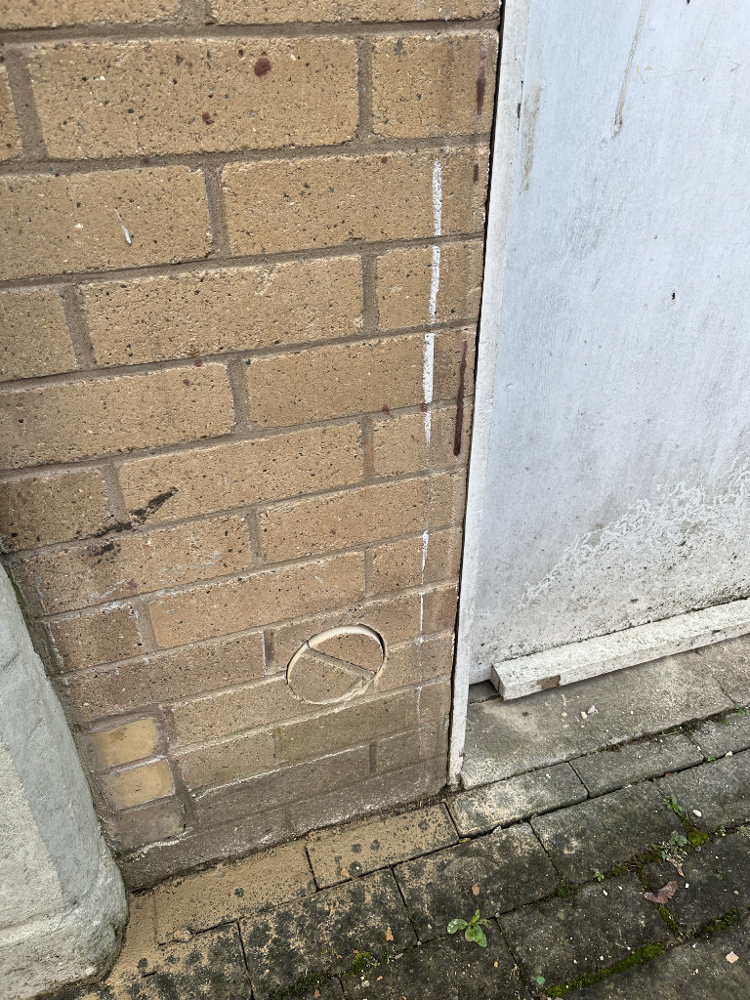
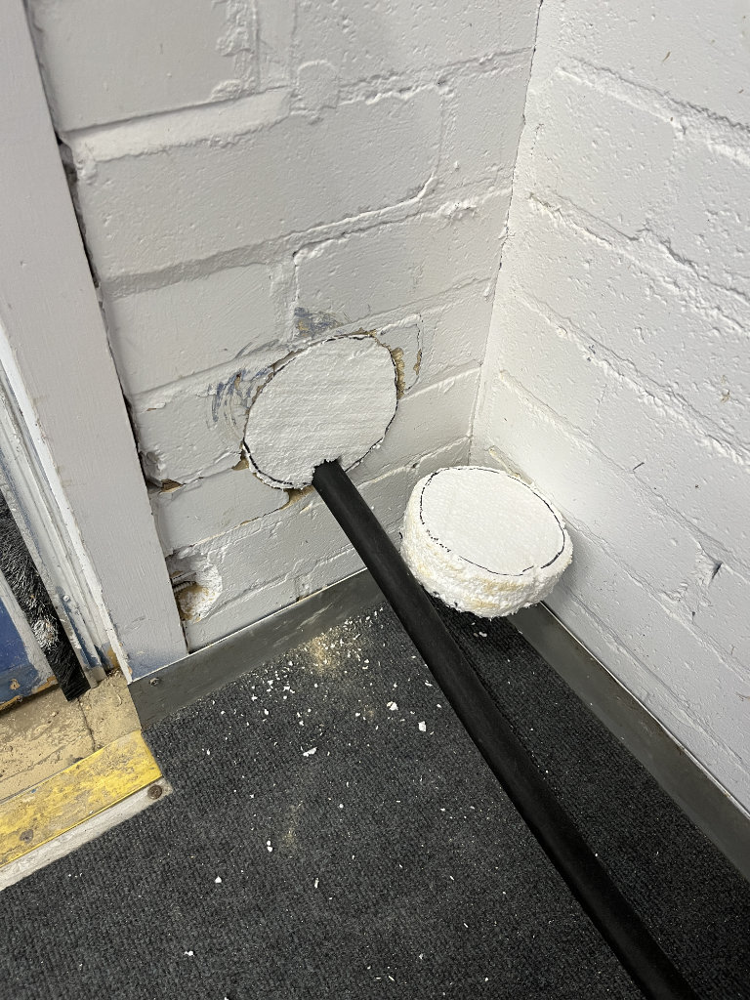
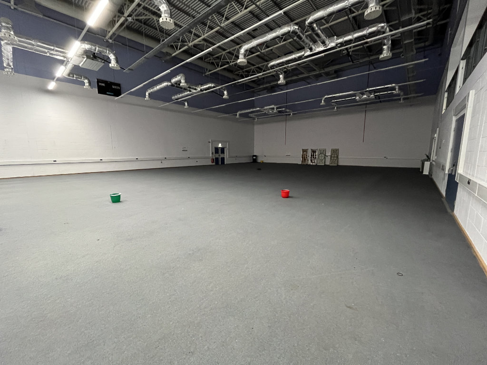
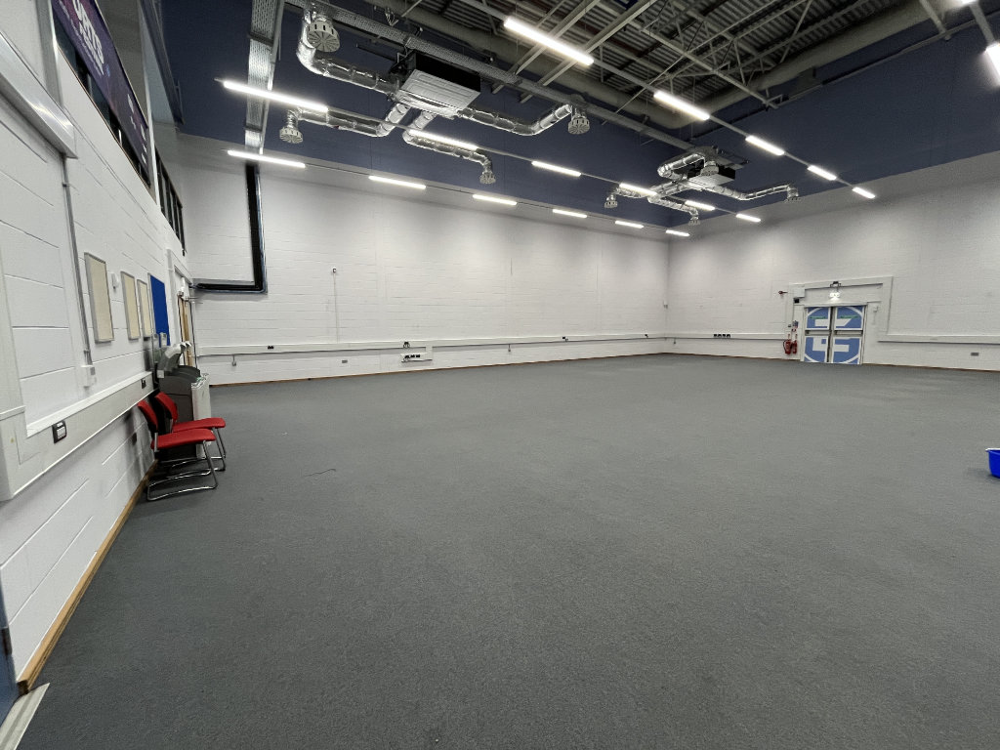
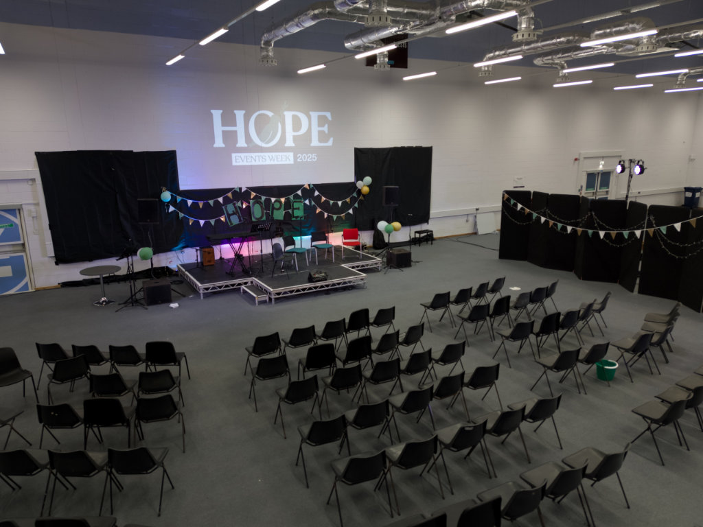

# Junction Building

The Junction Building is the old University of Warwick Sports Centre which has since been repurposed into an exams venue
and space for [Warwick Innovation Group](https://warwickinnovationdistrict.com/). There are still certain areas, most
notably the empty and collapsed-roof swimming pool, which are not accessible to students or staff.

There are two large events spaces within junction: Junction Hall 1 (JX0.03) and Junction Hall 2 (JX0.10), both
of which are bookable as [Centrally Timetabled Rooms](/wiki/spaces/ctr).

:::lore
Work is being done in these spaces over Summer 2025 to make them suitable for lectures. Planned works include
collapsible auditorium seating and new AV systems.
:::

## [Junction Hall 1 (JX0.03)](https://campus.warwick.ac.uk/search/623c8927421e6f5928c0ef6e?projectId=warwick)

:::warning
As of 2025, the timetable report states that this space is not available to student bookings. In addition, additional
card access to the space may need to be arranged with the Access Control office.
:::

<figure>

<figcaption>Junction Hall 1 during the WHACK Hackathon</figcaption>
</figure>

This hall is located at the front of the building. In 2024, it was used as the venue for the
[Warwick Hackathon (WHACK)](https://warwickhack.co.uk/), resulting in the installation of a dedicated 63-3A power
supply in one of the side storage cupboards.

A floorplan that was used for the WHACK 2024 Hackathon can be found below:

<figure>

<figcaption>Junction loading car park and Hope 2025 marquee</figcaption>
</figure>

One of the fire exits leads to a small outdoor car park, which is very beneficial for loading. This car park has been
used as a marquee location for [Warwick CU's Hope Events Week](https://warwickcu.org/hope-2025/) in 2025.

### The Hope Hole

<figure>

<figcaption>Interior and exterior views of The Hope Hole</figcaption>
</figure>

The hope hole refers to a hole in the wall of Junction Hall 1, next to one of the fire exits, which was created to
supply heavy duty power from Junction Hall 1's 63-3A supply to an outdoor marquee for
[Warwick CU's Hope Events Week](https://warwickcu.org/hope-2025/) in 2025. This also came in useful for supplying a
wired network connection to the marquee for livestreaming.

## [Junction Hall 2 (JX0.10)](https://campus.warwick.ac.uk/search/623c8927421e6f5928c0ef7a?projectId=warwick)

:::warning
As of 2025, the timetable report states that this is not bookable after 7pm Mon-Fri or during any weekend. Please speak
directly to Community Safety/the Central Timetable Office if you need to book this space outside of these hours.
:::

<figure>

<figcaption>Junction Hall 2</figcaption>
</figure>

This hall is located at the back of the building, however can be easily accessed from the back entrance. In 2025,
this was used as the indoor venue for [Warwick CU's Hope Events Week](https://warwickcu.org/hope-2025/).

<figure>

<figcaption>Warwick CU's Hope Events Week 2025 in Junction Hall 2</figcaption>
</figure>

:::lore
Junction Hall 2 used to be the space for the [Warwick Esports Centre](https://warwick.ac.uk/esports/) until this was
moved to Fusion in the Rootes Building.
:::