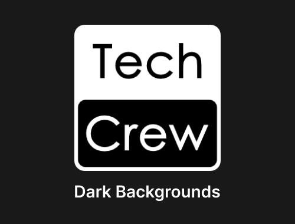

# Tech Crew Branding

This page contains all branding information and logos for Warwick Tech Crew. You may use our logo and resources when
working with us or promoting our events or activities. If you have any questions or need a different format, please
contact exec@warwicktechcrew.co.uk.

## Colours
We have a very boring colour palette of pure white (#FFFFFF) and black (#000000). Feel free to change this if it suits
your design better, but please keep our logo in its original colours.

## Logo

We have two versions of our logo: one with a black border for light backgrounds, and one with a white border for
dark backgrounds. Please don't modify our logo (excluding resizing it) without asking the exec first at
exec@warwicktechcrew.co.uk.

We've provided the logo in multiple formats for your convenience. Please use the SVG format if possible as this can
be scaled to any resolution without losing quality.

| Format               | Light Backgrounds                                                  | Dark Backgrounds                                                  |
|----------------------|--------------------------------------------------------------------|-------------------------------------------------------------------|
| Example              |     |     |
| SVG                  | [Download](https://www.warwicktechcrew.co.uk/logo-light.svg)       | [Download](https://www.warwicktechcrew.co.uk/logo-dark.svg)       |
| Small PNG (64x64)    | [Download](https://www.warwicktechcrew.co.uk/logo-light-small.png) | [Download](https://www.warwicktechcrew.co.uk/logo-dark-small.png) |
| Medium PNG (256x256) | [Download](https://www.warwicktechcrew.co.uk/logo-light.png)       | [Download](https://www.warwicktechcrew.co.uk/logo-dark.png)       |
| High PNG (1024x1024) | [Download](https://www.warwicktechcrew.co.uk/logo-light-high.png)  | [Download](https://www.warwicktechcrew.co.uk/logo-dark-high.png)  |

## Bonus Resources

We also have an SVG of the white Warwick SU logo available
[here](https://www.warwicktechcrew.co.uk/icons/warwick-su.svg).