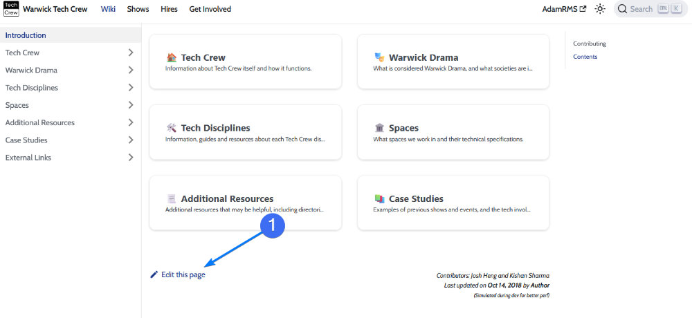
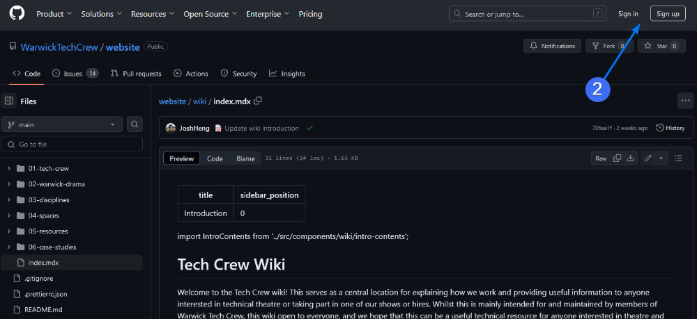
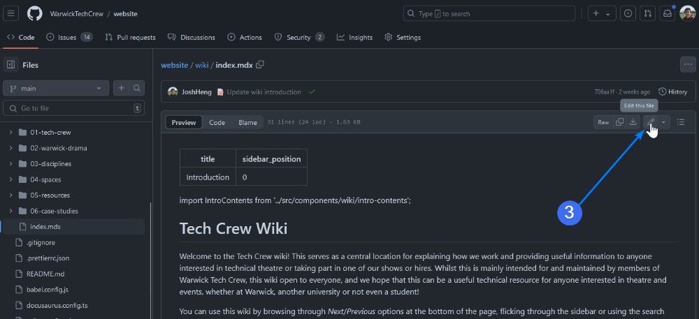
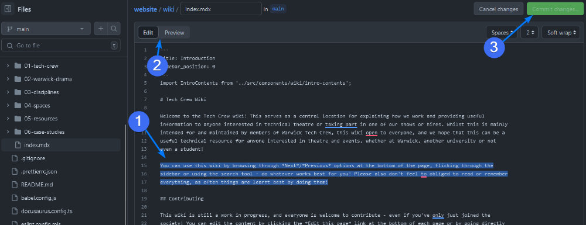
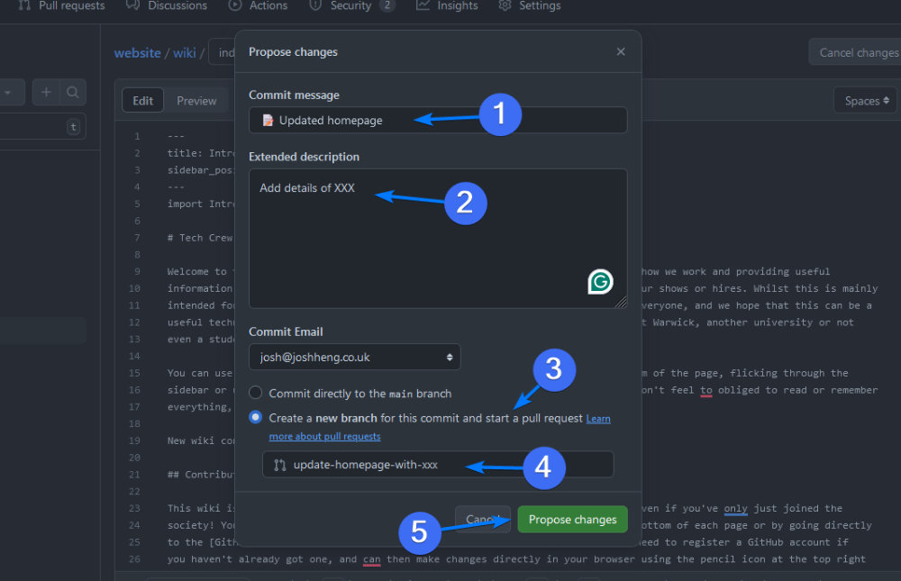
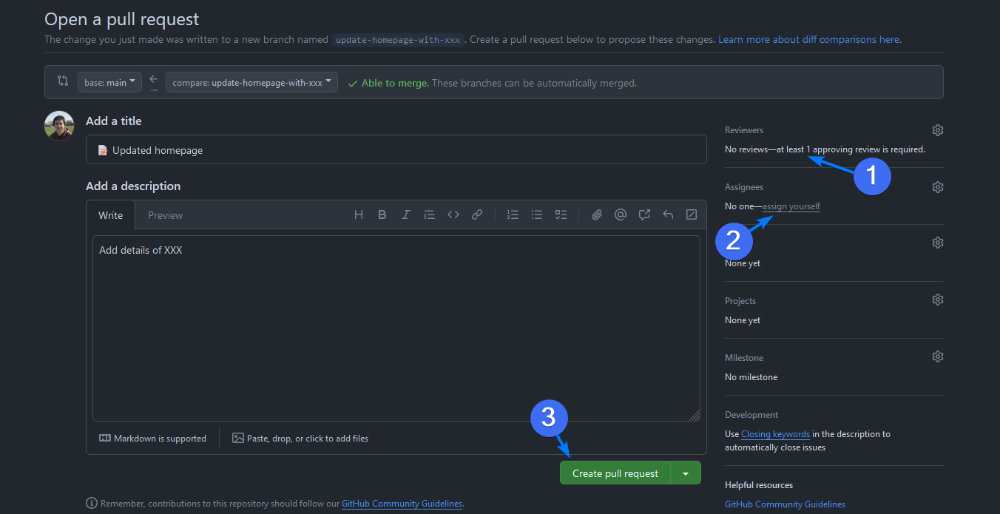
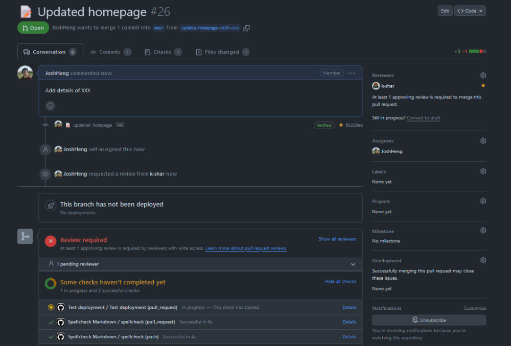

# Contributing to the Wiki

This wiki is a work in progress, and is a collaborative resource that is made by and for all members of Warwick Tech
Crew. Everyone is welcome and encouraged to contribute, even if you've only just joined the society (it could be 
argued that this is one of the most useful times to contribute, as you'll know what's confusing or difficult to 
understand)!

:::info
If you have any questions or issues about contributing, please reach out to a
[Wiki Maintainer](https://github.com/orgs/WarwickTechCrew/teams/wiki-maintainers) on Discord.
:::

## What to Contribute

Anything Tech Crew related that could be useful to someone else is suitable - this can range from detailed
instructions on how to use certain bits of equipment, to
[who to contact for certain services](/wiki/resources/equipment-directory), to [fun lore about our
history](/wiki/tech-crew/flight-cases). If there's something you've just learnt that you wish you knew sooner, or if
you've just got a response to a question that you think others might have, then it's worth adding to the wiki!

If you still want to help but aren't sure what you can add, we have a
[list of content requests](https://github.com/WarwickTechCrew/website/issues?q=is%3Aissue+is%3Aopen+label%3A%22content+request%22)
on the GitHub Repository that also need doing. You're equally welcome to add to this list if you think of something but
don't have time or the knowledge to write it up yourself.

## How to Contribute

### The Easy Way

If you want to quickly add a small piece of information or fix a typo but don't want to deal with the hassle of all
the steps below, you can just send a message on Discord to someone who can make the change for you (or just send a 
message in the #general channel).

The downside of this method is that this is dependent on another person, and you may not also be fully credited by our
automated systems (e.g. the authors on the bottom right of the page, or the [changelog](/wiki/resources/changelog)).

### The Online Way

In this example, we want to update the text on the [Wiki homepage](/wiki). To do this, we can follow these steps:

1. Go to the [Wiki homepage](/wiki) and click the **✏️ Edit this page** button at the bottom left.
   

2. This will take you to the GitHub repository for the website. Sign in at the top right, or create an account if 
   you don't yet have one. Once you've made an account, let a
   [Wiki Maintainer](https://github.com/orgs/WarwickTechCrew/teams/wiki-maintainers)
   know so that you can be added to the [Wiki Team](https://github.com/orgs/WarwickTechCrew/teams/wiki-team).
   

3. Click the pencil icon at the top right of the page to edit the text.
   

4. Make your desired changes. We use a format called [Markdown](https://docusaurus.io/docs/markdown-features) for
   formatting, which is quite simple to use and similar to the formatting used on Discord. More information about some
   of the specific features we use can be found in the [README](https://github.com/WarwickTechCrew/website).

   After you have made your changes, you can preview them by clicking the **Preview** tab (2). Once you're 
   happy, click **Commit changes** at the top of the page.
   

5. In the modal window that pops up, (1) add a general summary of what you've updated (this should be prefixed with 
   the `📝` [Gitmoji](https://gitmoji.dev/) emoji, (2) add an extended description if applicable, (3) ensure that
   **Create a new branch** is selected, (4) optionally give your branch a name and (5) click **Propose changes**.
   

6. On the next page, optionally (1) assign someone to review your changes (e.g. a
   [maintainer](https://github.com/orgs/WarwickTechCrew/teams/wiki-maintainers)), (2) click
   **assign yourself** and then (3) click **Create pull request**
   

7. You're done! Your changes will be reviewed and merged. You can check the status of your pull request at any time by
   going to the [Pull Requests](https://github.com/WarwickTechCrew/website/pulls) tab.
   

### The IDE Way

The fastest way to contribute to the wiki is to use a code editor such as
[Visual Studio Code](https://code.visualstudio.com/) and to make all changes locally on your own computer.

To do this, following the instructions in
[**Running the Website Locally**](https://github.com/WarwickTechCrew/website?tab=readme-ov-file#running-the-website-locally)
in the README. Once you've made your changes, you can commit these to a new branch and then follow the above steps to
create a Pull Request.