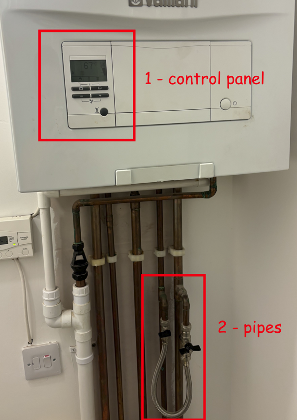
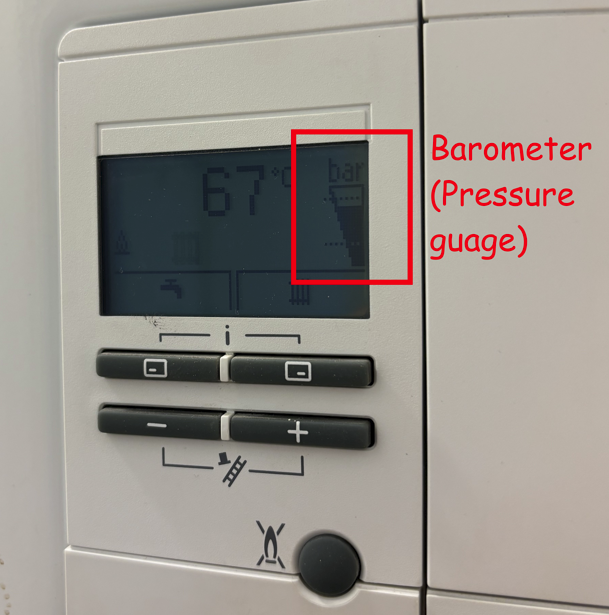
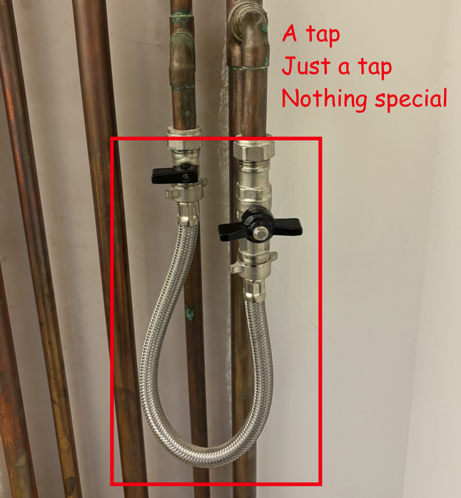

# Boiler Maintenance
This is a brief guide to fixing pressure boilers, to be used when they are only producing cold water

:::warning

If you are renting the house, you will need to get your landlord's permission before doing any maintenance 

:::

The boiler has two main sections, the control panel (1), and the pipes (2). If you cannot find either of these components this guide may not function as intended.

<figure>

<figcaption>A pressure boiler</figcaption>
</figure>

## Control Panel

The control panel displays many metrics, the only one needed for this guide is the barometer.

A barometer measures the pressure within the boiler.

This specific fix is for if the barometer is displaying low (or no) pressure within the boiler

**If there is pressure in the boiler, this solution will not work**

<figure>

<figcaption>Boiler Control Panel</figcaption>
</figure>

## The Solution

If your pressure is low, you can increase it by opening the input taps.

For the example provided, there are 2 valves on the input taps, and both need to be opened.

Turn on the tap(s) until the pressure inside the boiler is a normal level. In the picture below, that means in the middle of the two lines.

Once the pressure is a normal level, turn off the tap(s), making sure it is fully closed.

<figure>

<figcaption>Pipes of a boiler</figcaption>
</figure>

## Concluding remarks

After switching off the tap(s), the boiler will start working again. This may move the pressure outside of the intended range temporarily, however this is completely normal and **does not need more water adding to fix it**.

The boiler will need a small amount of time to heat up again, as you have just filled it with cold water.

While inspecting the boiler room, it's advisable to test your Carbon Monoxide alarm, as they need regular testing and will likely be in the same room as the boiler.
