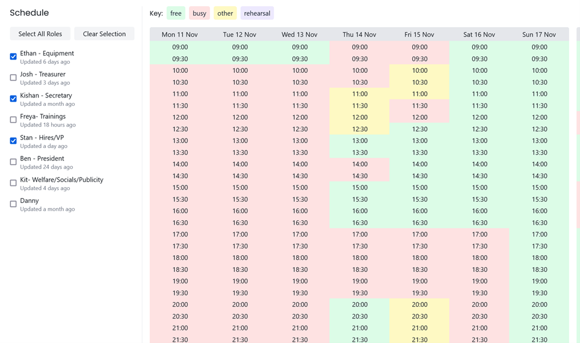
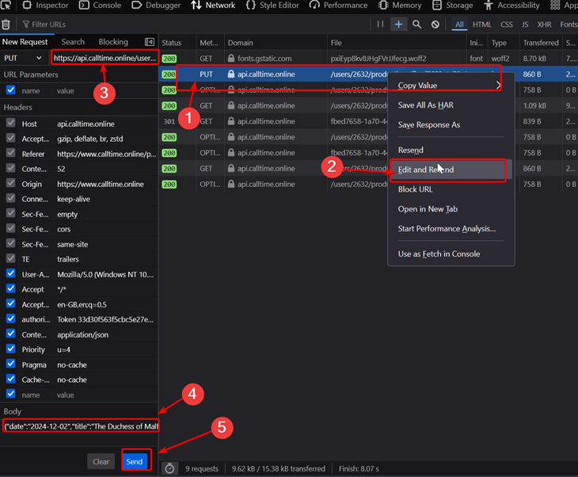

# CallTime
[CallTime](https://www.calltime.online/) is the recommended tool for scheduling rehearsals. Each show will generally
have its own CallTime production, which will contain the availability of everyone involved.

Upon making a **Production**, a link can be sent to Cast/Crew and to Admins. These links will allow people to claim a
role and input their availability (which can sync between multiple productions if the user is logged in), or to view
everyone's availability and schedule rehearsals respectively.

<figure>

<figcaption>The CallTime schedule for an example production</figcaption>
</figure>

## Changing Production Date of a Previous Event
CallTime has an annoying feature where once the production date of an event has passed, you can no longer access it.
This is unhelpful for post-show meetings such as [Show Debriefs](/wiki/warwick-drama/shows/show-week#debrief).

To get around this, you can change the production date of the event to a future date using the following steps:

:::info
These steps assume that you were previously an admin member of that CallTime production, i.e. it appears on your
*Productions* page.

These instructions are also made for Firefox, but other browsers (e.g. Chrome) should have a similar process
:::

1. Find the key for the production
   
   1. Go to the CallTime Productions page (Circle 1)
   2. Open the Web Inspector by pressing CTRL+SHIFT+I or right-clicking and selecting *Inspect*
   3. Go to the *Network* tab  (Circle 2)
   4. Find the **GET** request made to `/users/[id]/productions/` and click on it (Circle 3)
   5. Go to the **Response** tab, find the correct production and copy the `pk` value (Circle 4)
2. Make a **PUT** request to `https://api.calltime.online/users/[id]/productions/[key]/`, containing a body of
   `{"date":"YYYY-MM-DD"}`.
   * The easiest way to do this is to open the Web Inspector again, update the name/date of an existing production that
     you can see and then right-clicking this request and clicking **Edit and Resend**. You can then update the production
     key in the URL and the request body.
     
   * You could also do this manually using a tool like Postman or Curl, but this will require adding additional headers
     (e.g. for authorisation)
