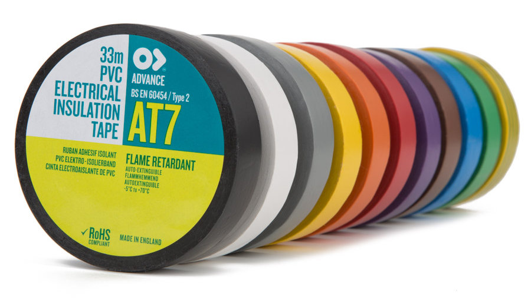

# Equipment & Consumable Shop Directory

## By Shop

### [Central Theatre Supplies, Birmingham](https://www.centraltheatresupplies.co.uk/)
Central Theatre Supplies are a friendly and fairly local shop who often have good deals on
[older/ex-hire stock](https://shop.centraltheatresupplies.co.uk/). They can send orders by post, but it can sometimes
also be worth driving there in person.

### [10K Used Gear](https://www.10kused.com/)
This auction site often has good deals on used equipment - it can be worth regularly checking if there is anything here
of interest.

### [10K New Gear](https://www.10knew.com/)
10K New Gear sells new equipment, and can also be worth a browse. Note that all listed prices exclude VAT, so this
needs to be added on top.

## By Equipment/Consumable

### Electrical Tape

Where possible, Tech Crew tries to buy AT7 electrical tape as it is nice to use and easy to tear. This can often be
found on several vendors such as [Zoro](https://www.zoro.co.uk/) or [Mo-Kit](https://www.mo-kit.co.uk/) for around
£1.00-£1.50 per roll.

