# Makka Pakka & Friends Directory

Makka Pakka and his collection of friends are one of the most important parts of Tech Crew - they help improve crew
morale and are an essential part to any large show or hire.

<figure>
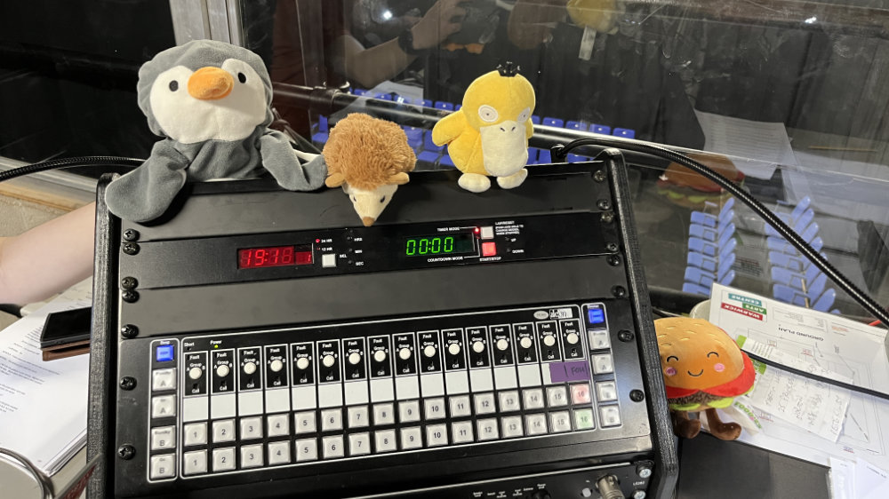
<figcaption>Pengy, Hedgey, Psymon and Patty (left-right) at the DSM Desk during The Duchess of Malfi</figcaption>
</figure>

## Makka Pakka
Makka Pakka was gifted to Josh (Tech Crew Treasurer 23/24) at the start of the 2024 academic year, and since then,
Tech Crew has never been the same.

<figure>

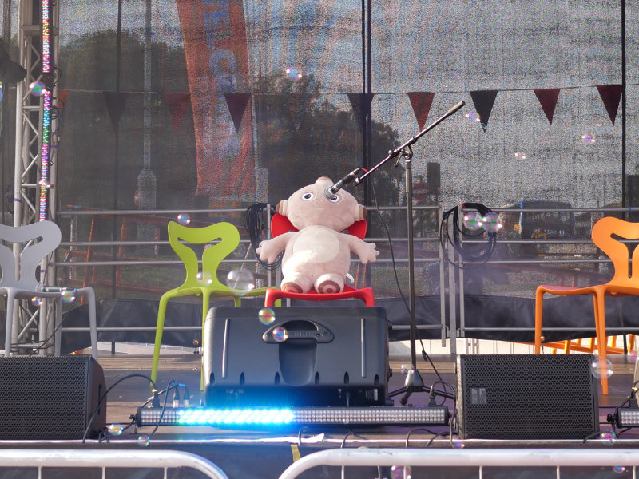
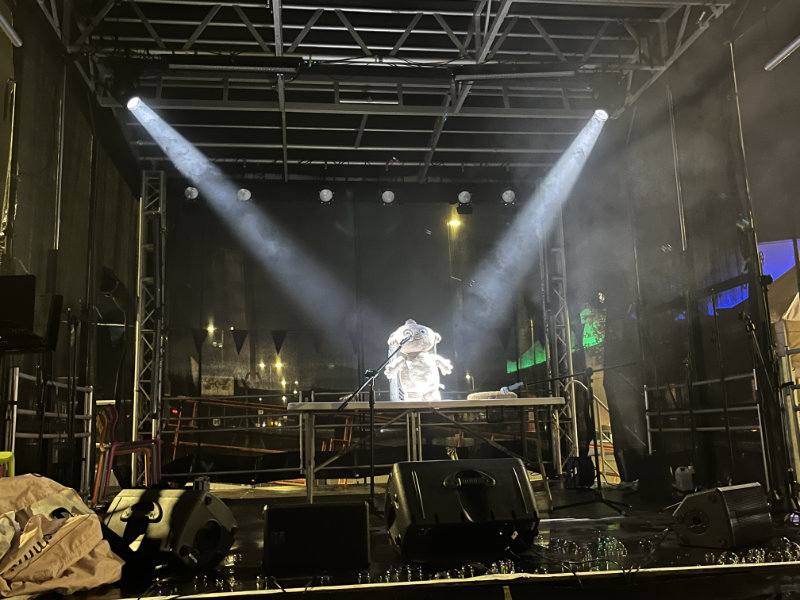
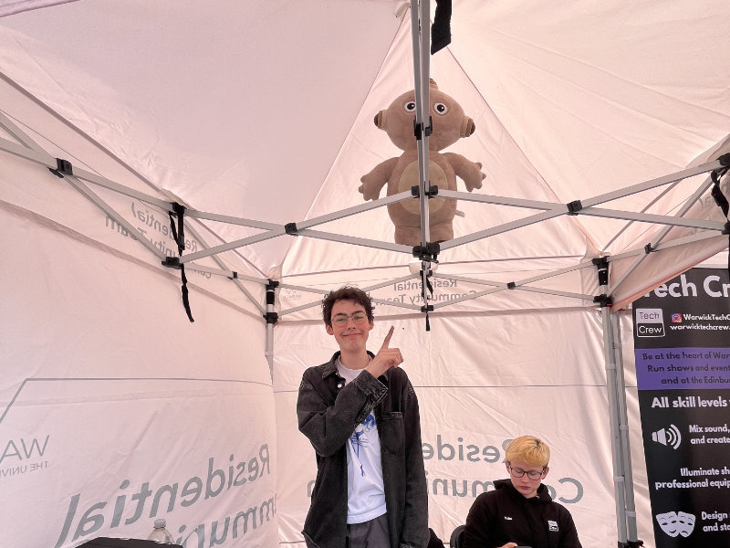
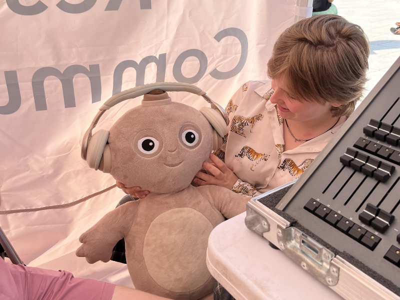

<figcaption>Makka Pakka at the Arrivals Stage 2024</figcaption>
</figure>

Makka Pakka made his first Tech Crew debut at [Arrivals Stage 2024](/wiki/case-studies/arrivals-2024), where he
frequently helped out in the tech tent or filled in on stage when needed. Makka Pakka also particularly helped by
filling in for a DJ set in one of the last events of the day.

  <iframe
    src="https://www.youtube.com/embed/yg9dulfQpjw?si=hPr4i0ljPjCWlblW"
    title="YouTube video player"
    frameborder="0"
    allow="accelerometer; autoplay; clipboard-write; encrypted-media; gyroscope; picture-in-picture; web-share"
    referrerpolicy="strict-origin-when-cross-origin"
    allowfullscreen
  ></iframe>

Makka Pakka has also featured at other hires including the Christmas Lights Switch-on 2024, and the Christian Union's
Weekend Away. It was at the Weekend Away, however, that Makka Pakka was first attacked in the middle of the night due
to his growing popularity. He luckily escaped safely, but it was a grave reminder of the dangers that can come with
stardom.

<figure>

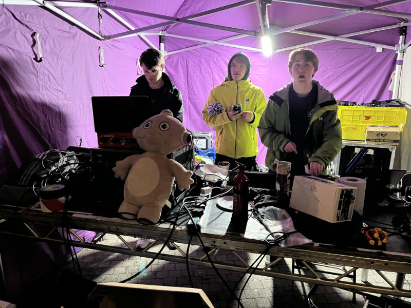
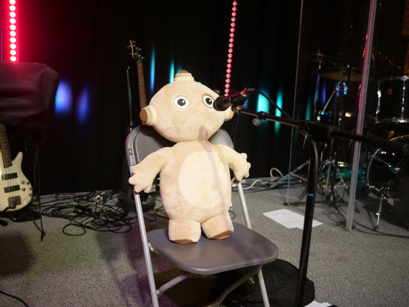
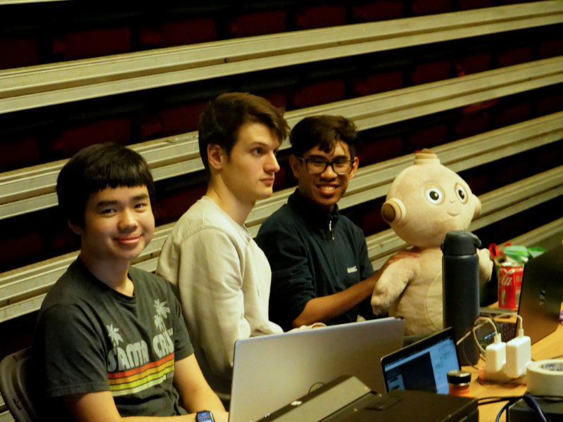

<figcaption>Makka Pakka at the Christmas Lights and CU Weekend Away hires</figcaption>
</figure>

<figure>

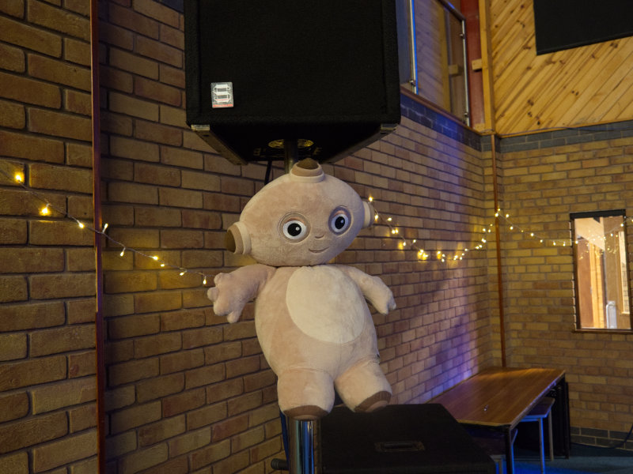
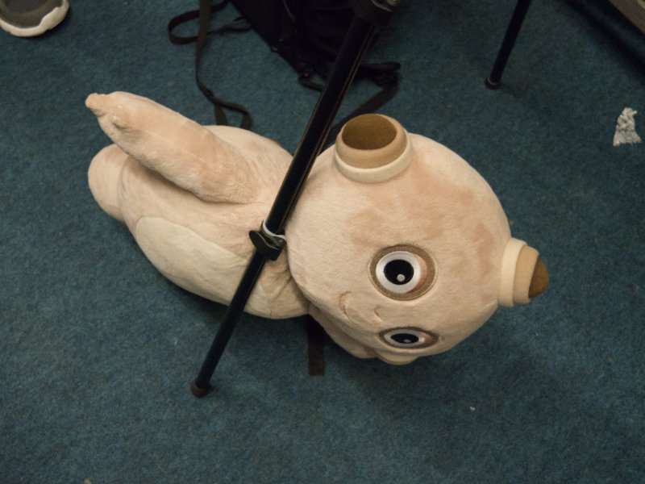

<figcaption>Makka Pakka being attacked during the middle of the night during the CU Weekend Away hire</figcaption>
</figure>

Makka Pakka also made an appearance at Can You Teach Me How To Breathe 2025, briefly gracing the occupants of a submarine of the mind with its visage.
<figure>
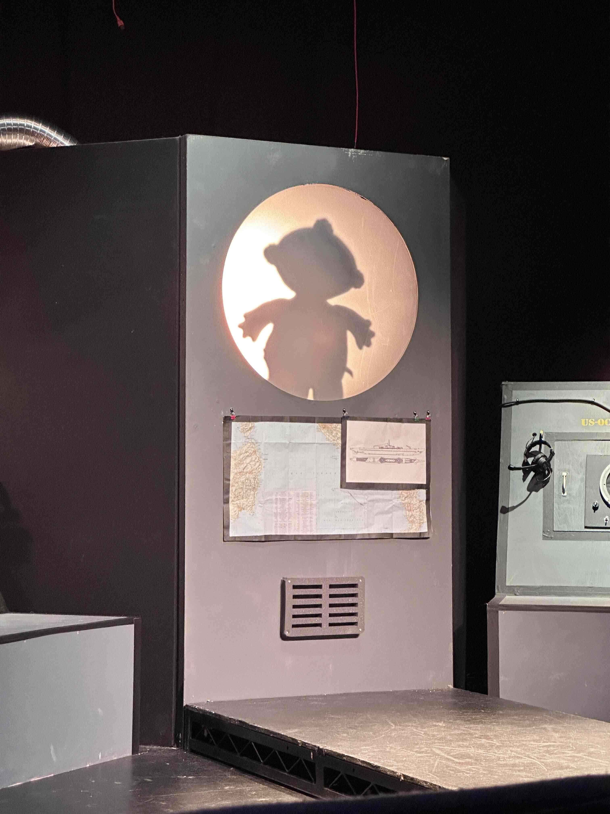
<figcaption>Makka Pakka's first appearance at CYTMHTB</figcaption>
</figure>

    <iframe
        width="560"
        height="315"
        src="https://www.youtube.com/embed/WTVQMoy7pec"
        title="YouTube video player"
        frameborder="0"
        allow="accelerometer; autoplay; clipboard-write; encrypted-media; gyroscope; picture-in-picture; web-share"
        referrerpolicy="strict-origin-when-cross-origin"
        allowfullscreen
    ></iframe>

## Barry the Baguette

Barry the Baguette is one of Makka Pakka's closest friends. Wherever there is Barry the Baguette, Makka Pakka is likely
to be close by.

<figure>

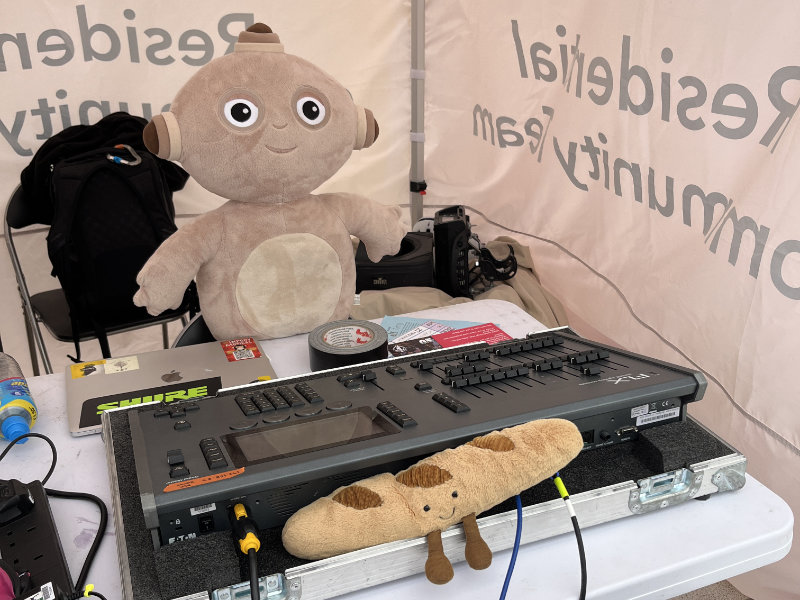

<figcaption>Barry the Baguette and Makka Pakka at the Arrivals Sage</figcaption>
</figure>

Barry also has a particular love for operating the [SQ5 Sound Desk](/wiki/disciplines/sound/sound-desks), fitting
perfectly at the top.

<figure>

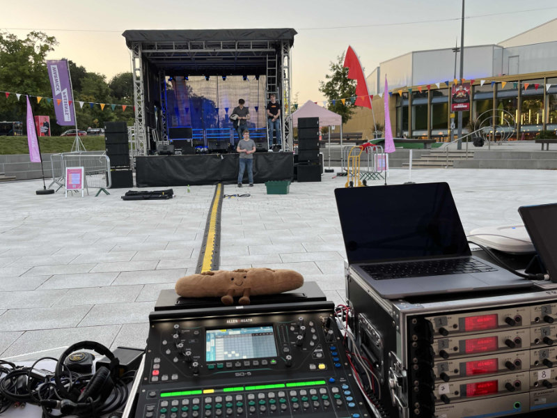

<figcaption>Barry the Baguette on the SQ5 at the Arrivals Stage</figcaption>
</figure>

## The Great IKEA Trip of Term 1, 2024
On the 1 October 2024, several Tech Crew Members embarked on a quest to IKEA in the SU IKEA trip. This was a great time
full of important set research, swedish meatball consumption and battery buying, but most importantly, it was a time
for Makka Pakka to find new friends.

<figure>

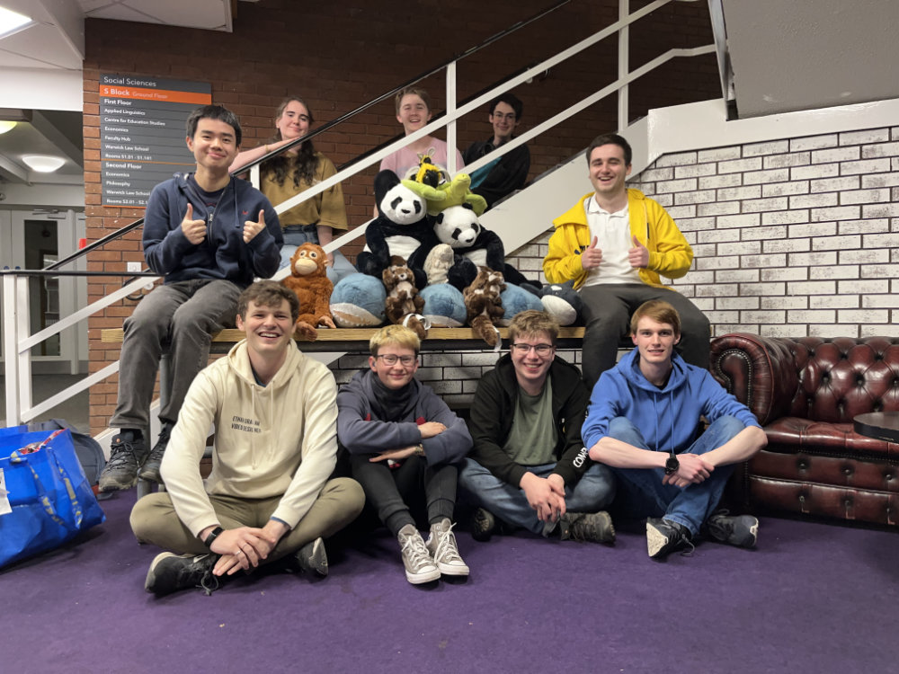
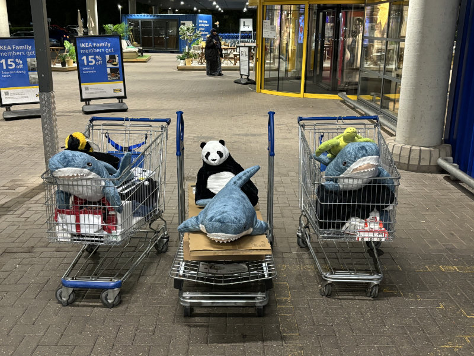

<figcaption>The result of the Great IKEA Trip of Term 1, 2024</figcaption>
</figure>

## Leli the Bulldog
Leli is another of Makka Pakka's friends, originating from the 2025 MTW hit musical Anything Goes! His favourite pastime is sitting on Connie's DSM desk during Act 2, overlooking her work with glee.

<figure>

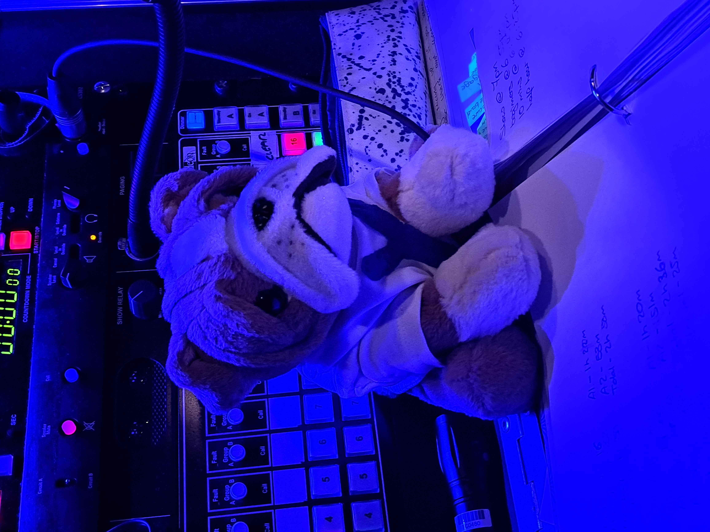
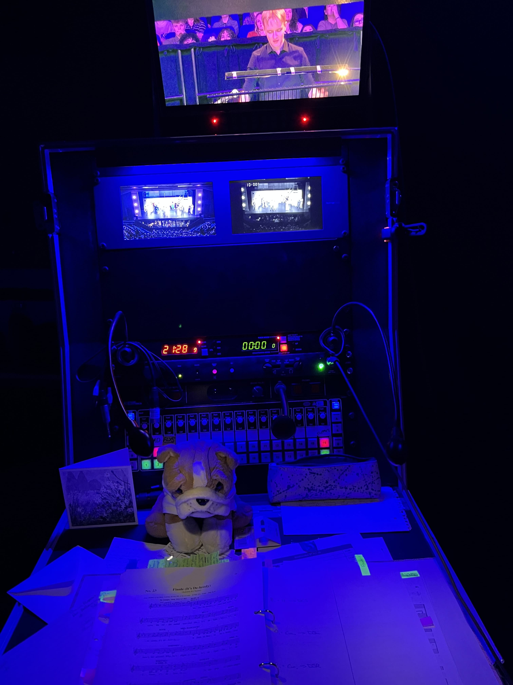

<figcaption>Leli overlooking Connie's work during Anything Goes!, 2025</figcaption>
</figure>
